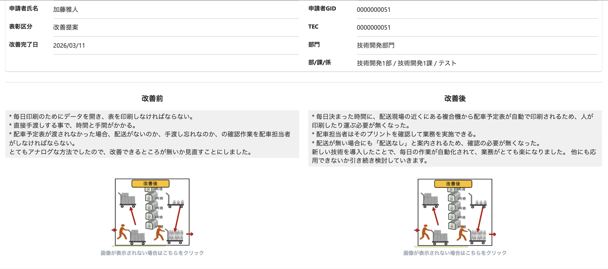

# 添付ファイル機能 — 仕様確認

**報告日:** 2026年4月3日

---

## 背景

PDF・Excel等の多形式対応のため、アップロード方式を変更した。これにより以下の制約が生じている。

- **プレビュー画面**: 添付ファイルのインライン表示が**不可**（技術的制約）
- **評価・閲覧画面**: 画像（JPG/PNG）はインライン表示可。PDF等の他形式は**別タブで開く**のみ

<table>
  <tr>
    <th></th>
    <th style="text-align:center">プレビュー</th>
    <th style="text-align:center">評価画面</th>
  </tr>
  <tr>
    <th style="text-align:center">v1</th>
    <td></td>
    <td></td>
  </tr>
  <tr>
    <th style="text-align:center">v2</th>
    <td></td>
    <td></td>
  </tr>
</table>

---

## 提案パターン

**パターン1（現行設計）**: 画像はインライン表示のまま残す。カテゴリ（改善前/改善後/その他）を維持。プレビューの添付欄は「添付あり」テキストに変更。

**パターン2**: インライン表示を全廃。カテゴリをなくし、添付はシンプルなリスト（最大10件）に統一。全ファイルをタップ→別タブで開く形に変更。

**パターン3**: パターン2に加え、プレビュー機能も削除。申請フォームの操作をシンプルにする。

---

## 比較表

<table style="border-collapse:collapse; width:100%; font-size:14px;">
  <thead>
    <tr style="background-color:#2c3e50; color:#fff;">
      <th style="padding:10px 14px; text-align:left;"></th>
      <th style="padding:10px 14px; text-align:center;">カテゴリ</th>
      <th style="padding:10px 14px; text-align:center;">評価・閲覧（画像）</th>
      <th style="padding:10px 14px; text-align:center;">評価・閲覧（PDF等）</th>
      <th style="padding:10px 14px; text-align:center;">プレビュー画面</th>
      <th style="padding:10px 14px; text-align:center;">UIの複雑さ</th>
    </tr>
  </thead>
  <tbody>
    <tr style="background-color:#f8f8f8;">
      <td style="padding:9px 14px; font-weight:bold; border-bottom:1px solid #ddd;">パターン1</td>
      <td style="padding:9px 14px; text-align:center; background-color:#d4edda; border-bottom:1px solid #ddd;">○</td>
      <td style="padding:9px 14px; text-align:center; background-color:#d4edda; border-bottom:1px solid #ddd;">インライン表示</td>
      <td style="padding:9px 14px; text-align:center; border-bottom:1px solid #ddd;">別タブ</td>
      <td style="padding:9px 14px; text-align:center; border-bottom:1px solid #ddd;">添付あり表示</td>
      <td style="padding:9px 14px; text-align:center; background-color:#fde8e8; border-bottom:1px solid #ddd;">高</td>
    </tr>
    <tr>
      <td style="padding:9px 14px; font-weight:bold; border-bottom:1px solid #ddd;">パターン2</td>
      <td style="padding:9px 14px; text-align:center; background-color:#fde8e8; border-bottom:1px solid #ddd;">✗</td>
      <td style="padding:9px 14px; text-align:center; border-bottom:1px solid #ddd;">別タブ</td>
      <td style="padding:9px 14px; text-align:center; border-bottom:1px solid #ddd;">別タブ</td>
      <td style="padding:9px 14px; text-align:center; border-bottom:1px solid #ddd;">添付あり表示</td>
      <td style="padding:9px 14px; text-align:center; background-color:#d4edda; border-bottom:1px solid #ddd;">低</td>
    </tr>
    <tr style="background-color:#f8f8f8;">
      <td style="padding:9px 14px; font-weight:bold;">パターン3</td>
      <td style="padding:9px 14px; text-align:center; background-color:#fde8e8;">✗</td>
      <td style="padding:9px 14px; text-align:center;">別タブ</td>
      <td style="padding:9px 14px; text-align:center;">別タブ</td>
      <td style="padding:9px 14px; text-align:center; background-color:#fde8e8;">✗（削除）</td>
      <td style="padding:9px 14px; text-align:center; background-color:#d4edda;">最低</td>
    </tr>
  </tbody>
</table>
