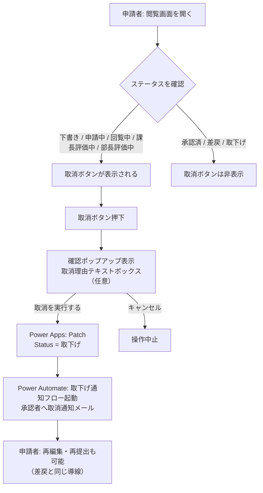
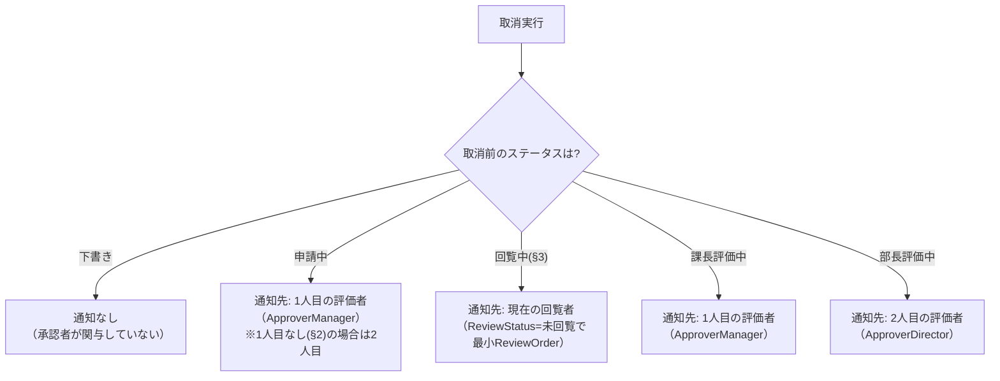
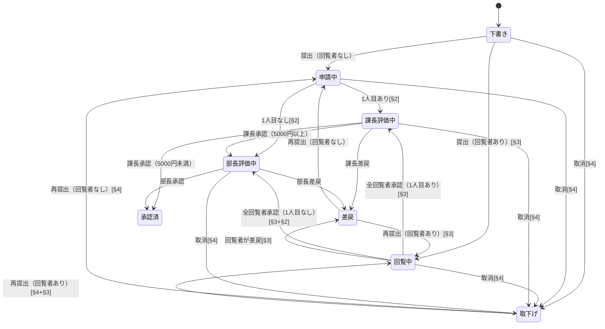

# 申請取消機能

## 概要

申請者が回覧中・評価待ちの申請を自ら取り消せる機能を追加する。v1の取下げ（下書き・申請中のみ）を拡張し、「回覧中」「課長評価中」「部長評価中」からも取消可能にする。

取消操作はPower Appsの閲覧画面から実行する。取消ボタン押下でステータスを「取下げ」に直接Patchし、Power Automateの取下げ通知フロー（フロー No.4）がトリガーで起動して承認者へ通知メールを送信する。取消後は差戻と同じ導線で再編集・再提出が可能。

## 設計判断

本提案の設計は以下の判断に基づく。

### DJ-1: 取消理由の入力 — 任意入力

取消ボタン押下時にテキストボックスを表示するが、空でも取消可能とする。

- **選定理由**: 必須にすると取消操作のハードルが上がる。一方、理由を書きたいケースもあるため入力欄は用意する
- 取消理由はメール通知の本文に差し込む。入力がない場合は「（理由なし）」と表示

### DJ-2: 取消後の再提出 — 可能

取消後の申請は差戻と同じ導線で再編集・再提出が可能とする。

- **選定理由**: 取消＝間違いに気づいた・修正したいというケースが多く、再提出できないと新規申請が必要になり手間が増える
- ステータスが「取下げ」のレコードに対して申請フォームを編集モードで開き、修正後に再提出できる
- 再提出時のステータス遷移は差戻→再提出と同じ（「申請中」に戻る。回覧者がいる場合は「回覧中」に直接遷移）
- 既存の評価データは保持し、再提出時は課長（1人目の評価者）から再評価

### DJ-3: 取消理由のSharePoint保存 — メール通知のみ（SP非保存）

§3（回覧者）の差戻コメントと同方針で、取消理由はメール本文にのみ記載し、SharePointリストへの永続保存は行わない。

- **選定理由**: 差戻コメントも同方針（§3 DJ-7）であり、操作体験とデータ管理を統一する
- §7-5（承認履歴リスト）の実装時にコメント保存対応を追加する余地を残す

### DJ-4: 取消操作の確認ポップアップ — あり

提出・承認・差戻と操作体験を統一するため、取消ボタン押下時に確認ポップアップを表示する。

- ポップアップ内に取消理由テキストボックスを配置
- 「取消を実行する」「キャンセル」の2ボタン構成
- 既存の確認ポップアップ（提出・承認・差戻）と同じUIパターンを使用

### DJ-5: 本人確認ロジック — 閲覧画面の評価結果表示と同じ判定を再利用

取消ボタンの表示条件に `User().Email = ApplicantEmail`（テストモード時は `gCurrentEmail = ApplicantEmail`）を使用する。

- **選定理由**: 閲覧画面 [v10.2] の評価結果セクション表示制限と同じ判定条件。新規ロジック不要
- 申請者本人以外は取消ボタンが非表示になるため、権限制御として十分

### DJ-6: 評価データの扱い — 保持（削除しない）

取消時に既に入力済みの評価データがある場合、削除せず保持する。

- **選定理由**: 差戻再提出と同方針。評価データは参考記録として残し、再提出時は課長（1人目の評価者）から再評価を開始する
- 評価データリストのレコード自体は変更しない

### DJ-7: ステータス名 — 既存の「取下げ」を維持

Status列の選択肢は既存の「取下げ」をそのまま使用する。ボタンラベルは「取消」と表示し、内部ステータス名との差異はUI層で吸収する。

- **選定理由**: 新規ステータスを追加すると既存フロー・画面の条件分岐に影響が広範囲に及ぶ。「取下げ」の意味は「申請者による取り消し」であり、概念として一致する

### DJ-8: Embeddedモード時の取消ボタン — 非表示

評価画面に組み込まれた閲覧画面（Embeddedモード）では取消ボタンを非表示にする。

- **選定理由**: 評価画面は評価者（課長・部長・回覧者）が操作する画面であり、申請者の取消操作は不適切。閲覧画面をViewモードで直接開いた場合のみ取消ボタンを表示する

### DJ-9: 競合状態 — 運用上許容

取消操作と評価操作が同時に行われた場合（例: 申請者が取消ボタンを押した直後に課長が承認ボタンを押す）の競合状態は、発生頻度が極めて低いため運用上許容する。

- SharePointのPatch操作は後勝ち（最後に更新した方が反映される）
- 万が一発生した場合は管理者が手動でステータスを修正する

## 業務フロー

### 取消操作のフロー



### 取消時の通知先



> **§2（評価者変更）との連携**: 1人目の評価者がなし（ApproverManagerが空）の場合、「申請中」からの取消では2人目の評価者（ApproverDirector）に通知する。フロー内でApproverManagerの空判定を行う。

> **§3（回覧者）との連携**: 「回覧中」ステータスからの取消では、回覧者リストからReviewStatus=「未回覧」かつ最小ReviewOrderのレコードを取得し、その回覧者に通知する。

## ステータス遷移

v2全機能（§2評価者変更 + §3回覧者 + §4申請取消）を統合したステータス遷移図。



### 取消可能ステータス一覧

| ステータス | v1（取下げ） | v2（申請取消） | 取消時の通知先 |
|-----------|-------------|---------------|-------------|
| 下書き | ○ | ○ | なし |
| 申請中 | ○ | ○ | 1人目の評価者（1人目なし時は2人目） |
| 回覧中 | -- | ○（新規） | 現在の回覧者（§3） |
| 課長評価中 | x | ○（新規） | 1人目の評価者 |
| 部長評価中 | x | ○（新規） | 2人目の評価者 |
| 承認済 | x | x | -- |
| 差戻 | x | x（再編集可能なため不要） | -- |
| 取下げ | -- | x（再提出で対応） | -- |

## リスト設計

### 改善提案メイン リスト — 変更なし

既存の列構成をそのまま使用する。新規列の追加は不要。

| 列名 | 内部名 | 型 | §4での扱い |
|------|-------|---|-----------|
| ステータス | Status | 選択肢 | 既存の「取下げ」をそのまま使用。選択肢の追加なし |

> **取消理由列を追加しない理由**: DJ-3の決定により、取消理由はメール通知のみ。§7-5（承認履歴リスト）のHistoryComment列で将来対応する。

### その他リスト — 変更なし

評価データ、改善メンバー、改善分野実績、回覧者（§3）、社員マスタ、改善分野マスタ、表彰区分マスタはいずれも変更なし。

- **評価データ**: 取消時に削除しない（DJ-6）。レコードはそのまま保持
- **回覧者リスト（§3）**: 取消時にReviewStatusの更新は行わない。再提出時に§3の既存ロジック（全件削除→再作成）で対応

## 画面設計

### 閲覧画面 — 変更箇所

#### 取消ボタンの追加

閲覧画面のアクション領域（ステータスバッジ・承認者情報の下）に取消ボタンを追加する。

**取消ボタンの表示条件**:

```
// 取消ボタンの表示条件（Visible プロパティ）
// 条件1: 申請者本人であること
// 条件2: 取消可能なステータスであること
// 条件3: Viewモードであること（Embeddedモードでは非表示）

And(
    If(
        gTestMode,
        gCurrentEmail = varViewRecord.ApplicantEmail.Email,
        User().Email = varViewRecord.ApplicantEmail.Email
    ),
    varViewRecord.Status.Value in ["下書き", "申請中", "回覧中", "課長評価中", "部長評価中"],
    varViewMode = "View"
)
```

> **Embeddedモード判定**: 評価画面から組み込まれた閲覧画面では `varViewMode = "Embedded"` が設定される。Viewモードでのみ取消ボタンを表示する。

#### 確認ポップアップ

取消ボタン押下時に確認ポップアップを表示する。既存の提出・承認・差戻ポップアップと同じUIパターン。

```
┌───────────────────────────────────┐
│  申請を取り消しますか？             │
│                                     │
│  取消理由（任意）:                  │
│  ┌─────────────────────────────┐  │
│  │                             │  │
│  │                             │  │
│  └─────────────────────────────┘  │
│                                     │
│  [キャンセル]    [取消を実行する]   │
└───────────────────────────────────┘
```

#### 取消実行処理（btnCancel.OnSelect）

Power Appsトリガーフロー方式を採用する。Power Appsから直接フローを起動し、取消理由・取消前ステータスをパラメータとして渡す。

> **spec/flows.mdとの差異**: spec/flows.md（5.1フロー一覧）ではフロー No.4のトリガーが「Lists項目変更時（ステータス=取下げ）」と定義されているが、取消理由をパラメータで渡す必要があるため「Power Appsトリガー」に変更する。spec/マージ時にflows.mdのトリガー定義を更新すること。

```
// 擬似コード: 取消実行処理

// 1. 取消理由を変数に保存（フロー通知用）
Set(varCancelReason, txtCancelReason.Value);

// 2. 取消前ステータスを変数に退避（Patch後にvarViewRecordが更新される可能性があるため）
Set(varPreviousStatus, varViewRecord.Status.Value);

// 3. ステータスを「取下げ」に更新
Patch(
    改善提案メイン,
    varViewRecord,
    {
        Status: {Value: "取下げ"}
    }
);

// 4. フローを直接起動（下書きの場合はスキップ — 承認者が関与していないため通知不要）
If(
    varPreviousStatus <> "下書き",
    取下げ通知フロー.Run(
        varViewRecord.RequestID,
        varCancelReason,
        varPreviousStatus
    )
);

// 5. 完了通知
Notify("申請を取り消しました。", NotificationType.Success);

// 6. ポップアップを閉じる
Set(varShowCancelPopup, false);
```

### 閲覧画面 — レイアウト

```
┌────────────────────────────────────────────────────┐
│ 閲覧画面                                            │
│ ┌────────────────────────────────────────────────┐ │
│ │ 申請内容表示（既存）                            │ │
│ │ リクエストID / 申請者情報 / 表彰区分 / ...     │ │
│ │ 改善テーマ / 問題点 / 改善内容 / ...           │ │
│ │ 改善前後画像 / 添付ファイル / ...              │ │
│ ├────────────────────────────────────────────────┤ │
│ │ 評価結果セクション（申請者本人のみ表示）       │ │
│ ├────────────────────────────────────────────────┤ │
│ │ ステータスバッジ / 承認者情報                   │ │
│ ├────────────────────────────────────────────────┤ │
│ │ ★ [取消] ボタン                                │ │
│ │ （申請者本人 + 取消可能ステータス + Viewモード）│ │
│ └────────────────────────────────────────────────┘ │
└────────────────────────────────────────────────────┘
```

### 申請フォーム — 変更箇所

取下げ状態からの再編集・再提出に対応する。

- v1では「差戻」ステータスのレコードのみ編集モードで開くことが可能
- §4で「取下げ」ステータスのレコードも編集モードで開けるよう条件を追加

```
// 編集モードの表示条件（既存の差戻 + 取下げを追加）
varViewRecord.Status.Value in ["差戻", "取下げ"]
```

- 再提出時のステータス遷移は差戻→再提出と同一ロジック（回覧者の有無で「申請中」or「回覧中」に遷移）
- 既存のbtnSubmit.OnSelect（提出処理）に変更は不要。差戻→再提出と同じパスで処理される
- **回覧者コレクション復元**: 取下げからの再編集時、回覧者コレクション（colReviewers）の読み込みロジックにも「取下げ」ステータスの条件追加が必要。§3の差戻後の回覧者復元ロジックと同じ処理を「取下げ」時にも適用する

### 評価画面 — 変更なし

評価画面自体には変更なし。Embeddedモードで組み込まれた閲覧画面の取消ボタンがDJ-8により非表示になるため、評価者が誤って取消を実行する心配はない。

## フロー設計

### 取下げ通知フロー（フロー No.4）

| 項目 | 内容 |
|------|------|
| フロー名 | 取下げ通知フロー |
| トリガー | Power Appsから（Power Appsトリガー） |
| 入力パラメータ | RequestID（テキスト）、CancelReason（テキスト）、PreviousStatus（テキスト） |

#### フロー詳細

| ステップ | アクション | 詳細 |
|---------|-----------|------|
| 1 | トリガー: Power Appsから | パラメータ: RequestID, CancelReason, PreviousStatus |
| 2 | 項目の取得 | 改善提案メインリストからRequestIDで取得 |
| 3 | 通知先の判定 | PreviousStatusパラメータに基づき通知先を決定（下記参照） |
| 4 | メール送信 | 通知先へ取下げ通知メール（取消理由付き） |

#### 通知先判定ロジック

フローのステップ3で、Power Appsから渡されたPreviousStatus パラメータに基づいて通知先を判定する。

> **注意**: Power Appsトリガー方式では、フロー起動時点でステータスは既に「取下げ」に更新済み。取消前ステータスはPower Apps側でPatch前に変数退避し、パラメータとして渡す（btnCancel.OnSelectのステップ2・4を参照）。

| PreviousStatus | 通知先 | 備考 |
|----------------|--------|------|
| 申請中 | ApproverManager（空ならApproverDirector） | §2: 1人目なしの場合は2人目に通知 |
| 回覧中 | 回覧者リストから現在の回覧者を取得（ReviewStatus=未回覧 かつ 最小ReviewOrder） | §3: 直列方式のため通常1名。エッジケースで複数の未回覧者が存在する場合も最小ReviewOrderの1名のみに通知する（直列方式では処理中の回覧者は常に1名のため） |
| 課長評価中 | ApproverManager | — |
| 部長評価中 | ApproverDirector | — |

> **「下書き」はフロー呼び出し対象外**: btnCancel.OnSelectで `varPreviousStatus <> "下書き"` の条件分岐によりフローは起動されない。

### メールテンプレート

| 項目 | 内容 |
|------|------|
| テンプレートファイル | `powerautomate/3-4_取下げ通知.html` |
| 宛先 | 通知先（上記判定による） |
| 件名 | 【改善提案】取下げ通知: {テーマ} |
| 本文に含む情報 | 申請者名、テーマ、取消理由（空の場合「（理由なし）」）、申請内容閲覧リンク |

メール本文のリンク:

| リンクテキスト | リンク先画面 | URLパラメータ |
|--------------|-------------|-------------|
| 申請内容を確認する | 閲覧画面 | `?RequestID={RequestID}` |

> **URL形式**: `https://apps.powerapps.com/play/{AppID}?RequestID={RequestID}`。`{AppID}` はPower Appsアプリ公開後に確定。

## 既存機能への影響

### 影響あり

| 対象 | 影響内容 | 対応 |
|------|---------|------|
| **閲覧画面** | 取消ボタン・確認ポップアップの追加 | 画面YAMLに取消ボタン・ポップアップコントロールを追加 |
| **申請フォーム** | 取下げステータスからの編集モード開放 | 編集モード条件に「取下げ」を追加 |
| **spec/flows.md** | フロー No.4の詳細定義 | 提案プランから正式仕様へ昇格 |
| **spec/screens.md** | 閲覧画面に取消ボタンの記述追加 | 画面設計に取消機能を追加 |
| **spec/overview.md** | ステータス遷移表の更新 | 取下げの遷移条件を拡張 |
| **メールテンプレート** | 取下げ通知メールの新規作成 | `powerautomate/3-4_取下げ通知.html` を作成 |

### 影響なし

| 対象 | 理由 |
|------|------|
| **リスト設計（lists.md）** | 新規列追加なし。ステータス選択肢も既存の「取下げ」を使用。**ただしStatus列の説明文を更新する必要あり**: 「取下げは「下書き」「申請中」時のみ可」→「取下げは「下書き」「申請中」「回覧中」「課長評価中」「部長評価中」時に可」 |
| **評価画面** | 変更なし（Embeddedモードで取消ボタン非表示） |
| **申請通知フロー（No.1）** | 変更なし |
| **課長承認フロー（No.2）** | 変更なし |
| **部長承認フロー（No.3）** | 変更なし |
| **評価ロジック（evaluation.md）** | 変更なし |
| **権限設計（security.md）** | 変更なし。申請者本人のみ取消可能はPower Apps側で制御 |

### §2（評価者変更）との接続ポイント

- 1人目の評価者がなし（ApproverManagerが空）の場合:
  - 「申請中」からの取消 → 通知先は2人目の評価者（ApproverDirector）
  - フロー内でApproverManagerの空判定を行い、通知先を切り替える
- 取消後の再提出時、評価者設定は申請フォームの評価者セクション（§2）から再設定可能

### §3（回覧者）との接続ポイント

- 「回覧中」ステータスからの取消:
  - 通知先は回覧者リストからReviewStatus=「未回覧」かつ最小ReviewOrderのレコード
  - 既に承認済みの回覧者には通知しない
- 取消後の再提出時、回覧者リストの扱いは§3の既存ロジック（全件削除→再作成）に従う

## 移行手順への影響

### Power Automateフロー

- **取下げ通知フロー（No.4）の新規作成**: Power Appsトリガーのフローを新規作成する
- `a_project/migration/deployment-guide.md` にフロー No.4の構築手順を追加する必要あり

### Power Apps Studio手作業

- 閲覧画面に取消ボタン・確認ポップアップを追加（YAML定義 + Code View貼り付け）
- 申請フォームの編集モード条件に「取下げ」を追加
- 取下げ通知フローとの接続（Power Apps → フロー起動の設定）
- `a_project/migration/ui-manual-2-7.md` に手作業手順を追記する必要あり

### PnPスクリプト

- リスト設計に変更がないため、`scripts/` 配下のスクリプト変更は不要
