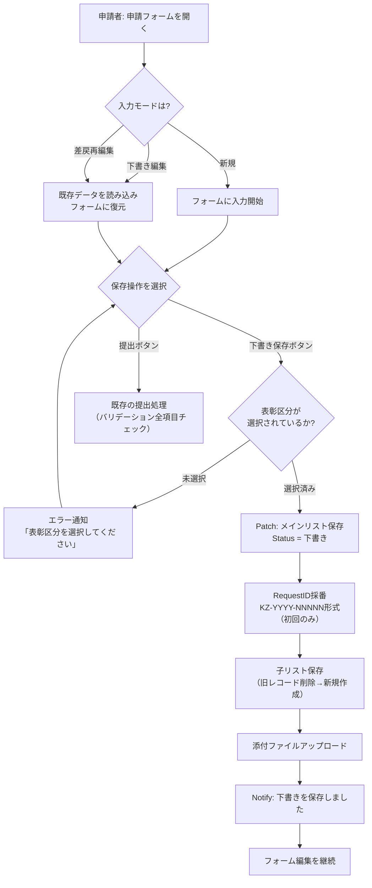
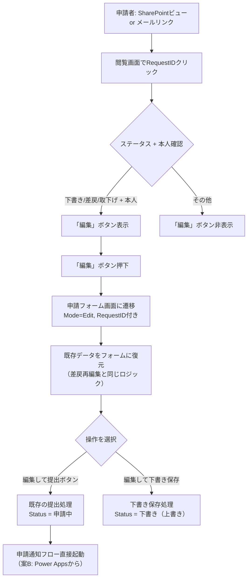
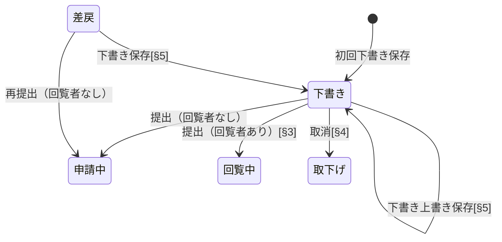
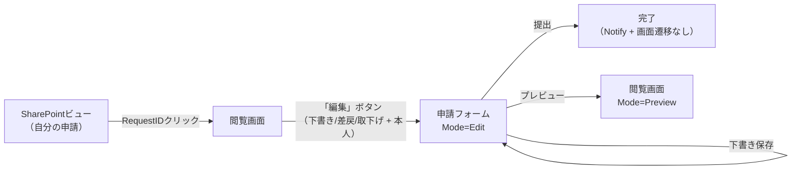

# 下書き保存機能

## 概要

申請フォームで入力途中の内容を一時保存（下書き保存）できる機能を追加する。v1で「下書き」ステータスは既に定義済みだが、保存UIが存在しないため実質的に利用不可であった。本機能により、申請者は入力途中で中断し、後から続きを入力して正式提出できるようになる。

下書き保存は既存の提出処理ロジックをベースに、ステータスを「下書き」にして保存する。子リスト（改善メンバー・改善分野実績）や添付ファイルも同時に保存する。下書き一覧は新しい画面を作らず、既存のSharePointリストビュー + Column Formatting + 閲覧画面の「編集」ボタンで実現する。

## 設計判断

### DJ-1: 下書き保存時のバリデーション方針 — 表彰区分のみ必須

下書き保存時は表彰区分のみを必須とし、他の入力項目はすべてスキップする。

- **選定理由**: 表彰区分は改善提案メインリストの選択肢型列でSP側に必須制約がかかっている。また、表彰区分が決まっていないと改善分野の入力UIが成立しない（表彰区分によって表示内容が変わる）ため、最低限の必須項目として妥当
- SP側の必須制約がある列（ApplicantEmail, ApplicantGID, ApplicantName, Department等）はログインユーザーから自動取得されるため、下書き保存時でも値が入る
- Theme, Problem, Improvement等のテキスト列はSP側で必須制約がかかっている場合、Patchで空文字列 `""` を送信して回避する（空文字列はSP上で「値あり」として扱われる）

### DJ-2: 下書き一覧の表示場所・編集導線 — 閲覧画面に編集ボタン追加方式

下書き一覧専用画面は作らない。既存の導線を活用する。

- SharePointリストビューのColumn Formattingリンク → 閲覧画面に遷移（既存のv10.1導線を活用）
- 閲覧画面で「申請者本人 かつ ステータスが下書き or 差戻 or 取下げ」の場合のみ「編集」ボタンを表示
- 「編集」ボタン押下 → 申請フォーム画面に `Mode=Edit`, `RequestID` 付きで遷移
- **選定理由**: 新しい画面を追加せず、既存の閲覧画面とSharePointビューを再利用することで実装コストを抑える。§4（申請取消）で閲覧画面にボタンを追加する方針と一致

### DJ-3: 差戻後の再編集中の下書き保存 — 可能

差戻状態のレコードを編集中に下書き保存した場合、ステータスを「下書き」に変更する。再提出（提出ボタン押下）で「申請中」に戻り、通常の承認フローに復帰する。

- **選定理由**: 差戻後に大幅な修正が必要な場合、一度で修正が完了しないケースがある。途中保存できないと最初からやり直しになり、ユーザー体験が悪い
- ステータスが「下書き」に変わっても、既存の評価データは保持する（提出ロジックで評価データの削除は行わないため）
- ステータス変更により差戻コメントの文脈が読み取りにくくなるが、差戻コメントはメール通知のみでSPリストに保存していない（§3 DJ-7 / §4 DJ-3準拠）ため、実質的な情報喪失はない

### DJ-4: 改善メンバー・改善分野実績の下書き保存方式 — 子リストも全件保存

下書き保存時にも子リスト（改善メンバー・改善分野実績）を保存する。保存方式は提出時と同じ「旧レコード全件削除→新規作成」ロジックを再利用する。

- **選定理由**: 提出ロジック（submit-logic.pfx）のStep 1.6〜Step 3を再利用でき、新規ロジックの開発が不要。子リストが空の場合はForAllが空集合に対して実行されるだけで問題ない

### DJ-5: 添付ファイルの下書き保存 — 下書き保存時もアップロード

下書き保存時にも添付ファイルをSharePointドキュメントライブラリにアップロードする。差戻再編集の既存ファイル読み込みロジック（colAttachmentsへのClearCollect）を再利用する。

- **選定理由**: 添付ファイルはBase64でメモリに保持されるため、大量にメモリを消費する。早めにアップロードしてメモリを解放する方が安定動作する
- 既存のアップロードロジック（Step 3.5: `ContentBase64`が空の既存ファイルはスキップ、新規追加分のみアップロード）がそのまま使える
- 下書き編集時の既存ファイル復元は、差戻再編集の既存ロジック（知見: `差戻再提出（編集モード）でデータが表示されない問題パターン`）を再利用

### DJ-6: 下書きの有効期限 — 初期リリースでは自動削除なし

下書きの自動削除機能は初期リリースでは実装しない。運用開始後に必要性を判断してから検討する。

- **選定理由**: 15,000人規模で下書きレコードが大量に残るリスクはあるが、年間数百件の申請規模であれば当面問題にならない。自動削除の仕組み（Power Automateスケジュールフロー等）は後から追加可能

### DJ-7: 保存完了通知UI — Notifyのみ

下書き保存完了時は `Notify("下書きを保存しました")` のみ表示。画面遷移は行わず、そのまま編集を継続できる。

- **選定理由**: 下書き保存の目的は「途中保存」であり、保存後も引き続き入力を続けるのが自然な操作フロー。画面遷移が入ると再度データを読み込む必要があり、操作が煩雑になる

### DJ-8: 下書き保存ボタン配置 — 提出ボタンの左にセカンダリスタイル

下書き保存ボタンは提出ボタンの左に配置し、セカンダリスタイル（目立たない色）にする。

- **選定理由**: 提出ボタンがプライマリアクション（最も重要な操作）であり、下書き保存はセカンダリアクション。視覚的な優先度を下げることで、誤って下書き保存してしまうリスクを低減する
- ボタンの配置順: `[下書き保存（セカンダリ）] [提出（プライマリ）]`

### DJ-9: RequestIDの採番方式 — Power Apps側でKZ形式を直接生成

案B（申請通知フローのPower Appsトリガー化）に伴い、RequestIDの採番をPower Automateから**Power Apps側に移管**する。初回保存時（下書き or 提出）にKZ形式の正式番号を即座に生成する。

- **選定理由**: 案Bによりフローのトリガーが「項目作成時」→「Power Appsから直接起動」に変わるため、フロー側での採番が不要になる。Power Apps側で統一的に採番することで、下書き状態でもKZ形式のRequestIDが表示され、利用者の混乱を防ぐ
- 採番式: `"KZ-" & Text(Year(Now())) & "-" & Text(varNewRequest.ID, "00000")`
- 採番タイミング: 初回Patch直後（下書き保存 or 新規提出）
- **spec/lists.mdへの反映**: RequestID列の説明を「Power Automateで生成」→「Power Appsで初回保存時に生成」に更新する

### DJ-10: 申請通知フローのトリガー方式 — 案B: Power Appsからフロー直接起動

申請通知フロー（No.1）のトリガーを「Lists項目作成時（ステータス=申請中）」から「Power Appsから直接起動」に変更する。

- **背景**: 下書き保存を導入すると「新規→下書き→提出」のパスで「項目変更」になり、既存の「項目作成時」トリガーでは申請通知フローが起動しない
- **選定理由**:
  1. §4（取消通知）もPower Appsトリガー方式を採用しており、方式を統一できる
  2. 「項目作成時」トリガーとの併存が不要になり、二重通知のリスクがない
  3. Power Apps側で通知の要否を明示的に制御できる
- **変更内容**:
  - 申請通知フローのトリガーを「Power Appsから」に変更
  - 提出ボタン（btnSubmit.OnSelect）のStep 3.5の後、Step 4（クリーンアップ）の前に `申請通知フロー.Run(varEditRequestID)` を追加
  - 下書き保存ボタン（btnDraftSave.OnSelect）ではフロー起動なし
  - 既存の「項目作成時（ステータス=申請中）」トリガーは削除
  - §3回覧者ありの場合: ステータスが「回覧中」になるパスでは回覧通知フロー（§3で追加）が起動し、申請通知フローは起動しない。提出ロジック内で `If(回覧者あり, 回覧通知フロー.Run(...), 申請通知フロー.Run(...))` の分岐を行う

## 業務フロー

### 下書き保存のフロー



### 下書きからの正式提出フロー



### ステータス遷移（§5追加分）



> **補足**: 上記は§5が追加するステータス遷移のみ。「差戻→下書き」と「下書き→下書き（上書き）」が新規追加分。

## リスト設計

### 改善提案メイン リスト — 変更なし

既存の列構成をそのまま使用する。新規列の追加は不要。

| 列名 | 内部名 | 型 | §5での扱い |
|------|-------|---|-----------|
| ステータス | Status | 選択肢 | 既存の「下書き」をそのまま使用。選択肢の追加なし |
| リクエストID | RequestID | 1行テキスト | 採番方式を変更（DJ-9）。列定義自体は変更なし |

> **必須列への対応**: SP側で必須制約がある列でも、ログインユーザーから自動取得される列（ApplicantEmail, ApplicantGID, ApplicantName, Department等）は下書き保存時にも値が入る。手入力必須列（Theme, Problem, Improvement, CompletionDate）は下書き保存時に空文字列 `""` またはデフォルト値で保存し、正式提出時のバリデーションで必須チェックを行う。

#### SP必須列 vs 下書き保存の対応表

| 列名 | 必須 | 下書き保存時の値 | 備考 |
|------|------|----------------|------|
| ApplicantEmail | ○ | ログインユーザーから自動取得 | 常に値あり |
| ApplicantGID | ○ | 社員マスタ逆引きで自動取得 | 常に値あり |
| ApplicantName | ○ | 社員マスタから自動取得 | 常に値あり |
| AwardCategory | ○ | **DJ-1: 必須（未選択時はエラー）** | 表彰区分は下書きでも必須 |
| Department | ○ | 社員マスタから自動取得 | 常に値あり |
| Theme | ○ | 未入力時は空文字列 `""` | SP上は「値あり」扱い |
| Problem | ○ | 未入力時は空文字列 `""` | SP上は「値あり」扱い |
| Improvement | ○ | 未入力時は空文字列 `""` | SP上は「値あり」扱い |
| CompletionDate | ○ | 未入力時は `Today()` | 仮の日付。正式提出時に修正可能 |
| Status | ○ | `"下書き"` | 固定値 |
| ApproverManager | ○ | 社員マスタから自動取得 | 常に値あり |
| ApproverDirector | — | 空の場合はPatchから除外 | **M-1対応**: 空メールはSPエラー |

### その他リスト — 変更なし

改善メンバー、改善分野実績、評価データ、添付ファイルドキュメントライブラリ、社員マスタ、改善分野マスタ、表彰区分マスタはいずれもスキーマ変更なし。

- **改善メンバー**: 下書き保存時も提出時と同じ全件削除→再作成。空の場合はForAllがスキップされるだけ
- **改善分野実績**: 同上
- **添付ファイル**: 下書き保存時もアップロード。既存ファイルはスキップ（ContentBase64判定）

## 画面設計

### 画面遷移図



### 閲覧画面 — 変更箇所

#### 「編集」ボタンの追加

閲覧画面のアクション領域（ステータスバッジ・承認者情報の下、§4取消ボタンと同じ領域）に「編集」ボタンを追加する。

**編集ボタンの表示条件**:

```
// 編集ボタンの表示条件（Visible プロパティ）
// 条件1: 申請者本人であること
// 条件2: 編集可能なステータスであること（下書き/差戻/取下げ）
// 条件3: Viewモードであること（Embeddedモードでは非表示）

And(
    If(
        gTestMode,
        gCurrentEmail = varViewRecord.ApplicantEmail.Email,
        User().Email = varViewRecord.ApplicantEmail.Email
    ),
    varViewRecord.Status.Value in ["下書き", "差戻", "取下げ"],
    varViewMode = "View"
)
```

> **§4統合**: 表示条件のステータスリストに「取下げ」を含める（§4 DJ-2: 取消後の再提出可能）。

**編集ボタンのOnSelect**:

```
// 申請フォームに編集モードで遷移
Set(varEditRequestID, varViewRecord.RequestID);
Navigate(ApplicationFormScreen, ScreenTransition.None)
```

> **§4（取消ボタン）との関係**: 取消ボタン（§4）と編集ボタン（§5）は同じアクション領域に並ぶ。下書きステータスでは両方表示される。差戻ステータスでも両方表示される。取下げステータスでも両方表示される（再編集も取消もできる）。配置は左から `[編集] [取消]` の順とする。

#### 閲覧画面のレイアウト（§4+§5統合後）

```
+----------------------------------------------------+
| 閲覧画面                                            |
| +------------------------------------------------+ |
| | 申請内容表示（既存）                            | |
| | リクエストID / 申請者情報 / 表彰区分 / ...     | |
| | 改善テーマ / 問題点 / 改善内容 / ...           | |
| | 改善前後画像 / 添付ファイル / ...              | |
| +------------------------------------------------+ |
| | 評価結果セクション（申請者本人のみ表示）       | |
| +------------------------------------------------+ |
| | ステータスバッジ / 承認者情報                   | |
| +------------------------------------------------+ |
| | [編集] ボタン [§5]    [取消] ボタン [§4]       | |
| | （下書き/差戻/取下げ   （取消可能ステータス     | |
| |   + 本人）              + 本人）                | |
| +------------------------------------------------+ |
+----------------------------------------------------+
```

### 申請フォーム — 変更箇所

#### 1. 下書き保存ボタンの追加

提出ボタンの左にセカンダリスタイルの下書き保存ボタンを追加する。

**ボタン配置**:

```
+----------------------------------------------------------+
| ボタン領域                                                 |
|   [下書き保存（セカンダリ）]    [提出（プライマリ）]       |
+----------------------------------------------------------+
```

**ボタンのプロパティ**:

| プロパティ | 値 | 備考 |
|-----------|-----|------|
| Control | `Button@0.0.45` | モダンボタン |
| Text | `"下書き保存"` | |
| Appearance | `='ButtonCanvas.Appearance'.Secondary` | セカンダリスタイル（グレー系） |
| Width | `=140` | |

#### 2. 下書き保存ロジック（btnDraftSave.OnSelect）

```
// ============================================================
// 下書き保存ボタン (btnDraftSave.OnSelect)
// 提出処理（btnSubmit.OnSelect）のロジックをベースに、
// Status="下書き"で保存し、バリデーションを最小限にする
// ============================================================

// --- Step 0: バリデーション（表彰区分のみ必須） ---
If(
    IsBlank(ddAwardCategory.Selected),
    Notify("表彰区分を選択してください。", NotificationType.Error),

    // --- Step 1: User型列用のメールアドレスを準備 ---
    Set(
        varApplicantEmail,
        If(gTestMode, gCurrentEmail, User().Email)
    );
    Set(
        varManagerEmail,
        If(
            gTestMode,
            gCurrentEmail,
            LookUp(社員マスタ, GID = gManagerGID).Email
        )
    );
    Set(
        varDirectorEmail,
        If(
            gTestMode,
            gCurrentEmail,
            LookUp(社員マスタ, GID = gDirectorGID).Email
        )
    );

    // --- Step 2: メイン提案をPatch ---
    // 編集モード: 既存レコードを更新 / 新規: 新しいレコードを作成
    // M-1対応: ApproverDirectorは空メールチェック
    Set(
        varNewRequest,
        Patch(
            改善提案メイン,
            If(
                !IsBlank(varEditRequestID),
                LookUp(改善提案メイン, RequestID = varEditRequestID),
                Defaults(改善提案メイン)
            ),
            {
                ApplicantEmail: {
                    '@odata.type': "#Microsoft.Azure.Connectors.SharePoint.SPListExpandedUser",
                    Claims: "i:0#.f|membership|" & varApplicantEmail,
                    Department: "",
                    DisplayName: "",
                    Email: varApplicantEmail,
                    JobTitle: "",
                    Picture: ""
                },
                ApplicantGID: gCurrentGID,
                ApplicantName: gCurrentName,
                ApplicantOffice: gCurrentEmployee.Office,
                ApplicantCostUnit: gCurrentEmployee.CostUnit,
                AwardCategory: {Value: ddAwardCategory.Selected.AwardName},
                Department: gCurrentDept,
                Division: gCurrentDivision,
                Bu: gCurrentBu,
                Section: gCurrentSection,
                Unit: If(IsBlank(txtUnit.Value), "", txtUnit.Value),
                Theme: If(IsBlank(txtTheme.Value), "", txtTheme.Value),
                Problem: If(IsBlank(txtProblem.Value), "", txtProblem.Value),
                Improvement: If(IsBlank(txtImprovement.Value), "", txtImprovement.Value),
                CompletionDate: If(
                    IsBlank(dpCompletionDate.SelectedDate),
                    Today(),
                    dpCompletionDate.SelectedDate
                ),
                TotalEffectAmount: Sum(colCategories, EffectAmount),
                Status: {Value: "下書き"},
                ApproverManager: {
                    '@odata.type': "#Microsoft.Azure.Connectors.SharePoint.SPListExpandedUser",
                    Claims: "i:0#.f|membership|" & varManagerEmail,
                    Department: "",
                    DisplayName: "",
                    Email: varManagerEmail,
                    JobTitle: "",
                    Picture: ""
                }
            }
        )
    );

    // --- Step 2.1: ApproverDirector（空メールガード: M-1対応） ---
    If(
        !IsBlank(varDirectorEmail),
        Patch(
            改善提案メイン,
            varNewRequest,
            {
                ApproverDirector: {
                    '@odata.type': "#Microsoft.Azure.Connectors.SharePoint.SPListExpandedUser",
                    Claims: "i:0#.f|membership|" & varDirectorEmail,
                    Department: "",
                    DisplayName: "",
                    Email: varDirectorEmail,
                    JobTitle: "",
                    Picture: ""
                }
            }
        )
    );

    // --- Step 2.5: RequestID設定（KZ形式、初回のみ: DJ-9） ---
    If(
        IsBlank(varEditRequestID),
        Set(varEditRequestID, "KZ-" & Text(Year(Now())) & "-" & Text(varNewRequest.ID, "00000"));
        Patch(改善提案メイン, varNewRequest, {RequestID: varEditRequestID})
    );

    // --- Step 3: 編集モード時は旧子レコードを削除 ---
    If(
        !IsBlank(varEditRequestID),
        ClearCollect(_tempOldMembers, Filter(改善メンバー, RequestID = varEditRequestID));
        ForAll(
            _tempOldMembers As oldRec,
            Remove(改善メンバー, oldRec)
        );
        ClearCollect(_tempOldCategories, Filter(改善分野実績, RequestID = varEditRequestID));
        ForAll(
            _tempOldCategories As oldRec,
            Remove(改善分野実績, oldRec)
        )
    );

    // --- Step 4: 改善メンバーリストへ登録 ---
    ForAll(
        colMembers,
        Patch(
            改善メンバー,
            Defaults(改善メンバー),
            {
                RequestID: varEditRequestID,
                MemberGID: ThisRecord.MemberGID,
                MemberName: ThisRecord.MemberName,
                MemberOffice: ThisRecord.MemberOffice,
                MemberCostUnit: ThisRecord.MemberCostUnit,
                SortOrder: ThisRecord.SortOrder
            }
        )
    );

    // --- Step 5: 改善分野実績リストへ登録 ---
    ForAll(
        colCategories,
        Patch(
            改善分野実績,
            Defaults(改善分野実績),
            {
                RequestID: varEditRequestID,
                CategoryCode: ThisRecord.CategoryCode,
                CategoryName: ThisRecord.CategoryName,
                ActualValue: ThisRecord.ActualValue,
                WIPAmount: ThisRecord.WIPAmount,
                ConversionRate: ThisRecord.ConversionRate,
                Comment: ThisRecord.Comment,
                Formula: ThisRecord.CategoryType,
                EffectAmount: ThisRecord.EffectAmount,
                SortOrder: ThisRecord.SortOrder
            }
        )
    );

    // --- Step 6: 添付ファイルアップロード ---
    ForAll(
        Filter(colAttachments, !IsBlank(ContentBase64)),
        改善WF_添付ファイルアップロード.Run(
            varEditRequestID,
            varEditRequestID & "_" & ThisRecord.Name,
            ThisRecord.ContentBase64,
            ThisRecord.Category
        )
    );

    // --- Step 7: 完了通知（画面遷移なし、編集継続） ---
    Notify("下書きを保存しました。", NotificationType.Success)
    // colCategories, colMembers, colAttachments はクリアしない（編集継続のため）
)
```

**提出ロジックとの主な差分**:

| 項目 | 提出（btnSubmit） | 下書き保存（btnDraftSave） |
|------|-----------------|------------------------|
| バリデーション | 全項目必須チェック | 表彰区分のみ |
| Status | `"申請中"` | `"下書き"` |
| 確認ポップアップ | あり | なし（即時保存） |
| SP必須テキスト列 | ユーザー入力値 | 空の場合は `""` で代替 |
| CompletionDate | ユーザー入力値（必須） | 未入力時は `Today()` |
| ApproverDirector | 常にPatch | 空メール時はスキップ（M-1対応） |
| 保存後の動作 | コレクションクリア + Notify | Notify のみ（編集継続） |
| varEditRequestID | 初回はなし→保存後クリア | 初回はなし→保存後セット（上書き用） |
| RequestID形式 | KZ-YYYY-NNNNN（DJ-9） | 同左 |
| 申請通知フロー | Power Appsから直接起動（DJ-10） | 起動しない |

#### 3. 提出ロジック（btnSubmit.OnSelect / submit-logic.pfx）への変更

案B（DJ-10）およびDJ-9の採用に伴い、既存の提出ロジックにも以下の変更が必要:

**変更1: Step 1.5 — RequestIDをKZ形式に変更**

```
// 変更前:
Patch(改善提案メイン, varNewRequest, {RequestID: Text(varNewRequest.ID)})

// 変更後（DJ-9）:
Set(varEditRequestID, "KZ-" & Text(Year(Now())) & "-" & Text(varNewRequest.ID, "00000"));
Patch(改善提案メイン, varNewRequest, {RequestID: varEditRequestID})
```

**変更2: Step 3.5の後 — 申請通知フロー直接起動を追加**

```
// --- Step 3.7: 申請通知フロー直接起動（DJ-10: 案B） ---
// §3回覧者ありの場合は回覧通知フローが代わりに起動
// ここでは回覧者なしの場合のみ申請通知フローを起動
// （§3実装時に条件分岐を追加）
申請通知フロー.Run(varEditRequestID);
```

> **§3統合時**: `If(CountRows(colReviewers) > 0, 回覧通知フロー.Run(varEditRequestID), 申請通知フロー.Run(varEditRequestID))` に変更

**変更3: Step 2 — ApproverDirectorの空メールガード追加（M-1対応）**

提出ロジック側にも同様のApproverDirector空メールガードを追加する。

> **コード同期ルール**: submit-logic.pfx と screen-application-form.yaml の btnSubmit.OnSelect の両方に上記変更を反映すること。

#### 4. 編集モードの条件拡張

現在の差戻再編集の条件に「下書き」「取下げ」を追加する。

```
// 編集モードで開ける条件（§4+§5統合後）
// OnVisible等でvarEditRequestIDをセットする際の条件
varViewRecord.Status.Value in ["下書き", "差戻", "取下げ"]
```

#### 5. 下書き編集時のデータ復元

下書きレコードの編集時は、差戻再編集と同じデータ復元ロジックを使用する。

**復元対象**:
- メインリストのフィールド → フォームコントロールの初期値に設定
- 改善メンバー → `ClearCollect(colMembers, Filter(改善メンバー, RequestID = varEditRequestID))`
- 改善分野実績 → `ClearCollect(colCategories, Filter(改善分野実績, RequestID = varEditRequestID))`
- 添付ファイル → `ClearCollect(colAttachments, ...)` + `ContentBase64: ""` マーカー（知見: 差戻再提出の問題パターン3,4を参照）

> **注意**: 差戻再編集のデータ復元ロジックは既に実装済みであり、下書き編集でも同じコードパスが使える。追加実装は不要で、OnVisibleの分岐条件に「下書き」を加えるだけで対応可能。

#### 6. 確認ポップアップの変更

下書き保存は確認ポップアップなしで即時保存する。提出ボタンの確認ポップアップには変更なし。

#### 7. §3回覧者リストの下書き保存（M-2対応）

§3（回覧者）が実装された場合、下書き保存時に回覧者リストも保存する。メンバー・分野実績と同じ「全件削除→再作成」方式を適用する。

```
// 下書き保存ロジックに追加（§3実装後）
// 旧回覧者を削除
ClearCollect(_tempOldReviewers, Filter(回覧者, RequestID = varEditRequestID));
ForAll(_tempOldReviewers As oldRec, Remove(回覧者, oldRec));
// 新規登録
ForAll(colReviewers, Patch(回覧者, Defaults(回覧者), {RequestID: varEditRequestID, ...}));
```

### SharePointリストビュー — 変更なし

v10.1で作成済みの「自分の申請」ビューにはフィルタ `ApplicantEmail = [Me]` が設定されており、下書きステータスのレコードも自動的に表示される。ビュー自体の変更は不要。

Column Formattingも既存のリンク（閲覧画面への遷移）がそのまま使えるため変更不要。

## フロー設計

### 申請通知フロー（No.1） — トリガー変更（DJ-10）

| 項目 | 変更前（v1） | 変更後（§5） |
|------|------------|------------|
| トリガー | Lists項目作成時（ステータス=申請中） | **Power Appsから直接起動** |
| RequestID採番 | フロー内で KZ形式に変換 | **削除**（Power Apps側で採番済み: DJ-9） |
| 起動元 | SPの項目作成イベント | btnSubmit.OnSelect内で `申請通知フロー.Run(varEditRequestID)` |

**変更後のフロー処理ステップ**:

| ステップ | アクション | 詳細 |
|---------|-----------|------|
| 1 | トリガー: Power Appsから | パラメータ: RequestID |
| ~~2~~ | ~~RequestID設定~~ | ~~削除: Power Apps側で採番済み~~ |
| 2 | メイン項目取得 | RequestIDで改善提案メインをLookUp |
| 3 | 承認者取得 | 社員マスタから課長GID→課長メールを取得。課長=申請者の場合は部長GIDを取得 |
| 4 | 条件分岐: 課長=申請者? | 課長本人の場合→部長へ承認依頼、それ以外→課長へ承認依頼 |
| 5 | メール送信 | 承認依頼メール（テーマ、申請者名、リンク付き） |

### 課長承認フロー（No.2）、部長承認フロー（No.3） — 変更なし

評価データリストのトリガーであり、下書き保存とは無関係。

## 既存機能への影響

### 影響あり

| 対象 | 影響内容 | 対応 |
|------|---------|------|
| **申請フォーム** | 下書き保存ボタン追加、下書き保存ロジック追加 | 画面YAMLに下書き保存ボタンを追加、OnSelectに下書き保存ロジックを実装 |
| **申請フォーム** | 編集モード条件に「下書き」「取下げ」追加 | OnVisibleの条件分岐に「下書き」「取下げ」を追加 |
| **閲覧画面** | 「編集」ボタン追加 | 画面YAMLに編集ボタンを追加、OnSelectで申請フォームに遷移 |
| **提出ロジック（submit-logic.pfx + btnSubmit.OnSelect）** | RequestID採番をKZ形式に変更（DJ-9）+ フロー直接起動追加（DJ-10）+ ApproverDirector空メールガード（M-1） | submit-logic.pfxとscreen-application-form.yamlの両方を更新（コード同期ルール） |
| **申請通知フロー（No.1）** | トリガー変更 + RequestID採番ステップ削除 | 「項目作成時」→「Power Appsから」に変更 |
| **spec/lists.md** | RequestID列の説明更新 | 「Power Automateで生成」→「Power Appsで初回保存時に生成」 |
| **spec/flows.md** | 申請通知フローのトリガー方式変更 | トリガーをPower Appsトリガーに更新 |
| **spec/screens.md** | 閲覧画面に編集ボタンの記述追加 | 画面設計に下書き編集導線を追加 |

### 影響なし

| 対象 | 理由 |
|------|------|
| **リスト設計（スキーマ）** | 新規列追加なし。ステータス選択肢も既存の「下書き」を使用 |
| **評価画面** | 変更なし |
| **課長承認フロー（No.2）** | 変更なし |
| **部長承認フロー（No.3）** | 変更なし |
| **評価ロジック（evaluation.md）** | 変更なし |
| **権限設計（security.md）** | 変更なし |

### 他の開発中提案との関係

| 提案 | 関係 | 備考 |
|------|------|------|
| §1（添付ファイル多形式対応） | 低 | 添付ファイルのアップロードロジックは共通だが、ファイル形式の制限は§1側の実装。§5の下書き保存ロジックでは§1の制約を自動的に引き継ぐ |
| §2（評価者変更） | なし | 下書きステータスでは評価者は未確定。提出時に確定するため§2とは干渉しない |
| §3（回覧者） | 中 | 下書き保存時に回覧者リストも保存する方針（M-2対応）。§3実装時に下書き保存ロジックに回覧者の保存・復元処理を追加する。提出時のフロー起動分岐（申請通知 vs 回覧通知）も§3統合時に対応 |
| §4（申請取消） | 中 | 閲覧画面のアクション領域に「編集」ボタン（§5）と「取消」ボタン（§4）が並ぶ。編集ボタン表示条件に「取下げ」を含め、§4の「取消後再編集」と統合 |

## 移行手順への影響

### Power Apps Studio手作業

- 申請フォームに下書き保存ボタンを追加（YAML定義 + Code View貼り付け）
- 申請フォームの下書き保存ロジック（btnDraftSave.OnSelect）を設定
- 閲覧画面に「編集」ボタンを追加（YAML定義 + Code View貼り付け）
- 申請フォームの編集モード条件に「下書き」「取下げ」を追加
- 提出ロジック（btnSubmit.OnSelect）の変更: RequestID KZ形式採番 + フロー直接起動 + 空メールガード
- 申請通知フローとの接続設定（Power Apps → フロー起動）
- `a_project/migration/ui-manual-2-7.md` に手作業手順を追記する必要あり

### Power Automateフロー

- 申請通知フローのトリガーを「Power Appsから」に変更
- 申請通知フローからRequestID採番ステップを削除
- `a_project/migration/deployment-guide.md` にフロートリガー変更手順を追記する必要あり

### PnPスクリプト

- リスト設計に変更がないため、`scripts/` 配下のスクリプト変更は不要
