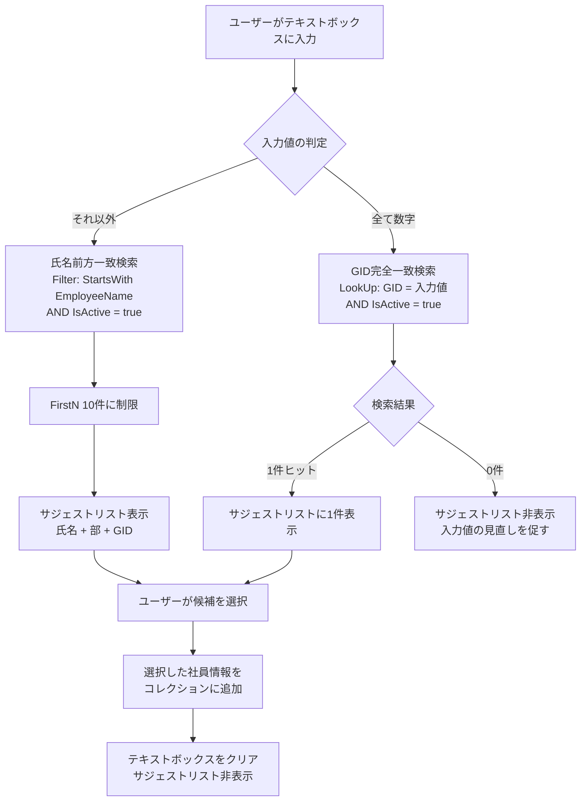
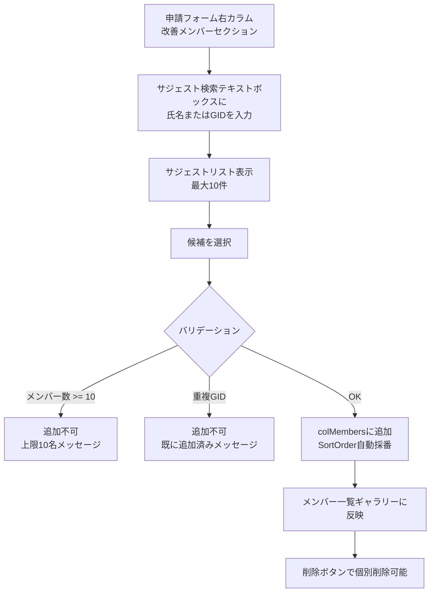
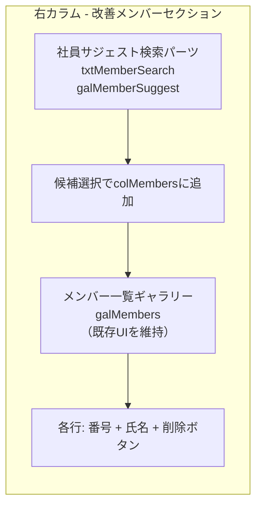

# 社員マスタサジェスト検索UI

## 概要

改善メンバー追加・評価者変更・回覧者追加など、社員マスタから人を選択するUI全般を「GID手入力」から「氏名サジェスト検索＋選択」方式に変更する。共通UIパーツとして定義し、複数画面で再利用可能にする。

本proposalでは以下を行う:
1. 共通UIパーツ「社員サジェスト検索」の仕様定義
2. 改善メンバー追加UIへの適用（既存GID入力UIを完全置換）

§2（評価者変更）・§3（回覧者）への適用は各proposalで個別に対応する。

## 設計判断

本提案の設計は以下の判断に基づく。

### DJ-1: 検索方式 — StartsWith前方一致 + GIDフォールバック

氏名検索には `Filter(社員マスタ, IsActive = true, StartsWith(EmployeeName, 入力値))` を使用する。

- **技術的根拠**: `StartsWith` はSharePoint委任対応関数であり、15,000件のデータソースに対してもサーバーサイドでフィルタリングされる。`Search()` 関数は**SharePointデータソースでは委任非対応**であり、500/2,000件の委任警告閾値を超えるレコードは検索対象外となる。部分一致（`in` 演算子）も委任非対応
- **GIDフォールバック**: 入力値が全て数字（`IsMatch(入力値, "\d+", MatchOptions.Complete)`）の場合、GID完全一致検索に切り替える。`Filter(社員マスタ, GID = 入力値 And IsActive = true)` で1件取得
- コレクション全件読み込み（`ClearCollect`）は15,000件では非現実的（メモリ・読み込み時間の問題）

### DJ-2: 入力閾値 — 1文字目から検索開始

テキスト入力の1文字目からサジェスト検索を発動する。

- **理由**: Power AppsのTextInputはIMEコンポジション中（未確定状態）は `.Value` が更新されない。漢字変換を確定して初めてフィルタが発動するため、1文字ずつ漢字が確定するケースはほぼ発生しない
- 1文字確定は「1文字姓」のケース（例: 林、森、原）が多く、検索として有効
- `StartsWith` は委任対応のため、1文字検索でもSharePoint側でフィルタリングされ、Power Apps側にはフィルタ結果のみが返る

### DJ-3: 適用範囲 — §8でUI定義 + メンバー追加UIに適用

本proposalで共通UIパーツの仕様を定義し、改善メンバー追加UIに適用する。

- §2（評価者変更）・§3（回覧者）は各proposal側で§8のUIパーツに差し替える
- 共通UIパーツとして再利用可能な構造を定義することで、差し替え時の仕様ブレを防ぐ

### DJ-4: サジェスト表示項目 — 氏名 + 部 + GID

サジェストリストの各行には以下の順序で表示する:

```
田中太郎  製造部  0012345678
```

- 氏名: `EmployeeName`（スペースなし形式「田中太郎」）
- 部: `Bu`（同姓同名の区別に最も有効な情報）
- GID: `GID`（最終確認用の一意識別子）

### DJ-5: サジェスト表示件数 — 最大10件

`FirstN(Filter(...), 10)` で最大10件に制限する。

- 10件を超える候補がある場合はユーザーに追加入力を促す（UIに件数超過メッセージは表示しない。10件の候補が表示されること自体が「もう少し入力してください」のシグナル）

### DJ-6: EmployeeName列インデックス — 追加

社員マスタの `EmployeeName` 列にインデックスを追加する。

- **理由**: `StartsWith` による前方一致検索の性能を確保するため。15,000件のリストでインデックスなしの `StartsWith` はビュー閾値に抵触する可能性がある
- `IsActive` 列は既にインデックス作成済み

### DJ-7: 既存GID入力UI — 完全置換

改善メンバー追加UIの既存GID入力方式を、サジェスト検索UIで完全に置き換える。

- GID入力のフォールバックはサジェスト検索UI内に統合されているため、別途GID入力フィールドを残す必要はない
- 既存の `txtMemberGID` + `btnAddMember` + GID氏名表示ラベルを、サジェスト検索UIパーツに差し替える

### DJ-8: 検索対象 — IsActive=true で退職者除外

サジェスト検索の対象は `IsActive = true`（有効社員）のみとする。

- 退職者・無効化済み社員は検索結果に表示しない
- `IsActive` 列は既にインデックス作成済みのため、フィルタ条件に追加してもパフォーマンスに影響なし

### DJ-9: テストモード — 特別な分岐不要

サジェスト検索UIにテストモード固有のロジックは不要。

- テストモードでも同じ社員マスタを検索する
- テストモードで影響を受けるのは `User().Email` の置換（`gCurrentEmail`）であり、サジェスト検索のフィルタ条件には関係しない

## 業務フロー

### サジェスト検索のUXフロー



### 改善メンバー追加の操作フロー



## リスト設計

### 社員マスタ — インデックス追加

既存の社員マスタに `EmployeeName` 列のインデックスを追加する。

**変更前（現行インデックス）:**

| 列 | 用途 |
|----|------|
| `GID` | 主キー検索用 |
| `Email` | ログインユーザーのEmail逆引き用 |
| `IsActive` | 有効社員フィルタ用 |

**変更後（インデックス追加）:**

| 列 | 用途 |
|----|------|
| `GID` | 主キー検索用 |
| `Email` | ログインユーザーのEmail逆引き用 |
| `IsActive` | 有効社員フィルタ用 |
| **`EmployeeName`** | **氏名前方一致検索用（§8で追加）** |

> **注意**: SharePointリストのインデックスはPnP PowerShellで作成可能。`scripts/` のリスト作成スクリプトに追加すること。

### リスト構造の変更 — なし

社員マスタの列定義に変更はない。EmployeeName列は既存列であり、インデックスの追加のみ。

## 画面設計

### 共通UIパーツ: 社員サジェスト検索

以下の構造を「社員サジェスト検索パーツ」として定義する。プレフィックスを変更することで複数箇所に適用可能。

#### パーツ構造図

```
cntXxxSearch (縦・AutoLayout)
  ├── txtXxxSearch          … テキスト入力（氏名 or GID）
  └── galXxxSuggest         … サジェストリスト（Gallery）
        └── cntXxxSuggestRow (横・テンプレート行)
              ├── lblXxxSuggestName   … 氏名
              ├── lblXxxSuggestBu     … 部
              └── lblXxxSuggestGID    … GID
```

#### 検索ロジック（Power Fx）

```
// テキスト入力のOnChange相当（サジェストリストのItems）
// 入力が空の場合はサジェスト非表示
// 全数字の場合はGID完全一致検索
// それ以外は氏名前方一致検索

galXxxSuggest.Items:
=If(
    IsBlank(txtXxxSearch.Value),
    Blank(),
    IsMatch(txtXxxSearch.Value, "\d+", MatchOptions.Complete),
    // GIDフォールバック: 完全一致で1件取得
    FirstN(
        Filter(
            社員マスタ,
            GID = txtXxxSearch.Value And IsActive = true
        ),
        10
    ),
    // 氏名前方一致検索
    FirstN(
        Filter(
            社員マスタ,
            IsActive = true,
            StartsWith(EmployeeName, txtXxxSearch.Value)
        ),
        10
    )
)
```

#### サジェストリスト表示/非表示

```
// サジェストリストのVisible
galXxxSuggest.Visible:
=!IsBlank(txtXxxSearch.Value) && CountRows(galXxxSuggest.AllItems) > 0
```

#### 候補選択時の処理

```
// GalleryのOnSelect（テンプレート行のSelect(Parent)経由で発火）
// 選択した社員情報を親コンポーネントに通知
// ※ 具体的な処理は適用先で定義（メンバー追加、評価者設定等）
galXxxSuggest.OnSelect:
=// 適用先固有の処理を記述（カスタマイズポイント）
 Set(varXxxSelectedEmployee, ThisItem);
 Reset(txtXxxSearch);
```

#### サジェスト行テンプレート

各行は「氏名  部  GID」を横並びで表示する。

| コントロール | 内容 | 幅 | サイズ |
|---|---|---|---|
| `lblXxxSuggestName` | `ThisItem.EmployeeName` | FillPortions=1 | 12 |
| `lblXxxSuggestBu` | `ThisItem.Bu` | 80 | 11, グレー |
| `lblXxxSuggestGID` | `ThisItem.GID` | 90 | 10, グレー |

#### YAML定義（共通パーツ）

```yaml
# ====== 社員サジェスト検索パーツ: Xxx ======
# 使い方: Xxx を任意のプレフィックスに一括置換
# 適用先: 改善メンバー追加=Member, 評価者変更=Eval1/Eval2, 回覧者=Reviewer
- cntXxxSearch:
    Control: GroupContainer@1.5.0
    Variant: AutoLayout
    Properties:
      DropShadow: =DropShadow.None
      LayoutDirection: =LayoutDirection.Vertical
      LayoutGap: =2
    Children:
      - txtXxxSearch:
          Control: TextInput@0.0.54
          Properties:
            AlignInContainer: =AlignInContainer.SetByContainer
            Height: =36
            Placeholder: ="氏名またはGIDを入力"
            Width: =280
      - galXxxSuggest:
          Control: Gallery@2.15.0
          Properties:
            Height: |
              =Min(
                  CountRows(galXxxSuggest.AllItems) * 36,
                  360
              )
            Items: |
              =If(
                  IsBlank(txtXxxSearch.Value),
                  Blank(),
                  IsMatch(txtXxxSearch.Value, "\d+", MatchOptions.Complete),
                  FirstN(
                      Filter(
                          社員マスタ,
                          GID = txtXxxSearch.Value And IsActive = true
                      ),
                      10
                  ),
                  FirstN(
                      Filter(
                          社員マスタ,
                          IsActive = true,
                          StartsWith(EmployeeName, txtXxxSearch.Value)
                      ),
                      10
                  )
              )
            AlignInContainer: =AlignInContainer.SetByContainer
            Layout: =Layout.Vertical
            OnSelect: |
              =// 適用先固有の処理を記述（カスタマイズポイント）
              Set(varXxxSelectedEmployee, ThisItem);
              Reset(txtXxxSearch)
            TemplatePadding: =0
            TemplateSize: =36
            Visible: |
              =!IsBlank(txtXxxSearch.Value)
              && CountRows(galXxxSuggest.AllItems) > 0
            Width: =280
          Children:
            - cntXxxSuggestRow:
                Control: GroupContainer@1.5.0
                Variant: AutoLayout
                Properties:
                  DropShadow: =DropShadow.None
                  Fill: |
                    =If(
                        ThisItem.IsSelected,
                        RGBA(230, 240, 255, 1),
                        RGBA(255, 255, 255, 1)
                    )
                  Height: =Parent.TemplateHeight
                  LayoutAlignItems: =LayoutAlignItems.Center
                  LayoutDirection: =LayoutDirection.Horizontal
                  LayoutGap: =6
                  OnSelect: |
                    =Select(Parent)
                  PaddingLeft: =8
                  PaddingRight: =8
                  Width: =Parent.TemplateWidth
                Children:
                  - lblXxxSuggestName:
                      Control: Text@0.0.51
                      Properties:
                        FillPortions: =1
                        Height: =30
                        Size: =12
                        Text: =ThisItem.EmployeeName
                  - lblXxxSuggestBu:
                      Control: Text@0.0.51
                      Properties:
                        FontColor: =RGBA(120, 120, 120, 1)
                        Height: =30
                        Size: =11
                        Text: =ThisItem.Bu
                        Width: =80
                  - lblXxxSuggestGID:
                      Control: Text@0.0.51
                      Properties:
                        FontColor: =RGBA(120, 120, 120, 1)
                        Height: =30
                        Size: =10
                        Text: =ThisItem.GID
                        Width: =90
```

#### カスタマイズポイント

| 項目 | プロパティ | 説明 |
|---|---|---|
| パーツ幅 | `txtXxxSearch.Width`, `galXxxSuggest.Width` | 配置先のカラム幅に合わせて調整 |
| プレースホルダー | `txtXxxSearch.Placeholder` | 「氏名またはGIDを入力」を適用先に合わせて変更可 |
| 候補選択処理 | `galXxxSuggest.OnSelect` | 適用先固有の処理を記述（メンバー追加、評価者セット等） |
| サジェスト行の色 | `cntXxxSuggestRow.Fill` | 選択時のハイライト色を変更可 |

### 改善メンバー追加UIへの適用

既存のGID入力UI（`txtMemberGID` + `btnAddMember` + GID氏名表示ラベル）を、社員サジェスト検索パーツ（プレフィックス: `Member`）に完全置換する。

#### 変更対象

`powerapps/screen-application-form.yaml` の右カラム・改善メンバーセクション内:

**削除するコントロール:**
- `cntMemberInput` — GID入力＋追加ボタンのコンテナ（内包する `txtMemberGID`, `btnAddMember` ごと削除）
- `lblMemberPreview` — GID→氏名の自動表示ラベル

**追加するコントロール:**
- `cntMemberSearch` — 社員サジェスト検索パーツ一式

#### OnSelect（候補選択→メンバー追加）

```
// galMemberSuggest.OnSelect
// 選択した社員をcolMembersに追加
=With(
    {emp: ThisItem},
    If(
        // 上限チェック
        CountRows(colMembers) >= 10,
        Notify("メンバーは最大10名までです", NotificationType.Warning),
        // 重複チェック
        !IsBlank(LookUp(colMembers, MemberGID = emp.GID)),
        Notify("この社員は既に追加されています", NotificationType.Warning),
        // 追加
        Collect(
            colMembers,
            {
                MemberGID: emp.GID,
                MemberName: emp.EmployeeName,
                MemberOffice: emp.Office,
                MemberCostUnit: emp.CostUnit,
                SortOrder: CountRows(colMembers) + 1
            }
        );
        Notify(emp.EmployeeName & " を追加しました", NotificationType.Success);
        Reset(txtMemberSearch)
    )
)
```

#### 改善メンバーセクションの画面構成（変更後）



#### 画面構造の変更前後比較

**変更前（GID入力方式）:**
```
cntMemberAdd
  ├── lblMemberPreview       … GID→氏名の自動表示
  ├── cntMemberInput
  │     ├── txtMemberGID    … GID入力（10桁）
  │     └── btnAddMember    … 追加ボタン
  └── galMembers            … メンバー一覧
```

**変更後（サジェスト検索方式）:**
```
cntMemberAdd
  ├── cntMemberSearch        … 社員サジェスト検索パーツ
  │     ├── txtMemberSearch  … 氏名/GID入力
  │     └── galMemberSuggest … サジェストリスト（最大10件）
  └── galMembers             … メンバー一覧（既存維持）
```

### サジェストリストのオーバーレイ表示

サジェストリスト（`galMemberSuggest`）は、メンバー一覧ギャラリー（`galMembers`）の上にオーバーレイ表示する必要がある。AutoLayoutコンテナ内では自然なオーバーレイが困難なため、以下の方式を採用する。

**方式: サジェストリストの高さを動的に制御**

- サジェストリストはAutoLayout内に配置し、候補がある場合のみ高さを確保する
- `galMemberSuggest.Height = Min(CountRows(galMemberSuggest.AllItems) * 36, 360)`
- 候補がない場合は `Visible = false` で高さ0になり、メンバー一覧が上に詰まる

> **注意**: 厳密なオーバーレイ（Z-index制御）はPower AppsのAutoLayoutでは困難。サジェストリストが展開されるとメンバー一覧が下に押し下がる動作となるが、UX上は許容範囲。サジェスト候補を選択するとリストが非表示になり、メンバー一覧が元の位置に戻る。

## 既存機能への影響

### §2（評価者変更）への影響

§2の `DJ-2` で「GID入力方式とし、§8完成後に差し替え」と明記されている。§8のUIパーツ完成後、§2のproposalで以下を更新する:

- 評価者変更UIの `txtEval1GID` / `txtEval2GID` を `cntEval1Search` / `cntEval2Search`（サジェスト検索パーツ）に差し替え
- OnSelect処理: 選択した社員を評価者変数にセットする処理に変更
- バリデーション（自分自身の設定禁止、1人目と2人目の重複禁止）は候補選択時にチェック

### §3（回覧者）への影響

§3の回覧者追加UIも同様に、GID入力方式からサジェスト検索パーツに差し替える:

- `txtReviewerGID` を `cntReviewerSearch`（サジェスト検索パーツ）に差し替え
- OnSelect処理: 選択した社員を回覧者コレクションに追加する処理に変更

### 既存の申請フォーム動作への影響

- **提出処理（btnSubmit.OnSelect）**: 変更不要。`colMembers` コレクションの構造は変更しないため、ForAllでのPatch処理はそのまま動作する
- **差戻再提出時の既存メンバー読み込み**: 変更不要。OnVisibleでの `ClearCollect(colMembers, ...)` は既存のまま
- **プレビュー機能**: 変更不要。colMembersの参照方式は変更なし

### フロー（Power Automate）への影響 — なし

サジェスト検索UIはPower Apps画面内の変更であり、Power Automateフローの変更は不要。

## 移行手順への影響

### PnP PowerShellスクリプト

`scripts/create-lists.ps1` の社員マスタ作成セクションに `EmployeeName` 列のインデックス作成を追加する必要がある。

```powershell
# 社員マスタ — インデックス追加（§8）
Add-PnPFieldIndex -List "社員マスタ" -Field "EmployeeName"
```

### パッチスクリプト（既存環境向け）

既存環境に差分適用するパッチスクリプトを `scripts/develop/` に作成する。

```powershell
# scripts/develop/patch-employee-name-index.ps1
# 既存の社員マスタにEmployeeName列のインデックスを追加
Add-PnPFieldIndex -List "社員マスタ" -Field "EmployeeName"
```

### Power Apps Studio手作業

- `powerapps/screen-application-form.yaml` の改善メンバーセクション部分をCode Viewにペースト
- 既存のGID入力UIコントロール（`txtMemberGID`, `btnAddMember`, `lblMemberLookup`）を削除し、サジェスト検索パーツに置換

### デプロイガイドへの追記

`a_project/migration/deployment-guide.md` にインデックス追加手順を追記する（実装時に対応）。
