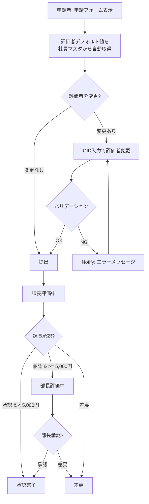
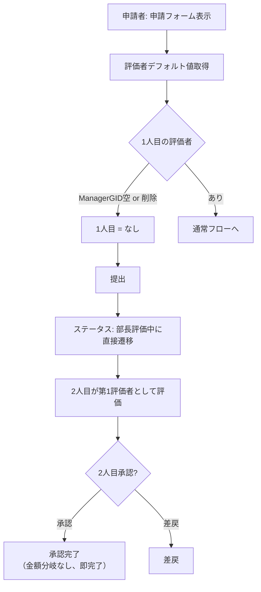
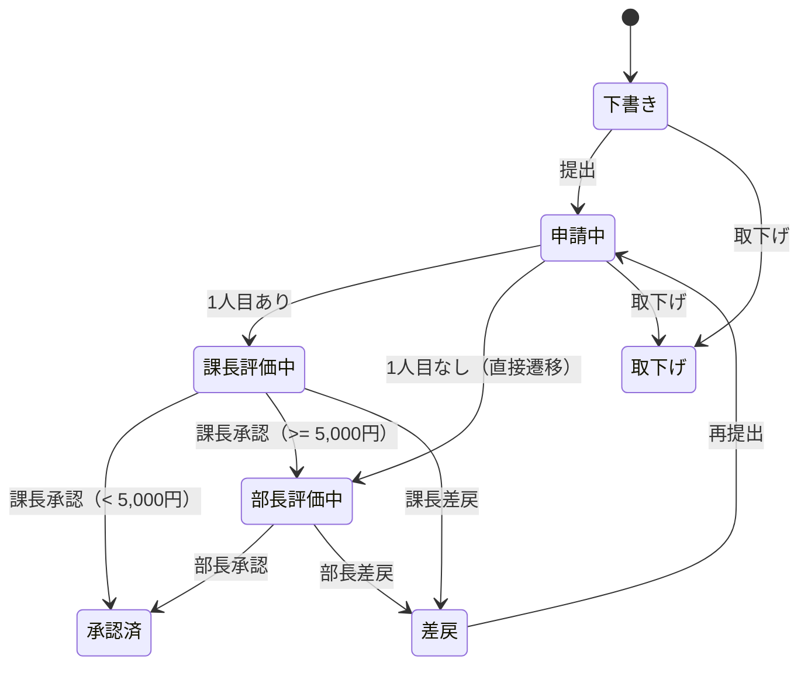
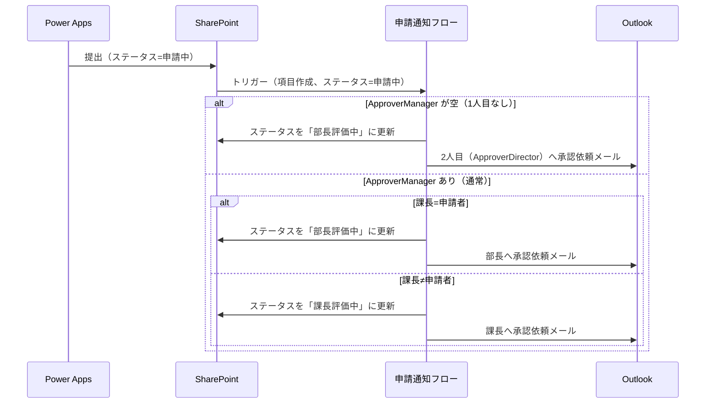
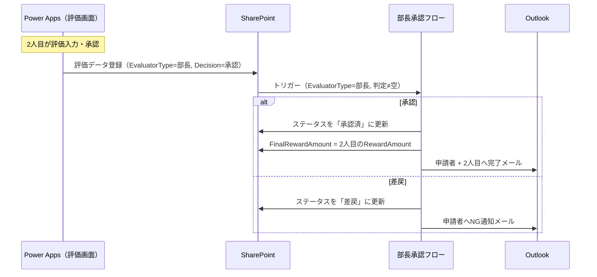

# 評価者の変更機能

## 概要

申請フォームで評価者（1人目=課長相当、2人目=部長相当）を表示・変更・削除できる機能を追加する。v1では「課長→部長」の固定ルートだったものを柔軟化し、以下を実現する。

- 評価者のデフォルト値を社員マスタから自動取得して申請フォームに表示
- 1人目の評価者を別の社員に変更、または削除（なしに設定）可能
- 2人目の評価者を別の社員に変更可能（削除不可、必須）
- 1人目なしの場合、2人目が第1評価者として直接評価を開始

> 旧v2 §2「課長不在時の直接部長承認」と旧v2 §3「承認者表示・変更機能」を統合・再整理した。

## 設計判断

本提案の設計は以下の判断に基づく。

### DJ-1: 1人目なし時の金額分岐 — スキップ

1人目の評価者がいない場合、v1の金額分岐ロジック（褒賞金額 >= 5,000円で部長承認へ遷移）はスキップする。2人目の承認で即完了となる。

- 理由: 1人目なしの場合、2人目が唯一の評価者であり、金額分岐で「さらに上位の承認者」へ回す仕組みが存在しない。2人目の評価結果をそのまま最終結果とする
- FinalRewardAmountには2人目の評価データのRewardAmountを転記する

### DJ-2: 評価者変更UI — GID入力方式

評価者の変更UIはGID（10桁数字）入力方式とする。改善メンバー追加UIと同じ方式。

- GID入力 → 社員マスタLookUp → 氏名を自動表示
- 将来的に氏名サジェスト検索UIに変更予定（§8として別途開発）
- §8が完成したら、評価者変更UIも§8の共通UIパーツに差し替える

### DJ-3: 変更理由 — 不要

評価者変更時の理由入力は不要とする。UIをシンプルに保つ。

### DJ-4: バリデーション — 自分自身の設定禁止 + 重複禁止

- 申請者自身を評価者に設定することを禁止する
- 1人目と2人目に同一人物を設定することを禁止する
- バリデーションエラー時は`Notify()`でエラーメッセージを表示し、提出を拒否する

### DJ-5: 1人目なし時のEvaluatorType — 従来通り「部長」

1人目の評価者が削除された場合、2人目が第1評価者となるが、評価データリストのEvaluatorTypeは従来通り「部長」のままとする。

- 理由: EvaluatorTypeを動的に変更すると、課長承認フロー・部長承認フローのトリガー条件に影響が出る。既存フローのトリガー条件（EvaluatorType=課長/部長）を維持し、フロー内部の分岐で1人目なしを吸収する方が安全
- 2人目が第1評価者であっても、EvaluatorType=部長のレコード1件のみを作成する

### DJ-6: §3（回覧者）との接合 — §2では回覧中に触れず

§2では回覧者機能には触れない。§3で上乗せする。

- §2のステータス遷移に「回覧中」は含めない
- §3実装時に「申請中」→「回覧中」→「1人目評価中 or 2人目評価中」の遷移を追加する
- **接続ポイント**: §2で実装する申請通知フロー内で、遷移先ステータスを `varNextStatus` 変数に格納してからステータス更新を行う。§3実装時に `varNextStatus` の値を「回覧中」に差し替えるだけで対応できる設計にしておく。具体的には: フロー内で `Initialize variable: varNextStatus` を定義し、1人目なし時は `varNextStatus = "部長評価中"`、1人目あり+課長=申請者時は `varNextStatus = "部長評価中"`、通常時は `varNextStatus = "課長評価中"` を設定した後、共通の「項目の更新」アクションで `Status = varNextStatus` を適用する

### DJ-7: 変更履歴 — §2では記録しない

評価者変更の履歴記録は§7-5（承認履歴リスト）実装時に追加する。§2では記録しない。

### DJ-8: 評価者セクション配置 — 右カラム

申請フォームの評価者セクションは右カラムに配置する。

- §3の回覧者セクションと同じ右カラムに配置し、「人の指定」を右カラムにまとめる
- 右カラムの構成は上から: 回覧者セクション（§3で追加予定）→ 評価者セクション（§2）→ 改善メンバーセクション（既存）
- §2単体実装時は: 評価者セクション → 改善メンバーセクション の順

### DJ-9: 閲覧画面1人目なし表示 — 「（なし）」表示

閲覧画面で1人目の評価者がいない場合、承認者情報セクションに「（なし）」と表示する。1人目の評価結果セクションも非表示とする。

### DJ-10: デフォルト値設定タイミング — 申請フォーム表示時

評価者のデフォルト値は申請フォーム表示時（OnVisible）に社員マスタから取得する。

- 1人目: 社員マスタのManagerGID → LookUp → メールアドレス・氏名取得
- 2人目: 社員マスタのDirectorGID → LookUp → メールアドレス・氏名取得
- ManagerGIDが空の場合: 1人目は最初から「なし」状態で表示
- 差戻後の再編集時: メインリストのApproverManager/ApproverDirectorから復元

## 業務フロー

### 通常フロー（1人目あり）

v1と同じフロー。評価者がデフォルトまたは変更後の社員に設定される。



### 1人目なしフロー



### 差戻→再提出時の1人目有無変更

差戻後に申請者が1人目の評価者の有無を変更して再提出した場合のシナリオ:

| 初回提出時 | 再提出時 | 動作 |
|-----------|---------|------|
| 1人目あり | 1人目あり（同一 or 変更） | 通常フロー。再提出後に申請通知フローが再トリガーされ、ApproverManagerへ通知 |
| 1人目あり | 1人目なしに変更 | 再提出後に申請通知フローが再トリガーされ、ApproverManagerが空のため「部長評価中」に直接遷移 |
| 1人目なし | 1人目ありに変更 | 再提出後に申請通知フローが再トリガーされ、ApproverManagerが設定されているため通常の課長通知フロー |
| 1人目なし | 1人目なしのまま | 再提出後に申請通知フローが再トリガーされ、再び「部長評価中」に直接遷移 |

> **ポイント**: 再提出後はステータスが「申請中」に戻り、申請通知フローが再トリガーされる。その時点のApproverManager列の値（空 or 設定済み）で1人目の有無が判定されるため、初回と異なる評価者構成でも正しく動作する。

### ステータス遷移図



> **§3接続ポイント**: §3実装時に「申請中」→「回覧中」→「課長評価中 or 部長評価中」の遷移を追加する。1人目なし時は「回覧中」→「部長評価中」に直接遷移する。

## リスト設計

### 改善提案メイン リスト — 列変更なし

既存の列構成をそのまま使用する。

| 列名 | 内部名 | 型 | 変更 | §2での扱い |
|------|-------|---|------|-----------|
| 承認者（課長） | ApproverManager | ユーザー | なし | 1人目の評価者。申請者が変更可能。1人目なしの場合は空でPatch |
| 承認者（部長） | ApproverDirector | ユーザー | なし | 2人目の評価者。申請者が変更可能。必須 |

> **列名の「課長」「部長」について**: 列名は現状維持する。実際には課長以外の社員を1人目に設定できるが、列の内部名変更はSharePoint既存データへの影響が大きいため、v2でも維持する。UIラベルでは「1人目の評価者」「2人目の評価者」と表示し、列名との不一致はUI層で吸収する。

### 改善提案メイン リスト — 必須制約の変更

| 列名 | v1の必須 | v2の必須 | 理由 |
|------|---------|---------|------|
| ApproverManager | ○ | **×（任意に変更）** | 1人目なしを許容するため。空でPatchできる必要がある |
| ApproverDirector | （空欄可） | **○（必須に変更）** | 2人目は必須。v1では必須制約なし（lists.md参照）だが、§2で必須に変更する |

> **実機検証項目（V-1）**: SharePointユーザー型列を空でPatchした場合の動作確認が必要。`Blank()` または `{Claims: "", ...}` で空Patchできるか要検証。

### 評価データ リスト — 変更なし

列構成は変更なし。1人目なしの場合の動作:

| 条件 | 作成されるレコード |
|------|----------------|
| 1人目あり（通常） | EvaluatorType=課長（1件）+ EvaluatorType=部長（0〜1件） |
| 1人目なし | EvaluatorType=部長（1件のみ） |

### その他リスト — 変更なし

改善メンバー、改善分野実績、承認履歴、社員マスタ、改善分野マスタ、表彰区分マスタはいずれも変更なし。

## 画面設計

### 申請フォーム — 変更箇所

#### 評価者セクションの追加（右カラム）

右カラムに評価者セクションを追加する。改善メンバーセクション（既存）の上に配置し、「人の指定」を右カラムにまとめる。

```
┌──────────────────────┬──────────────────────┐
│ 左カラム              │ 右カラム              │
│ ┌──────────────────┐ │ ┌──────────────────┐ │
│ │ 基本情報（既存）  │ │ │ ★評価者セクション │ │
│ │ 申請者情報、      │ │ │  （新規）         │ │
│ │ 表彰区分、組織... │ │ │  1人目の評価者    │ │
│ ├──────────────────┤ │ │  [GID] [氏名] [削]│ │
│ │ 改善テーマ、      │ │ │  2人目の評価者    │ │
│ │ 問題点、改善内容  │ │ │  [GID] [氏名]     │ │
│ ├──────────────────┤ │ ├──────────────────┤ │
│ │ 改善分野実績      │ │ │ 改善メンバー      │ │
│ │ （既存）          │ │ │ （既存）          │ │
│ ├──────────────────┤ │ └──────────────────┘ │
│ │ 添付ファイル      │ │                      │
│ │ （既存）          │ │                      │
│ ├──────────────────┤ │                      │
│ │ [プレビュー]      │ │                      │
│ │ [提出]            │ │                      │
│ └──────────────────┘ │                      │
└──────────────────────┴──────────────────────┘
```

> **§3実装後の右カラム構成**: 回覧者セクション（§3）→ 評価者セクション（§2）→ 改善メンバーセクション（既存）の順に配置する。

#### 評価者セクションのUI構成

**1人目の評価者**

| コントロール | 型 | 説明 |
|------------|---|------|
| lblEvaluator1Title | Text | 「1人目の評価者」ラベル |
| txtEvaluator1GID | TextInput | GID入力（10桁数字）。入力→社員マスタLookUp→氏名・メール取得 |
| lblEvaluator1Name | Text | 氏名表示（自動取得、読み取り専用） |
| btnEvaluator1Clear | Button | 「削除」ボタン。1人目を「なし」に設定 |
| lblEvaluator1None | Text | 1人目が「なし」の場合に「（1人目なし — 2人目が第1評価者になります）」を表示 |

**2人目の評価者**

| コントロール | 型 | 説明 |
|------------|---|------|
| lblEvaluator2Title | Text | 「2人目の評価者」ラベル |
| txtEvaluator2GID | TextInput | GID入力（10桁数字）。入力→社員マスタLookUp→氏名・メール取得 |
| lblEvaluator2Name | Text | 氏名表示（自動取得、読み取り専用） |

> 2人目には削除ボタンなし（必須のため）。

#### デフォルト値の設定ロジック（OnVisible）

> 以下は設計意図を示す**擬似コード**。Power Fxの正式な構文は実装時に調整する。

```
// 申請フォーム表示時にデフォルト評価者を社員マスタから取得
// varApplicantGID はログインユーザーから取得済み

Set(varApplicantEmployee, LookUp(社員マスタ, GID = varApplicantGID));

// 新規申請時: 社員マスタから取得
If(IsBlank(varEditRequestID),
    // 1人目: 課長GID
    If(!IsBlank(varApplicantEmployee.ManagerGID),
        Set(varEval1Employee, LookUp(社員マスタ, GID = varApplicantEmployee.ManagerGID));
        Set(varEval1GID, varApplicantEmployee.ManagerGID);
        Set(varEval1Name, varEval1Employee.EmployeeName);
        Set(varEval1Email, varEval1Employee.Email);
        Set(varEval1IsNone, false);
    ,
        // ManagerGIDが空: 1人目なし
        Set(varEval1GID, "");
        Set(varEval1Name, "");
        Set(varEval1Email, "");
        Set(varEval1IsNone, true);
    );

    // 2人目: 部長GID
    Set(varEval2Employee, LookUp(社員マスタ, GID = varApplicantEmployee.DirectorGID));
    Set(varEval2GID, varApplicantEmployee.DirectorGID);
    Set(varEval2Name, varEval2Employee.EmployeeName);
    Set(varEval2Email, varEval2Employee.Email);
,
    // 差戻後の再編集時: メインリストの既存値から復元
    // ApproverManagerが空 → 1人目なし
    If(IsBlank(varEditRecord.ApproverManager),
        Set(varEval1IsNone, true);
        // ...
    ,
        // ApproverManagerのEmailから社員マスタを逆引き
        // ...
    );
    // ApproverDirectorから復元
    // ...
);
```

#### GID入力時のLookUpロジック

```
// txtEvaluator1GID.OnChange 相当
If(Len(Self.Value) = 10,
    Set(varEval1Employee, LookUp(社員マスタ, GID = Self.Value && IsActive = true));
    If(!IsBlank(varEval1Employee),
        Set(varEval1GID, Self.Value);
        Set(varEval1Name, varEval1Employee.EmployeeName);
        Set(varEval1Email, varEval1Employee.Email);
        Set(varEval1IsNone, false);
    ,
        Notify("社員情報が見つかりません（GID: " & Self.Value & "）", NotificationType.Error);
    );
);
```

#### 1人目削除ボタンのロジック

```
// btnEvaluator1Clear.OnSelect
Set(varEval1GID, "");
Set(varEval1Name, "");
Set(varEval1Email, "");
Set(varEval1IsNone, true);
Reset(txtEvaluator1GID);
```

#### バリデーションロジック（提出時）

```
// 提出ボタンの既存バリデーションに追加

// 2人目は必須
If(IsBlank(varEval2GID),
    Notify("2人目の評価者は必須です。", NotificationType.Error);
    // 提出中断
);

// 自分自身の設定禁止
If(
    (!varEval1IsNone && varEval1GID = varApplicantGID) ||
    varEval2GID = varApplicantGID,
    Notify("自分自身を評価者に設定することはできません。", NotificationType.Error);
    // 提出中断
);

// 1人目と2人目の重複禁止
If(
    !varEval1IsNone && varEval1GID = varEval2GID,
    Notify("1人目と2人目に同じ評価者を設定することはできません。", NotificationType.Error);
    // 提出中断
);
```

#### 提出処理（Patch）への影響

`btnSubmit.OnSelect` のPatch式で、ApproverManager/ApproverDirectorに評価者の値を設定する。

```
// 既存のPatch式に追加/変更

Patch(改善提案メイン, ...,
    // 1人目: varEval1IsNone=true の場合は空でPatch
    ApproverManager: If(varEval1IsNone,
        Blank(),
        // ユーザー型列: Claims形式で設定
        {
            '@odata.type': "#Microsoft.Azure.Connectors.SharePoint.SPListExpandedUser",
            Claims: "i:0#.f|membership|" & varEval1Email,
            DisplayName: varEval1Name,
            Email: varEval1Email
        }
    ),
    // 2人目
    ApproverDirector: {
        '@odata.type': "#Microsoft.Azure.Connectors.SharePoint.SPListExpandedUser",
        Claims: "i:0#.f|membership|" & varEval2Email,
        DisplayName: varEval2Name,
        Email: varEval2Email
    },
    // ...既存の列...
);
```

> **submit-logic.pfx との同期**: 上記Patch変更は `powerapps/submit-logic.pfx` にも反映すること。

### 閲覧画面 — 変更箇所

#### 承認者情報セクションの変更

現在「承認者情報」として課長・部長の氏名を表示している箇所を、1人目なし対応に変更する。

| 条件 | 1人目の表示 | 2人目の表示 |
|------|-----------|-----------|
| 1人目あり | 氏名表示（従来通り） | 氏名表示（従来通り） |
| 1人目なし | 「（なし）」表示 | 氏名表示 |

> **ラベル表記について**: 閲覧画面の承認者情報ラベル（「課長」「部長」）はv1のまま維持する。実際には課長以外の社員が1人目に設定される場合があるが、閲覧画面のラベルは変更しない。申請フォームでは「1人目の評価者」「2人目の評価者」と表示するが、閲覧画面・評価画面では既存の「課長」「部長」表記を維持する。

#### 評価結果セクションの変更

| 条件 | 1人目の評価結果 | 2人目の評価結果 |
|------|-------------|-------------|
| 1人目あり | 表示（従来通り） | 表示（部長評価がある場合） |
| 1人目なし | **非表示** | 表示 |

表示制御ロジック:

```
// 1人目の評価結果セクションのVisible
// 評価データリストにEvaluatorType=課長のレコードが存在するか
Visible: =!IsEmpty(Filter(評価データ, RequestID = varViewRequestID && EvaluatorType.Value = "課長"))
```

### 評価画面 — 変更箇所

#### 1人目なし時の2人目評価画面

1人目なしの場合、2人目が最初から評価を行う。評価画面の動作変更:

| 項目 | 1人目あり時 | 1人目なし時 |
|------|-----------|-----------|
| 評価者種別表示 | 「課長評価」or「部長評価」 | 「部長評価」（EvaluatorType=部長のまま、ラベルも「部長」表記を維持） |
| 課長評価データのデフォルト値参照 | 部長画面で課長評価を参照 | **参照なし**（課長レコードが存在しないため） |
| 承認後の遷移 | 金額分岐あり | **金額分岐なし、即完了** |

部長評価画面で課長評価データをデフォルト値として表示するロジック（既存）に、1人目なしの場合のフォールバックを追加:

```
// 部長評価画面のデフォルト値設定
Set(varManagerEvalData, LookUp(評価データ, RequestID = varEvalRequestID && EvaluatorType.Value = "課長"));

// 1人目なし（課長評価データなし）の場合はデフォルト値なし
If(!IsBlank(varManagerEvalData),
    // 従来通り: 課長の評価をデフォルト値として表示
    Set(varDefaultEffectScore, varManagerEvalData.EffectScore);
    // ...
,
    // 1人目なし: デフォルト値なし（空欄から開始）
    Set(varDefaultEffectScore, Blank());
    // ...
);
```

## フロー設計

### 申請通知フロー — 変更あり

1人目の評価者がいない場合（ApproverManagerが空）、通知先を2人目（ApproverDirector）に変更し、ステータスを「部長評価中」に設定する。

| ステップ | 変更内容 |
|---------|---------|
| 2 | 条件分岐を追加: ApproverManagerが空かどうか |
| 2a（新規） | ApproverManager空 → ステータスを「部長評価中」に更新、ApproverDirectorへ承認依頼メール |
| 2b（既存改修） | ApproverManagerあり → 既存の課長通知ロジック（課長=申請者チェック含む） |



> **注意**: 既存の「課長=申請者」チェック（IsManager=1）は、1人目の評価者を変更した場合にも正しく動作する必要がある。v2では `ApproverManager` のメールアドレスと `ApplicantEmail` を直接比較する方式に変更する。`ApproverManager` が空の場合は1人目なしとして扱う。

#### 申請通知フロー改修詳細

**既存ステップとの対応:**

| 既存ステップ | v2での扱い |
|------------|-----------|
| ステップ1: トリガー（項目作成、ステータス=申請中） | **維持** |
| ステップ2: 社員マスタからGIDでLookUp + IsManagerフラグ判定 | **廃止** — トリガーレコードのApproverManager列を直接使用する方式に変更。社員マスタLookUpとIsManagerフラグ判定は不要になる |
| ステップ2a: 条件分岐（課長=申請者?） | **置換** — 下記の新しい条件分岐に置き換え |
| ステップ3: メール送信 | **維持**（分岐先ごとに宛先・パラメータを変更） |

```
既存ステップ2〜2aを以下に置換:

ステップ2: 条件分岐 — ApproverManager が空?
  ├─ Yes（1人目なし）
  │   ├─ ステップ2a-1: ステータスを「部長評価中」に更新
  │   └─ ステップ2a-2: ApproverDirectorのメールアドレスへ承認依頼メール送信
  │       - メール内容: 通常の承認依頼メール
  │       - リンク: ?RequestID={RequestID}&EvalType=部長
  │
  └─ No（1人目あり）
      ├─ ステップ2b-1: 条件分岐 — ApproverManager = ApplicantEmail?
      │   ├─ Yes（課長=申請者）
      │   │   ├─ ステータスを「部長評価中」に更新
      │   │   └─ ApproverDirectorへ承認依頼メール
      │   └─ No（通常）
      │       ├─ ステータスを「課長評価中」に更新
      │       └─ ApproverManagerへ承認依頼メール
```

### 課長承認フロー — 変更なし

1人目なしの場合、課長の評価データレコードが作成されないため、課長承認フローはトリガーされない。変更不要。

### 部長承認フロー — 変更あり

1人目なしの場合（課長評価データが存在しない場合）、金額分岐をスキップして即完了とする。

| ステップ | 変更内容 |
|---------|---------|
| 2a（承認時） | 既存ロジックに変更なし。2人目のRewardAmountをFinalRewardAmountに転記し、承認済に更新 |

> 部長承認フロー自体のロジックには変更不要。理由: 部長承認フローは元々「EvaluatorType=部長 AND 判定≠空」でトリガーされ、承認時は常にステータスを「承認済」に更新し、FinalRewardAmountに転記する。1人目の有無に関わらず、この動作は同一である。

ただし、以下の点を確認:



### メールテンプレートへの影響

| テンプレート | 変更 | 内容 |
|------------|------|------|
| 3-1_申請通知_承認依頼.html | **変更あり** | 1人目なし時にも使用。EvalTypeパラメータを動的に設定（課長 or 部長） |
| 3-2_課長承認_部長へ承認依頼.html | なし | |
| 3-2_課長承認_承認完了.html | なし | |
| 3-2_課長承認_差戻通知.html | なし | |
| 3-3_部長承認_承認完了.html | なし | 1人目なし時もこのテンプレートが使用される |
| 3-3_部長承認_差戻通知.html | なし | |

> 1人目なしで2人目のみの承認完了時、完了メールの宛先は「申請者 + 2人目」となる（部長承認完了メールのテンプレートをそのまま使用）。

## 評価ロジック

### 1人目なし時の変更

| 項目 | 1人目あり（v1） | 1人目なし（v2追加） |
|------|-------------|------------------|
| 評価レコード | 課長1件 + 部長0〜1件 | 部長1件のみ |
| 金額分岐 | 課長RewardAmount >= 5,000で部長へ | **金額分岐なし** |
| FinalRewardAmount | 最終承認者のRewardAmount | 2人目のRewardAmount |
| EvaluatorType | 課長 / 部長 | 部長のみ |
| 部長評価デフォルト値 | 課長評価データを参照 | デフォルト値なし（空欄開始） |

### 金額分岐スキップの詳細

v1の金額分岐ロジック（evaluation.md §6.4）:

```
課長承認 AND 褒賞金額 < 5,000円 → 承認完了
課長承認 AND 褒賞金額 >= 5,000円 → 部長評価
```

v2（1人目なし時）:

```
部長承認 → 承認完了（金額に関わらず即完了）
```

> この変更はフローの動作変更ではなく、部長承認フローが元々「承認→承認済」の固定動作であることを利用している。金額分岐は課長承認フロー内のロジックであり、1人目なし時は課長承認フローがトリガーされないため、自然にスキップされる。

### 表彰区分との組み合わせ

表彰区分が改善提案以外（小集団 パール賞/銅賞/銀賞）の場合:

| 1人目の有無 | 評価スコアリング | 金額分岐 | 備考 |
|-----------|-------------|---------|------|
| 1人目あり | 不要（固定金額） | 固定金額で分岐 | v1と同じ |
| 1人目なし | 不要（固定金額） | スキップ | 2人目の承認で即完了 |

> 小集団銅賞（5,000円）・銀賞（10,000円）は1人目ありの場合、金額 >= 5,000円で部長評価に遷移する。1人目なしの場合は金額分岐自体がスキップされるため、2人目が直接承認して完了する。

## 既存機能への影響

| 影響箇所 | 影響内容 | 対応方針 |
|---------|---------|---------|
| 申請フォーム: 右カラム | 評価者セクションの追加 | 改善メンバーセクションの上に新セクション配置 |
| 申請フォーム: OnVisible | 評価者デフォルト値の取得ロジック追加 | 社員マスタLookUpを追加 |
| 申請フォーム: バリデーション | 評価者バリデーション追加 | 自分自身禁止 + 重複禁止 |
| 申請フォーム: btnSubmit.OnSelect | ApproverManager/ApproverDirectorのPatch値変更 | 変数値でPatch。1人目なし時はBlank() |
| submit-logic.pfx | 上記と同期 | btnSubmit.OnSelectと同一変更を反映 |
| 閲覧画面: 承認者情報 | 1人目なし時「（なし）」表示 | Visible条件追加 |
| 閲覧画面: 評価結果 | 1人目なし時の課長評価セクション非表示 | 評価データの存在チェックで制御 |
| 評価画面: デフォルト値 | 1人目なし時のデフォルト値なし対応 | 課長評価データ存在チェック追加 |
| 申請通知フロー | 1人目なし分岐の追加 | ApproverManager空チェック→ステータス直接遷移 |
| メインリスト: ApproverManager | 必須制約の解除 | Required=FALSE に変更 |
| evaluation.md §6.4 | 1人目なし時の条件分岐行の追加 | 「1人目なし: 部長承認→即完了（金額分岐なし）」行を追加 |
| overview.md §1.2 | 1人目なしフローの業務フロー行の追加 | 業務フロー表に「1人目なし時: 申請→部長評価中に直接遷移」の行を追加 |

### 影響しない箇所

- 課長承認フロー（1人目なし時はトリガーされないため変更不要）
- 部長承認フロー（既存ロジックがそのまま動作）
- 改善メンバーリスト
- 改善分野実績リスト
- 評価データリストの列構成
- 社員マスタ・改善分野マスタ・表彰区分マスタ
- 添付ファイルドキュメントライブラリ
- Column Formatting
- メールテンプレート（承認依頼テンプレートのリンクパラメータのみ動的化）

### §3（回覧者）との接続ポイント

§3実装時に以下の接続が必要:

1. **ステータス遷移**: §2の「申請中→課長評価中/部長評価中」の遷移を「申請中→回覧中→課長評価中/部長評価中」に拡張
2. **申請通知フロー**: §2で追加する「1人目なし分岐」の遷移先に「回覧中」を追加
3. **完了メールCc**: 承認完了メールのCcに回覧者全員を追加

## 移行手順への影響

### デプロイガイド（deployment-guide.md）

以下の追記が必要:

1. **SharePointリスト設定**: 改善提案メインリストのApproverManager列のRequired設定をFALSEに変更する手順
2. **Power Automateフロー**: 申請通知フローの分岐条件追加手順

### UI手作業手順（ui-manual-2-7.md）

以下の追記が必要:

1. **申請フォーム**: 評価者セクションのコントロール配置手順（YAMLで対応可能であれば不要）
2. **閲覧画面**: 承認者情報セクションの表示条件変更

### PnPスクリプトへの影響

`scripts/create-lists.ps1` の改善提案メインリスト作成部分で以下の変更が必要:

1. **ApproverManager**: `Required`設定を`$false`に変更（1人目なしを許容）
2. **ApproverDirector**: `Required`設定を`$true`に変更（v1では必須制約なしだが、§2で必須に変更）

**既存環境向けパッチスクリプト**: 既にデプロイ済みの環境に対しては、`scripts/develop/` にパッチスクリプトを作成し、ApproverManagerのRequired解除 + ApproverDirectorのRequired設定を適用する必要がある。

## 実機検証項目

本提案には以下の実機検証が前提条件として含まれる。検証結果によっては提案の改訂が必要になる。

| No. | 検証項目 | 期待結果 | 不合格時の代替案 |
|-----|---------|---------|---------------|
| V-1 | SharePointユーザー型列（ApproverManager）を `Blank()` でPatchした場合、正常に空になるか | 列が空（null）になり、エラーなく保存される | `{Claims: "", ...}` 形式での空Patch、またはダミーユーザーの設定 + フラグ列追加 |
| V-2 | Power Automateの「項目が作成されたとき」トリガーで、ApproverManagerが空のレコードが正常にトリガーされるか | 空でもトリガーされ、フロー内でApproverManagerの空チェックが正常に動作する | トリガー条件の調整 or 別のフラグ列でトリガー制御 |
| V-3 | 1人目なし→差戻→再編集時に、ApproverManagerが空の状態が正しく復元されるか | 差戻後の申請フォーム表示時にApproverManagerの空状態が維持され、1人目なしの表示が復元される | 再編集時の明示的な空チェックロジック追加 |
| V-4 | 課長=申請者（IsManager=1）かつ評価者を変更した場合の動作確認 | ApproverManagerが課長本人以外に変更された場合、課長本人チェックではなくApproverManager vs ApplicantEmailの比較で正しく判定される | — |
| V-5 | 1人目なし案件の閲覧画面・評価画面表示確認 | ApproverManagerが空の案件を閲覧画面・評価画面で開いた際にエラーが発生せず、課長評価セクションが非表示、2人目の評価セクションが正常に表示される | 空チェック条件の追加・修正 |
