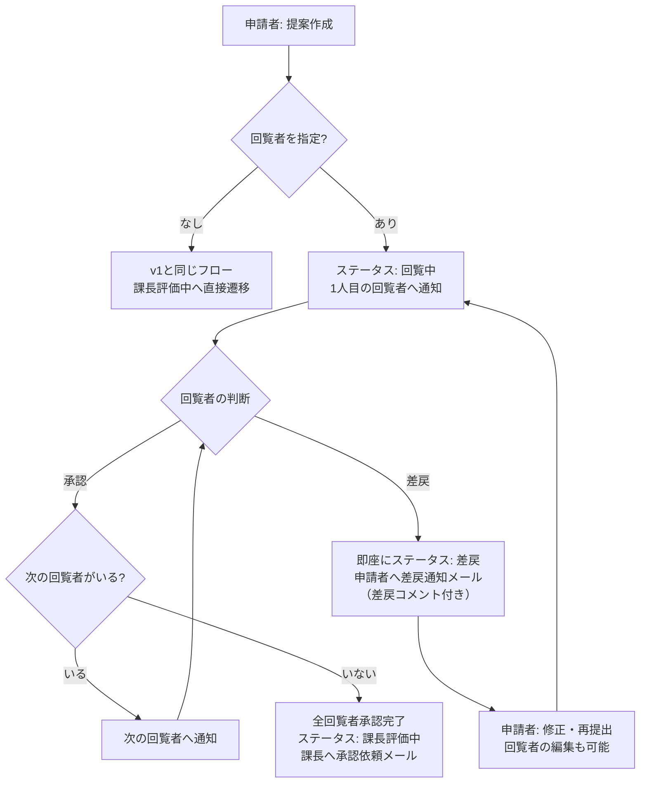
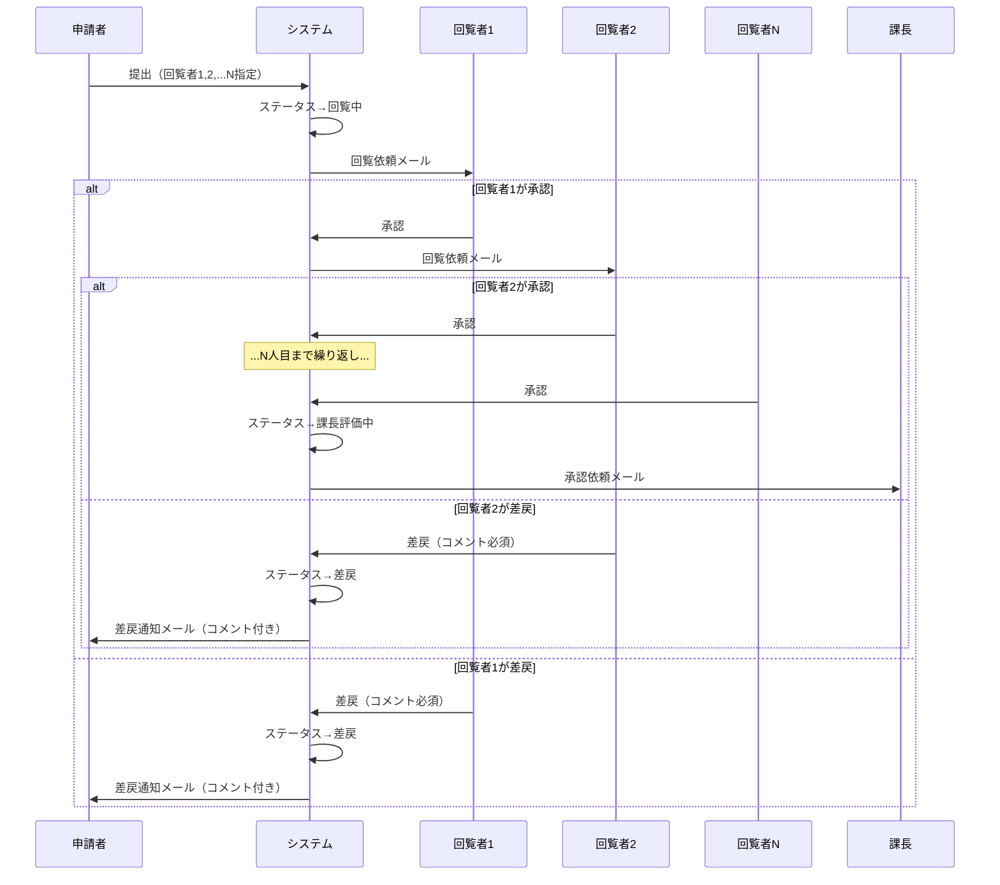
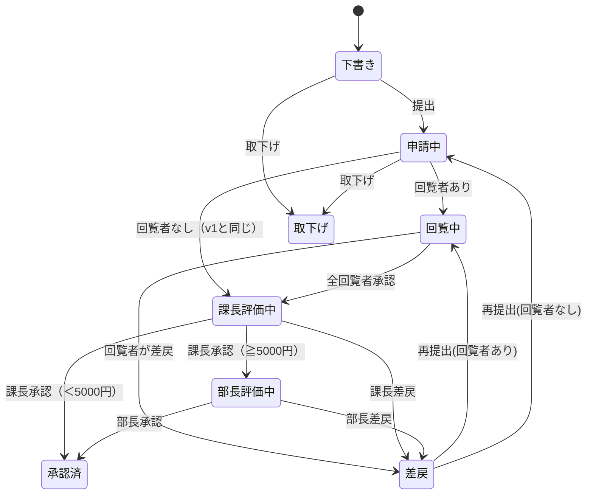
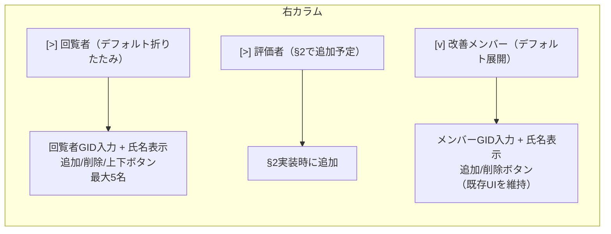
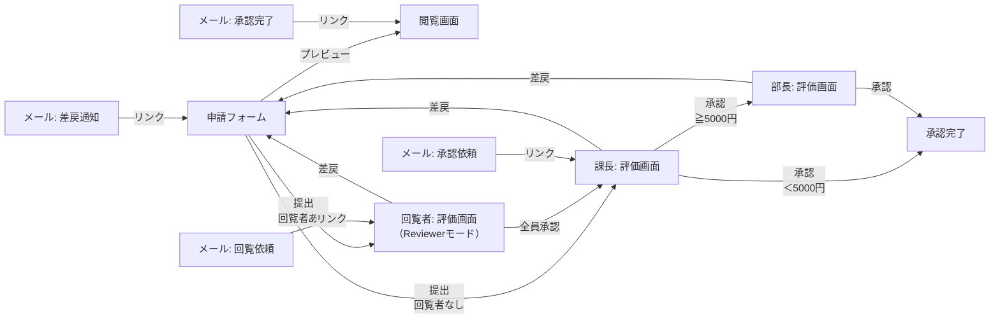

# 回覧者（事前確認者）

## 概要

評価者（課長・部長）に回る前に、申請内容を事前確認する「回覧者」を追加できる機能。回覧者は評価（スコアリング）は行わず、承認/差戻のみを行う。申請者が申請フォームで回覧者を最大5名まで指定し、直列（順番）に回覧する。1人目から順に通知し、承認後に次の回覧者へ進む。全回覧者の承認完了後に評価者（課長）へ遷移する。1人でも差戻した場合は即座に申請者へ差戻通知を行い、残りの回覧者の回答は待たない。

## 設計判断

本提案の設計は以下の判断に基づく。

### DJ-1: 回覧者の人数上限 — 最大5名

回覧者は0〜5名の範囲で指定可能。デフォルトは0名（回覧なし）。5名を超える事前確認が必要なケースは業務上想定しにくく、直列回覧のリードタイム（5名×承認待ち時間）を考慮すると5名が現実的な上限。

### DJ-2: 回覧順序 — 直列（順番に回覧）

1人目から順に通知し、承認後に次の回覧者へ進む方式を採用する。

- **選定理由**: 上位者が後から確認する、部署間で順序を制御するなど、回覧順序に意味がある業務が想定される
- **回覧者リストにOrder列**（回覧順）を持ち、申請フォームUIで並べ替え（上下ボタン）が可能
- フロー: 回覧者承認 → 次のOrderのレコードを取得 → あれば通知、なければ評価者へ遷移

### DJ-3: 回覧者用画面 — 評価画面をモード切替で兼用

新規画面は作成せず、既存の評価画面にReviewerモードを追加する。

- **選定理由**: 評価画面は上部に閲覧画面を組み込み済みで、回覧者が申請内容を確認→承認/差戻する導線として十分。新規画面の開発・保守コストを回避
- Reviewerモード時の表示: スコアリング部分を非表示、承認/差戻ボタン＋差戻コメント入力フォームを表示
- URLパラメータ `Mode=Reviewer` で評価画面のモードを切り替え

### DJ-4: 回覧者入力UIの配置 — 右カラムに回覧者・評価者・メンバーの3セクション

申請フォームの右カラムに「回覧者」「評価者（§2で追加）」「改善メンバー」の3セクションを配置し、折りたたみ式で省スペース化する。右カラムの構成は上から「回覧者セクション」→「評価者セクション（§2で追加）」→「改善メンバーセクション」の順。

- **選定理由**: 左カラムは基本情報で既にスペースが埋まっている。右カラムに回覧者・評価者・メンバーを集約することで「人の指定」を1箇所にまとめ、直感的なUI。回覧者→評価者→メンバーの順は、承認フローの流れ（回覧→評価→実施）と一致する
- 各セクションにExpandable/Collapsibleヘッダーを設置
- 回覧者セクション: デフォルト折りたたみ（回覧者0名が多数派のため）
- 評価者セクション: §2で追加予定
- メンバーセクション: デフォルト展開

### DJ-5: 回覧者リスト設計 — 新規「回覧者リスト」を作成

改善メンバーリストとは独立した新規SharePointリストとして作成する。

- **選定理由**: 改善メンバーとは性質が異なる（メンバー=参加者の記録、回覧者=承認フローの参加者）。ステータス・回覧順序など回覧固有の列が必要で、メンバーリストの拡張では列が混在して管理が複雑化する
- RequestID + ReviewerGID + Order + Status の構成

### DJ-6: 差戻後の再提出時の回覧 — 同じ回覧者に再度回覧（削除も可能）

差戻後の再提出時は、前回と同じ回覧者リストを引き継ぎ、再度1人目から回覧する。ただし、差戻後の編集画面で回覧者の削除・追加・順序変更も可能とする。

- **選定理由**: 回覧者は内容確認の役割であり、修正後の内容も確認してもらうのが自然。一方、差戻理由によっては回覧者の変更が必要になるケースもあるため柔軟性を持たせる
- 再提出時: 回覧者リストのStatusを全件「未回覧」にリセット → 1人目から回覧開始

### DJ-7: 差戻コメントのSP保存 — メール本文のみ（SP非保存）

backlog方針通り、差戻コメントはメール本文に記載するのみとし、SharePointリストへの永続保存は行わない。

- Power Appsの回覧者画面で入力した差戻コメントをPower Automateフローに渡し、メールテンプレートに差し込む
- 承認履歴リスト（§7-5）の実装時に保存対応を検討する余地を残す

### DJ-8: リマインダー対応 — §3では含めず

回覧者へのリマインダー（督促）は§3のスコープ外とし、§7-4（リマインダーフロー）の実装時に対応する。

### DJ-9: 承認履歴 — §3では含めず

回覧の承認/差戻アクションの履歴記録は§3のスコープ外とし、§7-5（承認履歴リスト）の実装時に対応する。現時点では回覧者リストのStatus列で最新状態を管理する。

### DJ-10: 承認完了Cc範囲 — 最終承認完了メールのみにCc追加

回覧者全員をCcに追加するのは最終承認完了メール（課長承認完了または部長承認完了）のみとする。

- 途中の評価者遷移メール（課長→部長への承認依頼等）には回覧者をCcに含めない
- 差戻通知メールにも回覧者をCcに含めない（差戻は申請者への通知のみ）

### DJ-11: §2（評価者変更）との接続点 — v1前提で設計

本提案はv1の承認ルート（課長→部長の固定ルート）を前提に設計する。§2（評価者変更機能）との統合ポイントを以下に明記し、§2実装時にスムーズに接続できるようにする。

- **回覧完了後の遷移先**: 現設計では「課長評価中」に遷移。§2で1人目の評価者が削除された場合は「2人目の評価者」（部長相当）に遷移するよう変更が必要
- **フローの条件分岐**: 回覧通知フローの「全回覧者承認後」の遷移ロジックを、§2の評価者リスト構造に合わせて一般化する必要あり
- **ステータス遷移**: 回覧者ありかつ1人目評価者なしの場合の遷移パス（回覧中→部長評価中）を§2で追加

## 業務フロー

### 回覧者ありの場合



### 直列回覧の詳細フロー



## ステータス遷移

v1のステータスに「回覧中」を追加する。



### ステータス遷移の変更点

| 変更点 | v1 | v2（本提案） |
|--------|-----|-------------|
| ステータス選択肢 | 下書き/申請中/課長評価中/部長評価中/承認済/差戻/取下げ | 下書き/申請中/**回覧中**/課長評価中/部長評価中/承認済/差戻/取下げ |
| 申請中→次ステータス | 課長評価中 | 回覧者あり→**回覧中** / 回覧者なし→課長評価中 |
| 差戻→再提出時 | 申請中に戻す | 回覧者あり→直接**回覧中**に遷移（「申請中」を経由しない） / 回覧者なし→「申請中」に戻す（既存仕様通り） |

## リスト設計

### 新規: 回覧者リスト

回覧者情報を管理する新規SharePointリスト。1提案あたり最大5名。

| 列名 | 内部名 | 型 | 必須 | 説明 |
|------|-------|---|------|------|
| リクエストID | RequestID | 1行テキスト | ○ | 親リスト（改善提案メイン）への参照キー。**インデックス作成必須** |
| 回覧者GID | ReviewerGID | 1行テキスト | ○ | 10桁半角数字（=SonyID） |
| 回覧者氏名 | ReviewerName | 1行テキスト | ○ | GIDから社員マスタで自動取得 |
| 回覧者メール | ReviewerEmail | 1行テキスト | ○ | GIDから社員マスタで自動取得。フロー通知に使用 |
| 回覧順 | ReviewOrder | 数値 | ○ | 1〜5。回覧の順番を指定 |
| ステータス | ReviewStatus | 選択肢 | ○ | 未回覧/承認/差戻。デフォルト: 未回覧 |
| 回覧日時 | ReviewDateTime | 日時 | | 承認または差戻を行った日時 |

> **インデックス設計**: `RequestID` 列にインデックスを作成する（親子リレーション検索用）。

### 変更: 改善提案メイン リスト

| 列名 | 内部名 | 型 | 変更種別 | 説明 |
|------|-------|---|---------|------|
| ステータス | Status | 選択肢 | **選択肢追加** | 「回覧中」を追加。選択肢: 下書き/申請中/**回覧中**/課長評価中/部長評価中/承認済/差戻/取下げ |

> **その他の列変更はなし**。回覧者情報は回覧者リストで管理するため、メインリストへの列追加は不要。

### リスト一覧（更新後）

| No. | リスト名 | 用途 | レコード規模 |
|-----|---------|------|------------|
| 1 | 改善提案メイン | 提案の基本情報・ステータス管理 | 年間数百件 |
| 2 | 改善メンバー | 提案ごとのメンバー情報（1:N） | メイン×最大10 |
| 3 | 改善分野実績 | 分野別の実績値・効果金額（1:N） | メイン×最大12 |
| 4 | 評価データ | 課長・部長の評価結果（1:2） | メイン×最大2 |
| ★5 | 承認履歴 | 承認/差戻/取下げの履歴ログ | アクション数分 |
| 6 | 社員マスタ | GID・氏名・組織・承認者情報 | 15,000人 |
| 7 | 改善分野マスタ | 改善分野の選択肢・単位・算出式 | 約14件 |
| 8 | 表彰区分マスタ | 表彰区分の選択肢・褒賞金額 | 4件 |
| **9** | **回覧者** | **提案ごとの回覧者情報（1:N）** | **メイン×最大5** |

## 画面設計

### 申請フォーム — 変更箇所

#### 右カラムの2セクション分割

右カラムを「回覧者」「評価者（§2で追加）」「改善メンバー」の3セクションに分割する。各セクションは折りたたみ式のヘッダーを持つ。上から回覧者→評価者→メンバーの順に配置する。



#### 回覧者入力UI

| 項目 | 入力方式 | データソース/備考 |
|------|---------|----------------|
| 回覧者GID | テキスト入力 | 10桁半角数字。社員マスタに該当なしの場合はエラー表示 |
| 回覧者氏名 | 自動表示（グレーアウト） | GIDから社員マスタで自動取得 |
| 回覧順 | 上下ボタンで並べ替え | Gallery内に上矢印/下矢印アイコンを配置 |
| 追加ボタン | ボタン | GID入力→社員マスタ検索→コレクションに追加。5名上限チェック |
| 削除ボタン | アイコン（各行） | 選択した回覧者をコレクションから削除。Order自動再採番 |

**バリデーション**:
- 回覧者に申請者自身を指定できない（`ReviewerGID <> varApplicantGID`）
- 回覧者に評価者（課長・部長）を指定できない（`ReviewerGID <> varManagerGID && ReviewerGID <> varDirectorGID`）
- 同一人物の重複指定不可
- 最大5名チェック

**コレクション管理（Power Apps側）**:

```
// 回覧者コレクション
colReviewers: {
    ReviewerGID: Text,
    ReviewerName: Text,
    ReviewerEmail: Text,
    ReviewOrder: Number
}
```

#### 提出処理（btnSubmit.OnSelect）への追加

提出時に回覧者コレクションをSharePoint回覧者リストに書き込む処理を追加する。

```
// 擬似コード: 回覧者リストへの書き込み
ForAll(
    colReviewers,
    Patch(
        回覧者リスト,
        Defaults(回覧者リスト),
        {
            RequestID: varRequestID,
            ReviewerGID: ThisRecord.ReviewerGID,
            ReviewerName: ThisRecord.ReviewerName,
            ReviewerEmail: ThisRecord.ReviewerEmail,
            ReviewOrder: ThisRecord.ReviewOrder,
            ReviewStatus: "未回覧"
        }
    )
);
```

> **注意**: 提出時のステータス設定も変更が必要。回覧者が1名以上いる場合は「回覧中」、いない場合は従来通り「申請中」をセットする。ただし、申請通知フローのトリガー条件が「ステータス=申請中」であるため、回覧者がいない場合のフローの動作には影響しない。回覧者がいる場合は別の回覧通知フローがトリガーされる設計とする。

#### 差戻後の再編集時

差戻後に申請フォームを開いた場合:
- 既存の回覧者リストから回覧者情報を読み込み、`colReviewers` に復元
- 回覧者の追加・削除・順序変更が可能
- 再提出時に回覧者リストを更新（下記参照）

**再提出時の回覧者リスト更新ロジック**（推奨方式: 全削除→全件新規作成）:

```
// 擬似コード: 再提出時の回覧者リスト更新
// 推奨方式: 既存レコードを全削除 → colReviewersから全件新規作成（最もシンプル）

// 1. 既存の回覧者レコードを全削除
ForAll(
    Filter(回覧者リスト, RequestID = varRequestID),
    Remove(回覧者リスト, ThisRecord)
);

// 2. colReviewersから全件新規作成（Statusは「未回覧」にリセット）
ForAll(
    colReviewers,
    Patch(
        回覧者リスト,
        Defaults(回覧者リスト),
        {
            RequestID: varRequestID,
            ReviewerGID: ThisRecord.ReviewerGID,
            ReviewerName: ThisRecord.ReviewerName,
            ReviewerEmail: ThisRecord.ReviewerEmail,
            ReviewOrder: ThisRecord.ReviewOrder,
            ReviewStatus: "未回覧"
        }
    )
);
```

> **補足**: 全削除→全件新規作成方式は、回覧者の追加・削除・順序変更がすべて反映され、差分計算の複雑さを回避できる。レコード数は最大5件であり、パフォーマンス上の問題はない。

### 評価画面 — 変更箇所（Reviewerモード追加）

#### モード切替

評価画面にReviewerモードを追加する。URLパラメータ `Mode=Reviewer` でモードを判定。

| モード | URLパラメータ | 表示内容 |
|--------|-------------|---------|
| 課長評価（既存） | `EvalType=課長` | 閲覧画面（上部）＋ スコアリング ＋ 承認/差戻ボタン |
| 部長評価（既存） | `EvalType=部長` | 閲覧画面（上部）＋ スコアリング ＋ 承認/差戻ボタン |
| **回覧者（新規）** | `Mode=Reviewer` | 閲覧画面（上部）＋ **差戻コメント入力** ＋ **承認/差戻ボタンのみ** |

#### Reviewerモードの評価入力欄

| 項目 | 入力方式 | 備考 |
|------|---------|------|
| 差戻コメント | 複数行テキスト入力 | 差戻時のみ必須。承認時は入力不要 |
| 承認ボタン | ボタン | 回覧者リストのStatusを「承認」に更新 → フロー実行 |
| 差戻ボタン | ボタン | コメント入力チェック → 回覧者リストのStatusを「差戻」に更新 → フロー実行 |

> スコアリング部分（①〜④評価軸、素点合計、職能換算、等級、褒賞金額、おすすめ情報）は**非表示**。

#### 承認/差戻処理

**承認時**:
```
// 擬似コード
Patch(
    回覧者リスト,
    LookUp(回覧者リスト, RequestID = varRequestID && ReviewerGID = varCurrentUserGID),
    {
        ReviewStatus: "承認",
        ReviewDateTime: Now()
    }
);
// → 回覧通知フローがトリガーされ、次の回覧者への通知 or 課長への遷移を処理
```

**差戻時**:
```
// 擬似コード
If(
    IsBlank(txtReviewComment.Value),
    Notify("差戻理由を入力してください", NotificationType.Error),
    // 差戻コメントをフローに渡す
    Patch(
        回覧者リスト,
        LookUp(回覧者リスト, RequestID = varRequestID && ReviewerGID = varCurrentUserGID),
        {
            ReviewStatus: "差戻",
            ReviewDateTime: Now()
        }
    );
    // メインリストのステータスを差戻に更新
    Patch(
        改善提案メイン,
        LookUp(改善提案メイン, RequestID = varRequestID),
        { Status: "差戻" }
    );
    // 差戻コメントをフローに渡してメール送信
    // ※ Power Automateフローの呼び出し方法は後述
)
```

> **差戻コメントのフローへの渡し方**: 回覧者リストにはコメント列を持たない（DJ-7）ため、差戻時にPower Automateのインスタントフローを直接呼び出し、コメントをパラメータとして渡す方式を採用する。または、回覧者リストのステータス変更をトリガーとするフロー内で、Power AppsからのパラメータをHTTPリクエスト経由で受け取る。詳細はフロー設計セクションで定義する。

### 閲覧画面 — 変更箇所

#### 回覧者一覧の表示追加

閲覧画面に「回覧者」セクションを追加し、回覧者の一覧と各回覧者のステータスを表示する。

| 表示項目 | 表示方式 | 備考 |
|---------|---------|------|
| 回覧者一覧 | データテーブル（読取専用） | 回覧順、氏名、ステータス（未回覧/承認/差戻） |

配置場所: 改善メンバー一覧の直下。回覧者が0名の場合はセクション非表示。

### 画面遷移図（更新後）



## フロー設計

### 新規: 回覧通知フロー

回覧者の承認/差戻をトリガーとして、次の回覧者への通知または評価者への遷移を制御するフロー。

| ステップ | アクション | 詳細 |
|---------|-----------|------|
| 1 | トリガー: 項目が変更されたとき | 回覧者リスト、条件: ReviewStatus = "承認"（方式A採用のため、差戻はインスタントフロー側で処理） |
| 2 | 変更されたアイテム取得 | トリガーのレコードからRequestID、ReviewStatus、ReviewOrderを取得 |
| 3 | 次の回覧者を検索 | 回覧者リストから `RequestID = 同一 AND ReviewOrder > 現在のOrder AND ReviewStatus = "未回覧"` で昇順ソート、先頭1件を取得 |
| 4 | 条件分岐: 次の回覧者がいる? | |
| 4a | Yes → 次の回覧者へ通知 | 回覧依頼メールを送信 |
| 4b | No → 全回覧者承認完了 | メインリストのステータスを「課長評価中」に更新。申請通知フロー（既存）の課長承認依頼ロジックを再利用（※後述） |

> **差戻処理について**: 方式A採用により、差戻はPower Appsからインスタントフロー（回覧差戻フロー）を直接呼び出して処理する。回覧通知フローは承認時のみトリガーされ、差戻処理は含まない。

> **差戻コメントの受け渡し方式**: 回覧者リストにコメント列を持たないため（DJ-7）、差戻時のコメントは以下のいずれかの方式で対応する。
>
> **方式A（推奨）: Power Appsからインスタントフロー呼び出し**
> - 回覧者の差戻ボタン押下時に、Power Appsから直接インスタントフロー（「回覧差戻フロー」）を呼び出す
> - パラメータ: RequestID, ReviewerGID, DismissComment
> - フロー内でメインリストのステータス更新＋差戻通知メール送信を実行
> - 回覧者リストのステータス更新はPower Apps側のPatchで行い、回覧通知フローのトリガーは承認時のみに限定
>
> **方式B: 回覧者リストに一時コメント列を追加**
> - 回覧者リストにDismissComment列を追加し、差戻時にコメントを書き込む
> - 回覧通知フローのトリガー（差戻時）でコメント列を読み取り、メールに差し込む
> - DJ-7の「SP非保存」方針とやや矛盾するが、実装はシンプル
>
> 実装時に方式Aを優先し、技術的制約で困難な場合は方式Bにフォールバックする。

#### 回覧全承認後の課長通知

回覧者全員が承認した後、課長への承認依頼メール送信が必要。以下の2つの方式がある。

**方式1: 回覧通知フロー内で直接課長通知を送信**
- 回覧通知フローの3a-2bステップで、メインリストのステータスを「課長評価中」に更新し、社員マスタから課長メールを取得して承認依頼メールを送信
- 既存の申請通知フローと処理が重複するが、回覧通知フロー内で完結するためシンプル

**方式2: 既存の申請通知フローを再利用**
- 回覧通知フローでメインリストのステータスを「課長評価中」に更新するだけ
- 申請通知フローのトリガー条件を「ステータス=申請中 OR ステータス=課長評価中」に変更
- 既存フローの再利用で保守性が高いが、トリガー条件の変更に伴う副作用に注意

> **推奨**: 方式1を採用。既存フローのトリガー条件変更は副作用リスクがある（ステータスが課長評価中に変わるタイミングは他にもあり得る）。回覧通知フロー内で課長通知まで完結させる方が安全。

### 変更: 申請通知フロー

| 変更点 | 詳細 |
|--------|------|
| トリガー条件 | 変更なし（ステータス=申請中）。回覧者がいる場合はステータスが「回覧中」になるため、このフローはトリガーされない |
| 処理 | 変更なし |
| 誤トリガー確認 | 回覧通知フローでメインリストのステータスを「課長評価中」に更新した際、申請通知フロー（作成時トリガー）は誤トリガーしない（申請通知フローは「項目作成時」トリガーであり、「項目更新」では発火しないため） |

> **重要**: 回覧者がいない場合のフローはv1と完全に同じ動作を維持する。回覧者がいる場合は申請通知フローがトリガーされず、代わりに回覧通知フロー（新規）が動作する。
>
> **差戻後の再提出時の注意**: 申請通知フローのトリガーは「項目作成時」であるため、再提出（=項目更新）ではトリガーされない。
> - **回覧者ありの場合**: Power Apps側でステータスを直接「回覧中」にセットし、回覧者リストを再作成する。これにより回覧通知フローが処理を開始するため、申請通知フローは関与しない。
> - **回覧者なしの場合**: 既存仕様と同じ問題（再提出が項目更新であるため申請通知フローがトリガーされない）が残る。この点は§3のスコープ外であり、既知の課題として記録する。

### 変更: 課長承認フロー

| 変更点 | 詳細 |
|--------|------|
| トリガー条件 | 変更なし |
| 承認完了メール | Ccに回覧者全員を追加（DJ-10: 最終承認完了メールのみ）。課長承認で完了する場合（< 5,000円）のみCc追加 |
| 部長承認依頼メール | Cc追加なし |
| 差戻通知メール | Cc追加なし |

### 変更: 部長承認フロー

| 変更点 | 詳細 |
|--------|------|
| トリガー条件 | 変更なし |
| 承認完了メール | Ccに回覧者全員を追加（DJ-10: 最終承認完了メールのみ） |
| 差戻通知メール | Cc追加なし |

### 回覧者Ccアドレスの取得ロジック

課長承認フロー・部長承認フローで承認完了メールにCcを追加する処理:

```
// 擬似フローロジック
1. RequestIDで回覧者リストをフィルタ（Get items: RequestID = トリガーのRequestID）
2. レコードが0件の場合 → Cc追加なし（回覧者なしのケース）
3. レコードが1件以上の場合 → ReviewerEmailをセミコロン区切りで結合 → Ccに設定
```

> **回覧者Emailの鮮度**: 回覧者リストのReviewerEmailは申請時点のスナップショットであり、社員マスタのメールアドレス変更には追従しない。メールアドレスは基本的に変更されないため、追従処理は不要と判断する。

### メールテンプレート（新規・変更）

| メール種別 | 新規/変更 | 宛先 | Cc | 件名 | 本文に含む情報 |
|-----------|----------|------|-----|------|-------------|
| **回覧依頼** | **新規** | 回覧者 | — | 【改善提案】回覧依頼: {テーマ} | 申請者名、テーマ、効果金額合計、回覧順（N人目/全M人）、Power Appsリンク |
| **回覧差戻通知** | **新規** | 申請者 | — | 【改善提案】回覧差戻: {テーマ} | 差戻者名、差戻コメント、修正・再提出用リンク |
| 承認完了（課長） | **変更** | 申請者+課長 | **回覧者全員** | （既存と同じ） | （既存と同じ） |
| 承認完了（部長） | **変更** | 申請者+部長 | **回覧者全員** | （既存と同じ） | （既存と同じ） |

### メールリンクURL設定（追加）

| テンプレート | リンクテキスト | リンク先画面 | URLパラメータ |
|-------------|--------------|-------------|-------------|
| 回覧依頼メール | 回覧画面を開く | 評価画面（Reviewerモード） | `?RequestID={RequestID}&Mode=Reviewer` |
| 回覧差戻通知メール | 申請内容を修正する | 申請フォーム | `?RequestID={RequestID}&Mode=Edit` |

### フロー一覧（更新後）

| No. | フロー名 | トリガー | 処理概要 |
|-----|---------|--------|---------|
| 1 | 申請通知フロー | Lists項目作成時（ステータス=申請中） | 課長へ承認依頼メール送信（変更なし） |
| 2 | 課長承認フロー | Lists項目変更時（課長評価完了） | 承認完了メールにCc追加 |
| 3 | 部長承認フロー | Lists項目変更時（部長評価完了） | 承認完了メールにCc追加 |
| **4** | **回覧通知フロー** | **回覧者リスト項目変更時（承認時のみ）** | **次の回覧者通知 or 課長遷移** |
| ★5 | 取下げ通知フロー | Lists項目変更時（ステータス=取下げ） | 承認者へ取下げ通知メール |
| ★6 | リマインダーフロー | スケジュール（日次） | 承認期限超過の案件を承認者へ督促 |

> **回覧差戻フロー（方式A採用時）**: Power Appsからのインスタントフロー呼び出しとして実装。フロー一覧のNo.は回覧通知フローと区別して別フローにするか、回覧通知フロー内に統合するかは実装時に判断。

## 評価ロジック

影響なし。回覧者はスコアリングを行わないため、評価ロジック・自動計算仕様に変更はない。

## 既存機能への影響

| 影響箇所 | 影響内容 | 対応方針 |
|---------|---------|---------|
| 改善提案メイン: Status列 | 選択肢に「回覧中」を追加 | PnPスクリプトで列定義を更新 |
| 申請フォーム: 右カラム | 回覧者セクションを追加（折りたたみ式） | YAML追加 |
| 申請フォーム: btnSubmit.OnSelect | 回覧者リストへの書き込み＋ステータス分岐ロジック追加 | submit-logic.pfx も同期必須 |
| 評価画面 | Reviewerモード追加（スコアリング非表示＋差戻コメント入力） | URLパラメータ判定ロジック追加 |
| 閲覧画面 | 回覧者一覧セクション追加 | YAML追加 |
| 課長承認フロー | 承認完了メールにCc追加 | フロー編集 |
| 部長承認フロー | 承認完了メールにCc追加 | フロー編集 |
| App.OnStart | `Mode=Reviewer` パラメータの処理追加。分岐ロジック: Mode=Edit → 申請フォーム、Mode=Reviewer → 評価画面（Reviewerモード）、未指定 → 閲覧画面 | app-onstart.pfx 更新 |
| Column Formatting | 影響なし（閲覧画面へのリンクのため） | — |
| spec/lists.md 3.1.1インデックス設計 | 回覧者リストのRequestIDインデックスを追加 | インデックス定義を追記 |
| spec/security.md | 回覧者ロールの権限定義を追加（回覧者リストの自分のレコードのみ更新可能、申請内容の閲覧のみ、評価権限なし） | セキュリティ設計に追記 |

### 影響しない箇所

- SharePoint ドキュメントライブラリの設計（変更なし）
- 改善メンバーリスト（変更なし）
- 改善分野実績リスト（変更なし）
- 評価データリスト（変更なし）
- 評価ロジック・自動計算仕様（変更なし）
- 社員マスタ・改善分野マスタ・表彰区分マスタ（変更なし）
- 申請通知フロー（回覧者ありの場合はトリガーされないため影響なし）

### §2（評価者変更）との接続ポイント

| 接続ポイント | 現設計（v1前提） | §2統合時の変更 |
|-------------|----------------|---------------|
| 回覧完了後の遷移先 | 固定で「課長評価中」 | 1人目評価者の有無に応じて遷移先を動的判定 |
| 回覧通知フローの課長通知 | 社員マスタから課長メールを固定取得 | メインリストのApproverManager（変更可能な評価者）からメール取得 |
| ステータス遷移 | 回覧中→課長評価中のみ | 回覧中→{1人目評価者}評価中 or 回覧中→{2人目評価者}評価中 |
| 回覧者バリデーション | 固定の課長/部長GIDとの重複チェック | 変更後の評価者GIDとの重複チェックに切替 |

### §4（申請取消機能）との接続ポイント

- 「回覧中」ステータスでの取消が§4のスコープに含まれる（backlog §4に記載済み）
- 取消時: 回覧者リストのステータスは変更不要（取消通知のみ）

## 移行手順への影響

### デプロイガイド（deployment-guide.md）

以下の追記が必要:

1. **SharePointリスト作成**: 回覧者リストの作成手順を追加（create-lists.ps1 に追加）
2. **メインリストのステータス列更新**: 「回覧中」選択肢の追加

### UI手作業手順（ui-manual-2-7.md）

以下の追記が必要:

1. **申請フォーム**: 右カラムの回覧者セクション配置手順
2. **評価画面**: Reviewerモードの表示制御設定
3. **閲覧画面**: 回覧者一覧セクションの配置手順

### PnPスクリプト

| スクリプト | 変更内容 |
|-----------|---------|
| `scripts/create-lists.ps1` | 回覧者リストの作成を追加 |
| `scripts/develop/patch-*.ps1` | 既存メインリストのStatus列に「回覧中」選択肢を追加するパッチ |

### Power Automateフロー

| フロー | 変更内容 |
|--------|---------|
| 回覧通知フロー | 新規作成 |
| 回覧差戻フロー | 新規作成（方式A採用時のインスタントフロー） |
| 課長承認フロー | 承認完了メールのCcに回覧者追加 |
| 部長承認フロー | 承認完了メールのCcに回覧者追加 |

### メールHTMLテンプレート

| テンプレート | 変更内容 |
|-------------|---------|
| `回覧依頼.html` | 新規作成 |
| `回覧差戻通知.html` | 新規作成 |
| `課長承認_承認完了.html` | 変更なし（Ccはフロー側で設定、テンプレート変更不要） |
| `部長承認_承認完了.html` | 変更なし（Ccはフロー側で設定、テンプレート変更不要） |

## 実機検証項目

| No. | 検証項目 | 期待結果 | 不合格時の代替案 |
|-----|---------|---------|---------------|
| V-1 | Power Automateで回覧者リストの項目変更をトリガーとして正しくフローが起動するか | ReviewStatus変更時にフローがトリガーされる | トリガー条件の見直し or Power Appsからのインスタントフロー呼び出しに切替 |
| V-2 | 直列回覧で次の回覧者の取得（Get items + Filter + Sort + Top 1）が正しく動作するか | ReviewOrder昇順で未回覧の次のレコードが取得できる | OData filterの構文調整 |
| V-3 | 回覧差戻時にPower Appsからインスタントフロー呼び出しでコメントを渡せるか（方式A） | フロー内でコメントパラメータを受信しメール本文に差し込める | 方式B（回覧者リストにDismissComment列追加）にフォールバック |
| V-4 | 課長承認フロー・部長承認フローで回覧者のメールアドレスを動的にCcに設定できるか | セミコロン区切りの複数メールアドレスがCcフィールドに設定される | 個別送信に切替（ForAllでCc無しメールを回覧者ごとに送信） |
| V-5 | 評価画面のReviewerモード切替（URLパラメータ `Mode=Reviewer`）が正しく動作するか | スコアリング非表示＋差戻コメント入力フォーム表示 | Power Apps側のParam()とVisible制御の調整 |
