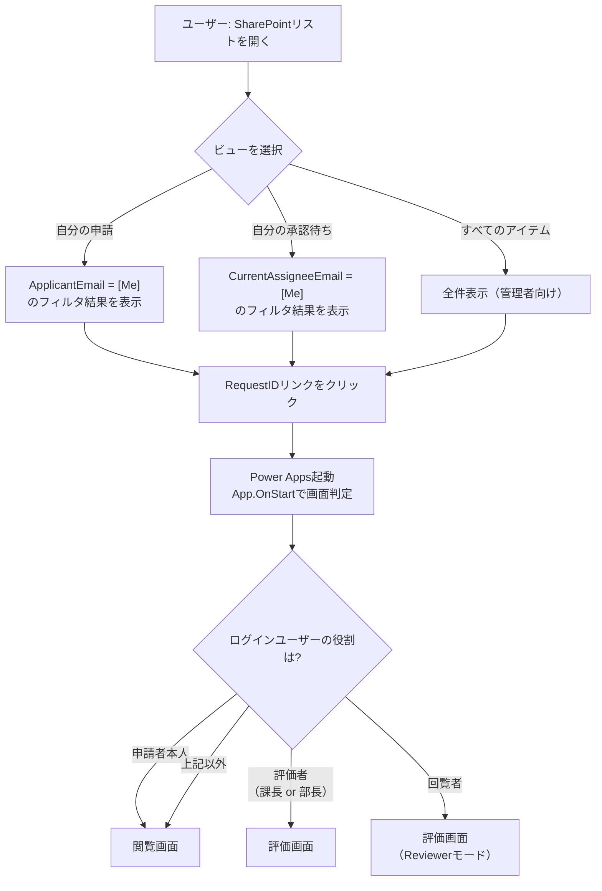
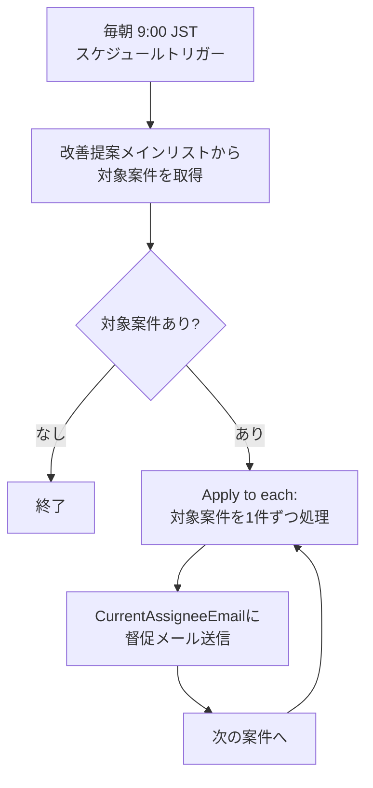
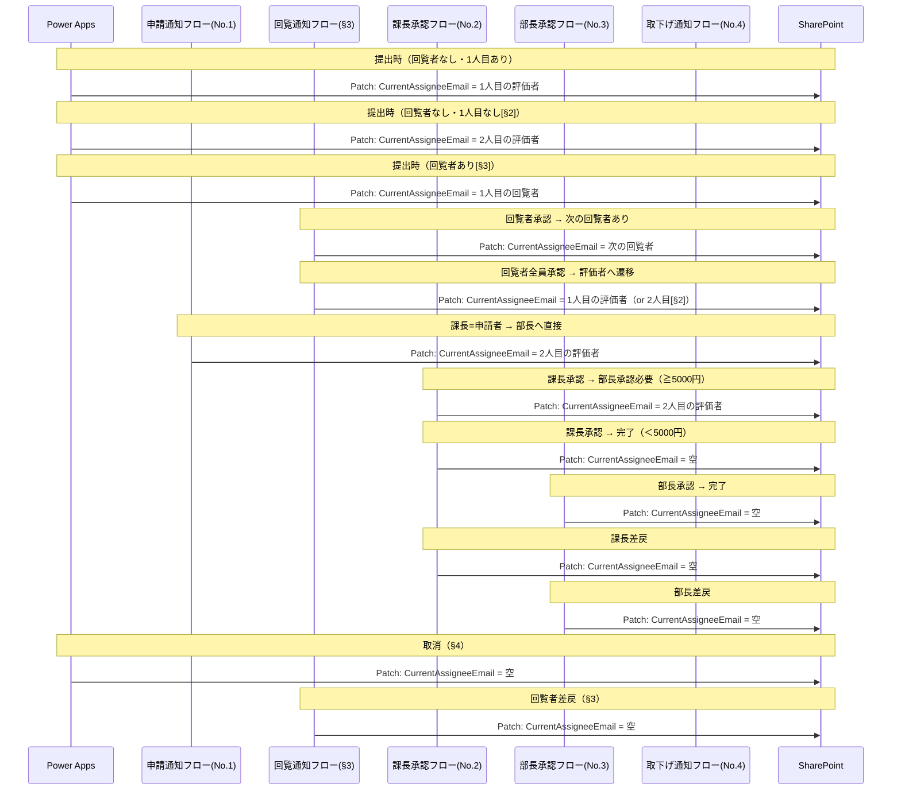

# §7 申請・承認状況の確認導線＋リマインダーフロー

## 概要

§7-1: SharePointリストのカスタムビュー＋Column Formattingにより、申請者・承認者・回覧者が自分に関連する案件を確認できる導線を構築する。v10.1で実装済みの「自分の申請」ビューを拡張し、「自分の承認待ち」ビューを追加する。Person型の`CurrentAssigneeEmail`列により`[Me]`フィルタでビューを構成する。

§7-4: 日次スケジュール（毎朝9:00 JST）のリマインダーフローにより、承認・回覧が滞留している案件の担当者に督促メールを送信する。基準日はメール受信の翌々日（`EvaluationStartDate + 2日`）とし、条件に該当する限り毎朝送信する。

## 設計判断

### DJ-1: CurrentAssigneeEmailの列型 — Person型

SPカスタムビューの`[Me]`フィルタを使用するため、Person型（ユーザー型）を採用する。

- **選定理由**: テキスト型ではSPビューの`[Me]`フィルタが利用できず、CAML Queryでのカスタム構築が必要になる。Person型であれば標準のビューフィルタ設定で`[Me]`を指定するだけで実現可能
- **トレードオフ**: Person型のPatchには`i:0#.f|membership|email`形式のクレーム文字列が必要であり、フロー・Power Apps双方での実装に注意が必要。しかしこのパターンは既存のApproverManager/ApproverDirector列で実績があるため問題ない

### DJ-2: 列名とセット対象の範囲 — `CurrentAssigneeEmail`（現在の担当者）として回覧者もセット

backlog記載の`CurrentEvaluatorEmail`（現在の承認担当者メール）から名称を変更し、`CurrentAssigneeEmail`（現在の担当者）とする。評価者（課長・部長）だけでなく回覧者もセット対象に含める。

- **選定理由**: 回覧者も「自分がアクションすべき未処理案件」の担当者である。回覧者を含めることで、回覧者が自分の承認待ちビューから担当案件を確認できるようになり、UX上の一貫性が保たれる
- 「自分の承認待ち」ビューの名称は実質「自分の対応待ち」の意味になるが、ビュー名はそのまま「自分の承認待ち」を採用する（回覧者の承認も「承認待ち」と呼べるため）

### DJ-3: リマインダー基準日 — 専用列`EvaluationStartDate`を追加、翌々日（2日後）からリマインド開始

承認依頼メールの受信日時を記録する専用列`EvaluationStartDate`（日時型）を追加する。リマインダーの条件は「`EvaluationStartDate + 2日 < 現在日時` かつ `CurrentAssigneeEmail`が空でない」とする。

- **選定理由**: `Created`や`Modified`は別の目的で更新されるため基準日には不適切。専用列で評価開始タイミングを正確に記録する
- メール受信の翌々日からリマインドを開始する。例: 3/29 9:00にメール受信 → 3/31 9:00のリマインダーから対象になる
- 回覧者の担当切り替え時にも`EvaluationStartDate`を更新するため、回覧者にも適切なリマインドが行われる

### DJ-4: リマインダーの回覧者対応 — 回覧者を含める

リマインダーの対象に回覧者を含める。`CurrentAssigneeEmail`に回覧者もセットするため、追加の条件分岐は不要。

- **選定理由**: §3 DJ-8で「リマインダー対応は§7-4で対応」と明記されており、本提案で回覧者対応を完結させる

### DJ-5: リマインダー実行時刻 — 毎朝9:00 JST

日次スケジュールトリガーで毎朝9:00 JST（日本時間）に実行する。

- **選定理由**: 業務開始時にリマインダーが届くことで、承認者が当日中に対応するきっかけになる

### DJ-6（推奨事項）: ビュー表示列 — ビュー目的に応じた列構成

ビューの目的に合わせて表示列を設定する。

- **すべてのアイテム / 自分の承認待ち**: `RequestID / Theme / Status / ApplicantName / Created`（誰の申請かを表示）
- **自分の申請**: `RequestID / Theme / Status / CompletionDate / FinalRewardAmount`（v10.1確定仕様を維持。自分の申請のみ表示されるためApplicantNameは冗長。承認済み案件の結果確認にCompletionDate/FinalRewardAmountが有用）

### DJ-7（推奨事項）: Column FormattingのEvalType — 省略（App.OnStartで動的判定）

Column FormattingのリンクURLに`EvalType`パラメータを含めない。`?RequestID={RequestID}`のみとし、App.OnStart側でログインユーザーとステータスに基づいて適切な画面（閲覧画面 or 評価画面）に遷移させる。

- **選定理由**: 申請者がリンクを開いた場合は閲覧画面、評価者が開いた場合は評価画面に遷移すべきであり、固定パラメータでは対応できない。App.OnStart側の動的判定はv10.1で既に実装済みのパターン

### DJ-8（推奨事項）: リマインダー再送間隔 — 毎日送信

条件に該当する限り毎朝送信する。間引き（3日おき等）は行わない。

- **選定理由**: 実装がシンプル。督促の頻度が高すぎる場合は運用開始後にEvaluationStartDateの閾値を調整すれば対応可能

### DJ-9（推奨事項）: 管理者Cc — 承認者のみに送信

リマインダーメールは承認者（`CurrentAssigneeEmail`）のみに送信し、管理者へのCcは行わない。

- **選定理由**: 初期リリースではシンプルに承認者のみ。管理者Ccが必要な場合は運用開始後に追加検討する

### DJ-10（推奨事項）: SPビュー構築方式 — PnP PowerShellスクリプトで自動化

SPビュー・Column Formattingの構築はPnPスクリプトで自動化する。手動構築は行わない。

## 業務フロー

### §7-1 確認導線のユーザーフロー



### §7-4 リマインダーフローの処理概要



### CurrentAssigneeEmailの更新タイミング全体図



## リスト設計

### 改善提案メイン リスト — 列追加

#### 新規列: CurrentAssigneeEmail（現在の担当者）

| 列名 | 内部名 | 型 | 必須 | 説明 |
|------|-------|---|------|------|
| 現在の担当者 | CurrentAssigneeEmail | ユーザー（Person） | | 現在アクションすべき担当者。評価者（課長・部長）または回覧者のメールアドレス。承認完了・差戻・取消時は空にクリア |

#### 新規列: EvaluationStartDate（評価開始日時）

| 列名 | 内部名 | 型 | 必須 | 説明 |
|------|-------|---|------|------|
| 評価開始日時 | EvaluationStartDate | 日時 | | 現在の担当者への承認依頼が開始された日時。リマインダーフローの基準日として使用。担当者が切り替わるたびに更新される |

#### インデックス追加

| 列名 | 目的 |
|------|------|
| CurrentAssigneeEmail | 「自分の承認待ち」ビューのフィルタ用。Person型列のインデックスによりSP閾値（5,000件）超過時のパフォーマンスを確保 |

> **EvaluationStartDateにはインデックス不要**: リマインダーフローではPower Automateの「複数の項目の取得」アクションでODataフィルタを使用するが、フィルタ条件の主キーは`CurrentAssigneeEmail ne null`（空でない）であり、EvaluationStartDateの比較はフロー内のApply to each内で行う。メインリストの年間レコード数は数百件のため、インデックスなしでもパフォーマンス上問題ない。

#### 既存インデックスとの統合

spec/lists.md 3.1.1節の改善提案メインのインデックス一覧に`CurrentAssigneeEmail`を追加する。

**改善提案メイン（更新後）:**
- `Status` — ステータスフィルタ用
- `ApplicantEmail` — 自分の申請一覧用
- `ApproverManager` — 課長の承認待ち一覧用
- `ApproverDirector` — 部長の承認待ち一覧用
- `CurrentAssigneeEmail` — 自分の承認待ちビュー用 **[§7-1で追加]**

### CurrentAssigneeEmail/EvaluationStartDateの更新タイミング一覧

全フロー・Power Appsでの更新タイミングを網羅する。

#### Power Apps（btnSubmit.OnSelect）

| タイミング | 条件 | CurrentAssigneeEmail | EvaluationStartDate |
|-----------|------|---------------------|---------------------|
| 提出（回覧者なし・1人目あり） | `CountRows(colReviewers) = 0 && !IsBlank(varManagerEmail)` | 1人目の評価者（課長）のメール | `Now()` |
| 提出（回覧者なし・1人目なし[§2]） | `CountRows(colReviewers) = 0 && IsBlank(varManagerEmail)` | 2人目の評価者（部長）のメール | `Now()` |
| 提出（回覧者あり[§3]） | `CountRows(colReviewers) > 0` | 1人目の回覧者のメール | `Now()` |

> **Person型のPatch値**: `{Claims: "i:0#.f|membership|" & varManagerEmail, Department: "", DisplayName: "", Email: varManagerEmail, ...}` の形式。既存のApproverManager/ApproverDirectorのPatchパターンと同じ。

> **下書き保存時[§5]**: 下書き保存（btnDraftSave.OnSelect）では`CurrentAssigneeEmail`と`EvaluationStartDate`はセットしない（承認フローが開始されていないため）。新規下書き時はPatchから除外、編集中の下書き保存時も既存値を維持する。

#### Power Apps（btnCancel.OnSelect）[§4]

| タイミング | CurrentAssigneeEmail | EvaluationStartDate |
|-----------|---------------------|---------------------|
| 取消実行時 | 空にクリア | 変更なし（記録として保持） |

> **Person型列を空にする方法**: `CurrentAssigneeEmail: Blank()` でPatchする。Person型のBlank()はSharePoint上でnull（空）として保存される。

#### フローNo.1: 申請通知フロー

§5のDJ-10により、申請通知フローのトリガーは「Power Appsから直接起動」に変更される予定。ただし、フロー内でのCurrentAssigneeEmail更新は不要（Power Apps側のbtnSubmit.OnSelectで提出時にセット済み）。

> **実装順序の依存**: §5が未実装の場合、フローNo.1のトリガーは既存の「Lists項目作成時」のまま。この場合もbtnSubmit.OnSelectでCurrentAssigneeEmail/EvaluationStartDateをPatch済みのためフロー内の追加更新ロジックは同じ。ただし、Listsトリガーの場合はフロー起動がPatch完了後に非同期で行われるため、タイミング差に注意。**本提案の実装は§5の実装後を推奨する。**

以下のケースではフロー内でCurrentAssigneeEmailを更新する必要がある:

| タイミング | 条件 | CurrentAssigneeEmail | EvaluationStartDate |
|-----------|------|---------------------|---------------------|
| 課長=申請者で部長へ直接 | フロー内の分岐（§2 DJ-6参照） | 2人目の評価者（部長）のメール | `utcNow()` |

> **説明**: btnSubmit.OnSelectでは「1人目の評価者」をセットするが、申請通知フロー内で「課長=申請者」と判定された場合、ステータスが「部長評価中」に変更されると同時に`CurrentAssigneeEmail`も部長に更新する必要がある。

> **注意**: §5 DJ-10により申請通知フローがPower Appsトリガーになる場合、フロー起動前にPower Apps側で`CurrentAssigneeEmail`を1人目の評価者にセットしている。課長=申請者の判定はフロー内で行われるため、フロー内でのPatch更新が必要。

#### フローNo.2: 課長承認フロー

| タイミング | 条件 | CurrentAssigneeEmail | EvaluationStartDate |
|-----------|------|---------------------|---------------------|
| 課長承認 → 部長承認へ | 褒賞金額 >= 5,000円 | 2人目の評価者（部長）のメール | `utcNow()` |
| 課長承認 → 完了 | 褒賞金額 < 5,000円 | 空にクリア | 変更なし |
| 課長差戻 | — | 空にクリア | 変更なし |

> **Person型のPatch値（フロー内）**: 「項目の更新」アクションのCurrentAssigneeEmailフィールドには、メインリストのApproverDirectorから取得したメールアドレスを`Claims`形式で設定する。具体的には式タブで`triggerOutputs()?['body/ApproverDirector/Email']`を取得し、メール送信先と同じ値を使用する。
>
> **空にクリアする方法（フロー内）**: 「項目の更新」アクションでPerson型フィールドを空にするには、値を空文字列`""`に設定する。または「SharePoint に HTTP 要求を送信」アクション（REST API）で`null`を明示的にセットする。実装時に動作確認が必要。

#### フローNo.3: 部長承認フロー

| タイミング | 条件 | CurrentAssigneeEmail | EvaluationStartDate |
|-----------|------|---------------------|---------------------|
| 部長承認 → 完了 | — | 空にクリア | 変更なし |
| 部長差戻 | — | 空にクリア | 変更なし |

#### 回覧通知フロー（§3）

| タイミング | 条件 | CurrentAssigneeEmail | EvaluationStartDate |
|-----------|------|---------------------|---------------------|
| 回覧者承認 → 次の回覧者あり | 次のReviewOrderが存在 | 次の回覧者のメール | `utcNow()` |
| 回覧全員承認 → 1人目の評価者あり | — | 1人目の評価者（課長）のメール | `utcNow()` |
| 回覧全員承認 → 1人目なし[§2] | ApproverManagerが空 | 2人目の評価者（部長）のメール | `utcNow()` |
| 回覧者差戻 | — | 空にクリア | 変更なし |

> **差戻後のEvaluationStartDate**: 差戻時にEvaluationStartDateはクリアしない（前回の承認依頼日時を記録として保持）。差戻→修正→再提出の際に、btnSubmit.OnSelectで`Now()`に更新されるため、リマインダーの基準日は再提出時点にリセットされる。差戻中のレコードはCurrentAssigneeEmailが空のため、リマインダーの対象にはならない。

#### 取下げ通知フロー（§4）

取下げ通知フロー（No.4）はPower Appsトリガー方式であり、ステータス更新はPower Apps側のbtnCancel.OnSelectで実行する。`CurrentAssigneeEmail`のクリアもPower Apps側で行うため、フロー内での更新は不要。

### その他リスト — 変更なし

回覧者リスト、評価データ、改善メンバー、改善分野実績、社員マスタ、マスタ各種はいずれも変更なし。

## 画面設計

### SPカスタムビュー定義

#### ビュー1: すべてのアイテム（既存ビューの拡張）

| 設定項目 | 内容 |
|---------|------|
| ビュー名 | すべてのアイテム |
| フィルタ | なし（デフォルト） |
| 並び替え | ID 降順（新しい順） |
| 表示列 | RequestID / Theme / Status / ApplicantName / Created |

> **既存ビューからの変更**: デフォルトの「すべてのアイテム」ビューの表示列を上記に設定する。

#### ビュー2: 自分の申請（既存ビューの更新）

| 設定項目 | 内容 |
|---------|------|
| ビュー名 | 自分の申請 |
| フィルタ | ApplicantEmail = [Me] |
| 並び替え | ID 降順（新しい順） |
| 表示列 | RequestID / Theme / Status / CompletionDate / FinalRewardAmount |

> **v10.1からの変更なし**: 申請者自身の申請のみ表示されるため、ApplicantNameは不要。承認済み案件の結果確認にCompletionDate/FinalRewardAmountを維持する。

#### ビュー3: 自分の承認待ち（新規）

| 設定項目 | 内容 |
|---------|------|
| ビュー名 | 自分の承認待ち |
| フィルタ | CurrentAssigneeEmail = [Me] |
| 並び替え | ID 降順（新しい順） |
| 表示列 | RequestID / Theme / Status / ApplicantName / Created |

### Column Formatting（RequestID列の書式設定）

v10.1で定義済みのColumn Formattingを継続使用する。3ビューすべてで同一の書式設定が適用される。

```json
{
  "$schema": "https://columnformatting.sharepointpnp.com/columnFormattingSchema.json",
  "elmType": "a",
  "txtContent": "@currentField",
  "style": {
    "color": "#0078d4",
    "text-decoration": "underline",
    "cursor": "pointer"
  },
  "attributes": {
    "href": "='https://apps.powerapps.com/play/{AppID}?RequestID=' + @currentField",
    "target": "_blank"
  }
}
```

> **注意**: `{AppID}` はPower AppsアプリのGUIDに置換する。アプリ公開後に確定。DJ-7により`EvalType`パラメータは含めない。

### Power Apps側の変更 — App.OnStart画面判定ロジックの拡張

v10.1のApp.OnStart（URLパラメータ受け取り）を拡張し、ログインユーザーの役割に応じた画面遷移を行う。

> **⚠️ 実装上の注意**: 以下はロジック説明用の擬似コード。`Navigate()`はApp.OnStartで使用不可のため、実装時は`App.StartScreen`プロパティの式に変換する必要がある（MEMORY.md「App.OnStart制限」参照）。

```
// 擬似コード: App.OnStart画面判定ロジック（拡張）
// ※ 実装時は App.StartScreen プロパティの式に変換すること
If(
    !IsBlank(Param("RequestID")),
    Set(varParamRequestID, Param("RequestID"));

    // 対象レコードを取得
    Set(varTargetRecord, LookUp(改善提案メイン, RequestID = varParamRequestID));

    // URLパラメータにEvalTypeまたはModeがある場合は既存ロジックで直接遷移
    If(
        !IsBlank(Param("EvalType")),
        // 既存: メールリンクからの評価画面遷移
        Set(varEvalType, Param("EvalType"));
        Navigate(EvalScreen),

        !IsBlank(Param("Mode")) && Param("Mode") = "Edit",
        // 既存: 差戻メールからの編集画面遷移
        Navigate(ApplicationFormScreen),

        !IsBlank(Param("Mode")) && Param("Mode") = "Reviewer",
        // 既存(§3): 回覧依頼メールからのReviewerモード遷移
        Navigate(EvalScreen),

        // パラメータなし（SPビューからの遷移）: ユーザー役割で判定
        // 1. 現在の担当者であれば評価画面/Reviewerモードへ
        // 2. 申請者本人であれば閲覧画面へ
        // 3. それ以外は閲覧画面へ
        If(
            // テストモード考慮
            (If(gTestMode, gCurrentEmail, User().Email)) = varTargetRecord.CurrentAssigneeEmail.Email,
            // 担当者の場合: ステータスで画面を判定
            If(
                varTargetRecord.Status.Value = "回覧中",
                Set(varViewMode, "Reviewer"); Navigate(EvalScreen),
                varTargetRecord.Status.Value = "課長評価中",
                Set(varEvalType, "課長"); Navigate(EvalScreen),
                varTargetRecord.Status.Value = "部長評価中",
                Set(varEvalType, "部長"); Navigate(EvalScreen),
                // その他（想定外）→ 閲覧画面
                Navigate(ViewScreen)
            ),
            // 担当者以外 → 閲覧画面
            Navigate(ViewScreen)
        )
    )
)
```

> **注意**: 上記は擬似コードであり、実際のPower Fx構文に変換が必要。`App.StartScreen`プロパティでの制御に合わせる（`Navigate()`はApp.OnStartで使用不可のため）。

## フロー設計

### 既存フローの変更

#### フローNo.1: 申請通知フロー — Patch追加

§5 DJ-10によりPower Appsトリガー方式に変更済み。フロー内のステータス更新アクション（「課長=申請者で部長へ直接遷移」の分岐）に`CurrentAssigneeEmail`と`EvaluationStartDate`のPatchを追加する。

**変更箇所**: ステップ2a（課長=申請者 → 部長へ承認依頼）の「項目の更新」アクション

| フィールド | 変更前 | 変更後 |
|-----------|--------|--------|
| CurrentAssigneeEmail | （なし） | ApproverDirectorのメールアドレス |
| EvaluationStartDate | （なし） | `utcNow()` |

> **通常ケース（課長≠申請者）では変更不要**: btnSubmit.OnSelectで既にCurrentAssigneeEmail=1人目の評価者、EvaluationStartDate=Now()をセット済み。フロー内での追加Patchは不要。

#### フローNo.2: 課長承認フロー — Patch追加

ステップ2a-2（承認 → 部長承認へ遷移）およびステップ2a-3（承認 → 完了）、ステップ2b（差戻）の各「項目の更新」アクションに追加。

**ステップ2a-2: 課長承認 → 部長承認へ（≧5,000円）**

| フィールド | 変更前 | 変更後 |
|-----------|--------|--------|
| Status | 部長評価中 | 部長評価中（変更なし） |
| CurrentAssigneeEmail | （なし） | `triggerOutputs()?['body/ApproverDirector/Email']` をPerson型Claims形式で設定 |
| EvaluationStartDate | （なし） | `utcNow()` |

**ステップ2a-3: 課長承認 → 完了（＜5,000円）**

| フィールド | 変更前 | 変更後 |
|-----------|--------|--------|
| Status | 承認済 | 承認済（変更なし） |
| CurrentAssigneeEmail | （なし） | 空にクリア |
| EvaluationStartDate | （なし） | 変更なし（既存値を維持） |

**ステップ2b: 課長差戻**

| フィールド | 変更前 | 変更後 |
|-----------|--------|--------|
| Status | 差戻 | 差戻（変更なし） |
| CurrentAssigneeEmail | （なし） | 空にクリア |
| EvaluationStartDate | （なし） | 変更なし（既存値を維持） |

#### フローNo.3: 部長承認フロー — Patch追加

ステップ2a（承認 → 完了）およびステップ2b（差戻）の各「項目の更新」アクションに追加。

**ステップ2a: 部長承認 → 完了**

| フィールド | 変更前 | 変更後 |
|-----------|--------|--------|
| Status | 承認済 | 承認済（変更なし） |
| CurrentAssigneeEmail | （なし） | 空にクリア |
| EvaluationStartDate | （なし） | 変更なし |

**ステップ2b: 部長差戻**

| フィールド | 変更前 | 変更後 |
|-----------|--------|--------|
| Status | 差戻 | 差戻（変更なし） |
| CurrentAssigneeEmail | （なし） | 空にクリア |
| EvaluationStartDate | （なし） | 変更なし |

#### 回覧通知フロー（§3） — Patch追加

回覧通知フローの各ステップにCurrentAssigneeEmail/EvaluationStartDateの更新を追加する。

**ステップ4a: 次の回覧者へ通知**

| フィールド | 変更前 | 変更後 |
|-----------|--------|--------|
| CurrentAssigneeEmail | （なし） | 次の回覧者のメールアドレス（Person型Claims形式） |
| EvaluationStartDate | （なし） | `utcNow()` |

**ステップ4b: 全回覧者承認 → 課長評価中に遷移**

| フィールド | 変更前 | 変更後 |
|-----------|--------|--------|
| Status | 課長評価中 | 課長評価中（変更なし） |
| CurrentAssigneeEmail | （なし） | 1人目の評価者のメール（ApproverManager。空の場合[§2]はApproverDirector） |
| EvaluationStartDate | （なし） | `utcNow()` |

**回覧者差戻時**（回覧差戻フロー / Power Apps側のPatch）

| フィールド | 変更前 | 変更後 |
|-----------|--------|--------|
| Status | 差戻 | 差戻（変更なし） |
| CurrentAssigneeEmail | （なし） | 空にクリア |
| EvaluationStartDate | （なし） | 変更なし |

#### Power Apps btnSubmit.OnSelect — Patch追加

提出処理のメインPatch（改善提案メインリストへの書き込み）に`CurrentAssigneeEmail`と`EvaluationStartDate`を追加する。

```
// 擬似コード: btnSubmit.OnSelectのメインPatch拡張
// 既存のPatch項目に以下を追加
// ※ IsBlank(varManagerEmail)分岐は§2（評価者変更）実装後に到達可能になる。
//   §2未実装時は社員マスタから課長メールが自動取得されるため、常にvarManagerEmailは値あり。

// 1. CurrentAssigneeEmailの決定
Set(
    varInitialAssignee,
    If(
        CountRows(colReviewers) > 0,
        // 回覧者あり → 1人目の回覧者
        LookUp(colReviewers, ReviewOrder = 1).ReviewerEmail,
        // 回覧者なし → 1人目の評価者（§2で変更可能）
        If(
            !IsBlank(varManagerEmail),
            varManagerEmail,
            varDirectorEmail
        )
    )
);

// 2. メインPatchに追加
Patch(
    改善提案メイン,
    ...,
    {
        // 既存のPatch項目（Status, Theme, etc.）は省略
        CurrentAssigneeEmail: {
            Claims: "i:0#.f|membership|" & varInitialAssignee,
            Department: "",
            DisplayName: "",
            Email: varInitialAssignee,
            JobTitle: "",
            Picture: ""
        },
        EvaluationStartDate: Now()
    }
)
```

#### Power Apps btnCancel.OnSelect[§4] — Patch追加

取消処理のPatch（ステータスを「取下げ」に更新）に`CurrentAssigneeEmail`のクリアを追加する。

```
// 擬似コード: §4 btnCancel.OnSelectのPatch拡張
Patch(
    改善提案メイン,
    varViewRecord,
    {
        Status: {Value: "取下げ"},
        CurrentAssigneeEmail: Blank()
        // EvaluationStartDate: 変更なし（前回の承認依頼日時を記録として保持）
    }
);
```

#### Power Apps btnDraftSave.OnSelect[§5] — 変更なし

下書き保存時は`CurrentAssigneeEmail`と`EvaluationStartDate`をセットしない。新規下書き時はPatchに含めず（列が空のまま）、既存下書きの上書き時も既存値を維持する。

### 新規フロー: リマインダーフロー（フロー No.5）

| 項目 | 内容 |
|------|------|
| フロー名 | リマインダーフロー |
| トリガー | Recurrence（スケジュール） |
| 実行間隔 | 1日、毎朝 9:00 JST |
| タイムゾーン | (UTC+09:00) 大阪、札幌、東京 |

#### フロー詳細

| ステップ | アクション | 詳細 |
|---------|-----------|------|
| 1 | トリガー: Recurrence | 毎日 9:00 JST |
| 2 | 複数の項目の取得 | 改善提案メインリスト。ODataフィルタ: `Status eq '回覧中' or Status eq '課長評価中' or Status eq '部長評価中'`（承認待ち/回覧待ち案件） |
| 3 | Apply to each | ステップ2の結果を1件ずつ処理 |
| 3-1 | 条件分岐: リマインド対象か？ | `addDays(items('Apply_to_each')?['EvaluationStartDate'], 2) < utcNow()` |
| 3-1a | Yes → メール送信 | CurrentAssigneeEmailのメールアドレス宛に督促メール送信 |
| 3-1b | No → スキップ | 何もしない（EvaluationStartDateから2日以内） |

> **ODataフィルタの方式**: Status列ベースのフィルタを採用する。Person型列の`ne null`比較はPower Automateの「複数の項目の取得」アクションで動作が不安定なため、選択肢型のStatus列でフィルタする方が確実。§3で「回覧中」ステータスが追加された場合はフィルタ条件にも追加すること。

> **日時比較の注意**: EvaluationStartDateはUTC形式で保存される。`addDays()`と`utcNow()`はいずれもUTC基準であるため、タイムゾーンの変換は不要。

#### リマインダー条件の詳細

| 条件 | 説明 |
|------|------|
| `CurrentAssigneeEmail` が空でない | 承認待ち/回覧待ちの案件（完了・差戻・取消済みは空のため除外） |
| `EvaluationStartDate + 2日 < 現在日時` | メール受信の翌々日以降（2日間の猶予期間を経過） |

例:
- 3/29 10:00に承認依頼メール送信（EvaluationStartDate = 3/29 10:00 UTC+9）
- 3/30 9:00のリマインダー: 3/29 10:00 + 2日 = 3/31 10:00 > 3/30 9:00 → **対象外**
- 3/31 9:00のリマインダー: 3/29 10:00 + 2日 = 3/31 10:00 > 3/31 9:00 → **対象外**
- 4/1 9:00のリマインダー: 3/29 10:00 + 2日 = 3/31 10:00 < 4/1 9:00 → **対象（リマインド送信）**

> **補足**: 上記の例では実質3日目からリマインドが届く。「翌々日」の解釈は「EvaluationStartDate + 48時間」であり、厳密には2日（48時間）経過後の最初の9:00から送信される。

### メールテンプレート

| 項目 | 内容 |
|------|------|
| テンプレートファイル | `powerautomate/3-5_リマインダー.html` |
| 宛先 | CurrentAssigneeEmail |
| 件名 | 【改善提案】承認リマインダー: {テーマ} |
| 本文に含む情報 | 申請者名、テーマ、ステータス（回覧中/課長評価中/部長評価中）、効果金額合計、承認依頼日（EvaluationStartDate）、経過日数、Power Appsリンク |

メール本文のリンク:

| リンクテキスト | リンク先 | URLパラメータ |
|--------------|---------|-------------|
| 対象の申請を確認する | Power Apps | `?RequestID={RequestID}` |

> **URL形式**: `https://apps.powerapps.com/play/{AppID}?RequestID={RequestID}`。`{AppID}`はPower Appsアプリ公開後に確定。DJ-7と同様、EvalTypeパラメータは含めない（App.OnStartで動的判定）。

> **経過日数の算出**: `div(sub(ticks(utcNow()), ticks(items('Apply_to_each')?['EvaluationStartDate'])), 864000000000)` で日数を計算。メール本文に「承認依頼から{N}日が経過しています」と表示する。

#### メールテンプレートのspec/flows.md 5.5節への追記

| メール種別 | 宛先 | 件名 | 本文に含む情報 |
|-----------|------|------|-------------|
| リマインダー | 現在の担当者（CurrentAssigneeEmail） | 【改善提案】承認リマインダー: {テーマ} | 申請者名、テーマ、ステータス、効果金額合計、承認依頼日、経過日数、Power Appsリンク |

> **spec/flows.md 5.5節との差異**: 既存仕様では件名を「【改善提案】承認期限超過: {テーマ}」としているが、翌々日（2日後）からのリマインドは「期限超過」ではなく「リマインダー」の方が適切なため変更する。specマージ時に5.5節の件名を更新すること。

## 既存機能への影響

### 影響あり

| 対象 | 影響内容 | 対応 |
|------|---------|------|
| **spec/lists.md** | 改善提案メインにCurrentAssigneeEmail列・EvaluationStartDate列を追加、インデックス追加 | 列定義テーブル・インデックス設計セクションを更新 |
| **spec/screens.md 4.5節** | 「自分の申請」ビューの表示列変更、「自分の承認待ち」ビューの追加 | ビュー定義テーブルを更新 |
| **spec/flows.md** | フロー No.5（リマインダー）の詳細定義追加、メールテンプレート追加 | フロー一覧・メールテンプレート表を更新 |
| **spec/flows.md 5.2〜5.4節** | フロー No.1〜3のPatchアクションにCurrentAssigneeEmail/EvaluationStartDateを追加 | 各フロー詳細テーブルに列追加を注記 |
| **§3 回覧通知フロー** | 回覧者切り替え・全承認→評価者遷移時のPatchにCurrentAssigneeEmail/EvaluationStartDateを追加 | §3 proposal実装時に本提案の更新タイミングを反映 |
| **§4 btnCancel.OnSelect** | 取消Patchに`CurrentAssigneeEmail: Blank()`を追加 | §4 proposal実装時に本提案を反映 |
| **§5 btnSubmit.OnSelect** | 提出PatchにCurrentAssigneeEmail/EvaluationStartDateを追加 | §5 proposal実装時に本提案を反映（submit-logic.pfxも同期） |
| **submit-logic.pfx** | btnSubmit.OnSelectの変更に同期 | コード同期ルールに従い更新 |
| **scripts/create-lists.ps1** | 改善提案メインリストにCurrentAssigneeEmail列・EvaluationStartDate列・インデックスを追加 | スクリプト更新 |
| **scripts/set-column-formatting.ps1** | 変更なし（v10.1のColumn Formattingを継続使用） | — |

### 影響なし

| 対象 | 理由 |
|------|------|
| **評価画面** | 変更なし（CurrentAssigneeEmailの更新はフロー側で処理） |
| **閲覧画面** | 変更なし（SPビュー → Power Appsの導線に変更はない） |
| **評価ロジック（evaluation.md）** | 変更なし |
| **権限設計（security.md）** | 変更なし。SPビューの`[Me]`フィルタは権限制御ではなく表示フィルタ |
| **§1（添付ファイル）** | 変更なし |
| **§2（評価者変更）** | 変更なし。§2のApproverManager/ApproverDirector変更時にCurrentAssigneeEmailを更新する必要はない（提出時にbtnSubmit.OnSelectでセットするため。下書き段階では評価者変更してもCurrentAssigneeEmailは空のまま） |
| **§6（CSV出力）** | 変更なし。CurrentAssigneeEmail/EvaluationStartDateは出力対象外 |

### 他の変更提案との接続ポイント

| 提案 | 接続内容 |
|------|---------|
| **§2（評価者変更）** | 1人目の評価者がなしの場合、btnSubmit.OnSelectで`CurrentAssigneeEmail`に2人目の評価者をセットする。回覧通知フローの全承認後遷移でもApproverManagerの空判定を行う |
| **§3（回覧者）** | 回覧通知フローの各ステップにCurrentAssigneeEmail/EvaluationStartDateの更新を追加。回覧者差戻時のクリアも対応。§3 DJ-8「リマインダー対応は§7-4で」を本提案で完結 |
| **§4（申請取消）** | btnCancel.OnSelectに`CurrentAssigneeEmail: Blank()`を追加 |
| **§5（下書き保存）** | btnSubmit.OnSelectへのPatch追加。下書き保存時はCurrentAssigneeEmail/EvaluationStartDateをセットしない |

## 移行手順への影響

### PnPスクリプト

- **`scripts/create-lists.ps1`**: 改善提案メインリストに以下を追加
  - `CurrentAssigneeEmail`列（Person型）
  - `EvaluationStartDate`列（日時型）
  - `CurrentAssigneeEmail`列のインデックス
  - 3ビュー（すべてのアイテム・自分の申請・自分の承認待ち）の定義
- **`scripts/develop/patch-v2-status-view.ps1`**（新規）: 既存環境に列・ビューを差分追加するパッチスクリプト

### Power Automateフロー

- **リマインダーフロー（No.5）の新規作成**: Recurrenceトリガーのフローを新規作成
- **既存フロー（No.1〜3）の変更**: 各フローの「項目の更新」アクションにCurrentAssigneeEmail/EvaluationStartDateフィールドを追加
- **回覧通知フロー（§3）の変更**: §3実装時に本提案の更新ロジックを組み込む
- `a_project/migration/deployment-guide.md` にフロー No.5の構築手順を追加

### Power Apps Studio手作業

- App.OnStartの画面判定ロジック拡張（CurrentAssigneeEmailに基づく動的遷移）
- btnSubmit.OnSelectへのCurrentAssigneeEmail/EvaluationStartDate Patch追加
- btnCancel.OnSelect（§4）へのCurrentAssigneeEmailクリア追加
- `a_project/migration/ui-manual-2-7.md` に手作業手順を追記

### メールテンプレート

- `powerautomate/3-5_リマインダー.html` を新規作成
