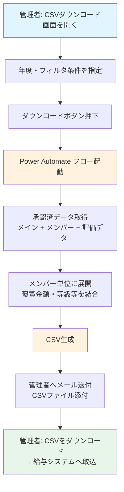
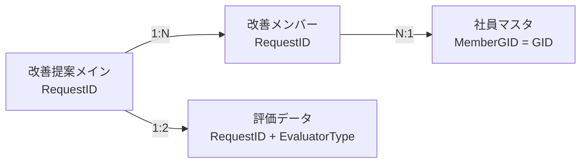
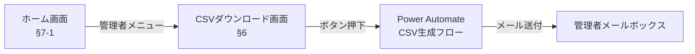
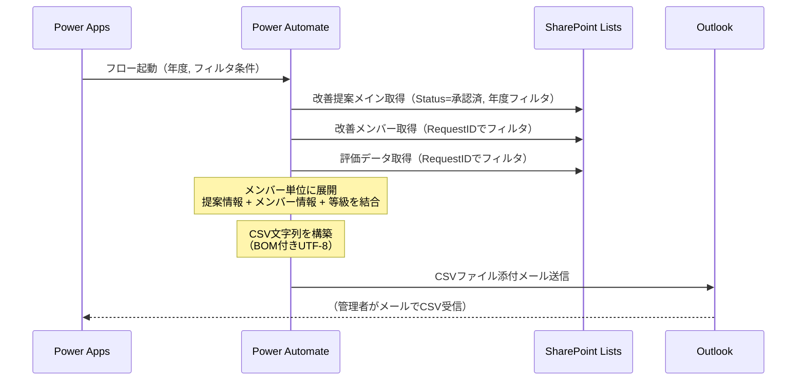

# §6 集計・CSVダウンロード機能

## 概要

承認済の改善提案データをCSV形式でダウンロードする機能を追加する。管理者が年度・ステータスでフィルタし、褒賞金額・等級・所属情報等を出力する。Power Apps にはCSV生成APIがないため、Power Automate 経由でCSVを生成しメール送付する方式を想定する。

> **スコープ注記**: overview.md 1.1節では「給与引当処理（社員/派遣/出向の集計・ダウンロード）は本システムのスコープ外」と定義している。本機能は給与引当処理そのものではなく、**管理者向けのデータエクスポート機能**として位置づける。CSVデータの給与システムへの取り込み・引当処理はシステム外の運用で対応する。

## 設計判断

| ID | 項目 | ステータス | 決定内容 | 備考 |
|----|------|-----------|---------|------|
| DJ-1 | 出力単位 | **確定** | メンバー単位（申請者＋追加メンバー各1行） | 1提案×N名→N行。申請者も1行目として出力 |
| DJ-2 | 褒賞金額の配分ルール | **確定** | 均等割（切り捨て） | `FinalRewardAmount ÷ 総人数`（申請者＋追加メンバー）。端数は切り捨て |
| DJ-3 | 実装方式 | **TBD** | Power Apps ボタン → Power Automate → メール送付 | SharePoint ExportToExcel は列選択・フォーマット制御不可 |
| DJ-4 | アクセス権限 | **TBD** | 管理者のみ | security.md のロール定義で管理者=「全件閲覧・マスタメンテナンス」。部長以上に開放するかは運用次第 |
| DJ-5 | フィルタ条件 | **TBD** | 年度指定 + ステータス=承認済 | 期間（From-To）やTEC単位のフィルタが必要かは運用次第。v2ステータス一覧: 下書き/申請中/回覧中/課長評価中/部長評価中/承認済/差戻/取下げ |
| DJ-6 | §7-2管理者画面との統合方針 | **確定** | §7-2はスコープ外。§6は独立したCSVダウンロードUIとして実装 | §7-2（管理者画面）はSPリスト直接編集で運用。backlog.md更新済み |
| DJ-7 | 出向者・派遣社員の集計区分 | **確定** | EmployeeType列をCSVに出力し、Excel側でフィルタ | データ出力のみ。システム側での区分別集計は不要 |
| DJ-8 | CSV文字コード | **確定** | BOM付きUTF-8 | Excelで文字化けしないための対策 |
| DJ-9 | 出力項目 | **確定** | 下記「出力項目一覧」参照 | 顧客確認済み（2026-03-27） |
| DJ-10 | 承認日の定義 | **確定** | 最終承認者の評価日時 | 部長承認ありなら部長の評価日時、なしなら課長の評価日時 |

## 業務フロー

> **注意**: DJ-3（実装方式）が確定するまで暫定フロー。方式変更時にフロー図も更新する。

## 出力項目一覧

### CSV列定義（出力順）

1行＝1対応者。申請者が1行目、追加メンバーが2行目以降。同一提案の行は同じリクエストID・承認日・最終褒賞金額を持つ。

| # | CSV列名 | 取得元 | 取得元列（内部名） | 備考 |
|---|---------|--------|-------------------|------|
| 1 | リクエストID | 改善提案メイン | RequestID | 全行同一値 |
| 2 | 承認日 | 評価データ | Modified（最終承認者） | DJ-10: 部長承認ありなら部長の評価日時、なしなら課長の評価日時 |
| 3 | 対応者GID | メイン or メンバー | ApplicantGID / MemberGID | 申請者行はApplicantGID、メンバー行はMemberGID |
| 4 | 対応者氏名 | メイン or メンバー | ApplicantName / MemberName | 同上 |
| 5 | 対応者メール | メイン or 社員マスタ | ApplicantEmail / 社員マスタEmail | 申請者行はApplicantEmail、メンバー行は社員マスタからGIDで取得 |
| 6 | 対応者在籍事業所 | メンバー or 社員マスタ | MemberOffice / 社員マスタOffice | 申請者行は社員マスタからGIDで取得、メンバー行はMemberOffice |
| 7 | 対応者原価単位 | メンバー or 社員マスタ | MemberCostUnit / 社員マスタCostUnit | 同上 |
| 8 | 対応者社員区分 | 社員マスタ | EmployeeType | GIDで社員マスタを参照（DJ-7確定） |
| 9 | 個人褒章 | フロー内算出 | — | `RoundDown(FinalRewardAmount ÷ 総人数, 0)`（均等割・切り捨て） |
| 10 | 最終褒賞金額 | 改善提案メイン | FinalRewardAmount | 提案全体の褒賞金額（全行同一値） |
| 11 | 作成日時 | 改善提案メイン | Created | 申請日 |
| 12 | 更新日時 | 改善提案メイン | Modified | |

### 出力イメージ

1000円の提案に申請者＋追加メンバー2名（計3名）の場合:

| リクエストID | 承認日 | 対応者GID | 対応者氏名 | 対応者メール | 対応者在籍事業所 | 対応者原価単位 | 対応者社員区分 | 個人褒章 | 最終褒賞金額 | 作成日時 | 更新日時 |
|---|---|---|---|---|---|---|---|---|---|---|---|
| KZ-2026-00001 | 2026/2/10 | 1234567890 | 山田太郎 | t.yamada@example.com | 本社 | A001 | 正規社員 | 333 | 1000 | 2026/1/20 | 2026/2/20 |
| KZ-2026-00001 | 2026/2/10 | 2345678901 | 鈴木花子 | h.suzuki@example.com | 本社 | A001 | 正規社員 | 333 | 1000 | 2026/1/20 | 2026/2/20 |
| KZ-2026-00001 | 2026/2/10 | 3456789012 | 佐藤一郎 | i.sato@example.com | 厚木 | B002 | 正規社員 | 333 | 1000 | 2026/1/20 | 2026/2/20 |

### 個人褒章の算出ルール

- **総人数** = 1（申請者）＋ 追加メンバー数
- **個人褒章** = `RoundDown(FinalRewardAmount ÷ 総人数, 0)`
- 端数は切り捨て（例: 1000÷3=333、合計999円。残り1円は切り捨て）
- 追加メンバーがいない場合: 個人褒章 = 最終褒賞金額（全額）

### 承認日の取得ロジック（DJ-10）

1. 評価データから `RequestID` でフィルタし、`EvaluatorType=部長` かつ `Decision=承認` のレコードを検索
2. 存在する場合 → **部長の評価日時**を承認日とする
3. 存在しない場合 → **課長の評価日時**を承認日とする

### 申請者情報の取得に関する注意

申請者の在籍事業所・原価単位・社員区分はメインリストに列がないため、**社員マスタからApplicantGIDで取得**する。メンバーの在籍事業所・原価単位は改善メンバーリストに記録済み（申請時点のスナップショット）。

> **注意**: 申請者の事業所・原価単位は社員マスタの現在値を取得するため、申請後に異動があった場合は申請時点の値と異なる可能性がある。メンバーリストの値は申請時点のスナップショットのため影響なし。

## リスト設計

### 新規リスト・列の追加

**新規リスト・列の追加は不要。** 必要なデータはすべて既存リストから取得可能。

| 取得元 | 用途 |
|--------|------|
| 改善提案メイン | 提案基本情報、申請者情報、FinalRewardAmount |
| 改善メンバー | メンバー単位の展開（GID・氏名・事業所・原価単位） |
| 評価データ | 等級（Grade）の取得。RequestID + EvaluatorType で最終評価者を特定 |
| 社員マスタ | EmployeeType等の追加情報（DJ-7確定後） |

### データ取得のリレーション

## 画面設計

### 概要

CSVダウンロード用の最小限のUIを Power Apps に追加する。§7-2（管理者画面）はスコープ外のため、独立した画面として実装する。

### 画面構成（概要レベル）

| 要素 | 内容 |
|------|------|
| 画面名 | CSVダウンロード画面（仮称） |
| アクセス権限 | 管理者のみ表示（DJ-4確定後） |
| フィルタUI | 年度ドロップダウン（DJ-5確定後に詳細化） |
| 実行ボタン | 「CSVダウンロード」ボタン → Power Automate フロー呼び出し |
| フィードバック | 「処理を開始しました。メールでCSVファイルをお届けします。」のメッセージ表示 |

### 画面遷移

> **注意**: ホーム画面（§7-1）は未実装。暫定的に既存画面からの遷移導線を検討する必要がある。

## フロー設計

### 概要

Power Automate に「CSV生成・送付フロー」を新規追加する。Power Apps のボタンからHTTP要求トリガーまたは Power Apps (V2) トリガーで起動し、フィルタ条件に基づいてデータを取得・結合・CSV化し、管理者にメール送付する。

> **DJ-3 確定後に詳細設計を追記する。** 以下は推奨方式（Power Apps → Power Automate → メール送付）を前提とした概要。

### フロー概要

| 項目 | 内容 |
|------|------|
| フロー名 | CSV生成・送付フロー（仮称） |
| トリガー | Power Apps (V2) — ボタン押下時に年度等のパラメータを受け取る |
| 出力 | CSVファイルをメール添付で管理者に送付 |

### 処理ステップ（概要）

### 技術的考慮事項

| 項目 | 課題 | 対応方針（概要） |
|------|------|----------------|
| メンバー展開 | 1提案に最大10名のメンバー → Apply to each のネストが必要 | 提案ごとにメンバーを取得し、各メンバー行をCSV文字列に追記 |
| APIスロットリング | 提案ごとにメンバー・評価データを取得するN+1クエリは、数百件でSharePoint APIスロットリング（600リクエスト/分）に抵触する恐れ | OData $filterで承認済RequestIDのメンバー・評価データを一括取得し、フロー内でグループ化する方式を検討 |
| 等級の取得 | 最終評価者の判定が必要（課長 or 部長） | EvaluatorType=部長のレコードが存在しDecision=承認なら部長、それ以外は課長。小集団はGrade空 |
| データ量 | 年間数百件×最大10名 = 最大数千行 | Power Automate の Apply to each 上限（100,000）内に収まる |
| CSV生成 | Power Automate の標準アクション活用 | Data Operations「Create CSV table」アクションを第一候補とする。BOM付与・カラム順の制御に追加処理が必要 |
| ファイルサイズ | 数千行のCSVは数百KB程度 | メール添付上限（25MB）内に十分収まる |
| BOM付きUTF-8 | Excelで文字化けしないための対策 | CSV文字列先頭にBOM（U+FEFF、Power Automateでは `decodeUriComponent('%EF%BB%BF')` で生成）を付与 |

## 既存機能への影響

| 既存機能 | 影響 | 詳細 |
|---------|------|------|
| 改善提案メインリスト | **なし** | 読み取りのみ。列追加・変更なし |
| 改善メンバーリスト | **なし** | 読み取りのみ |
| 評価データリスト | **なし** | 読み取りのみ |
| 社員マスタ | **なし** | 読み取りのみ |
| 既存3フロー | **なし** | 新規フロー追加のみ。既存トリガー・処理に変更なし |
| 既存画面（申請/閲覧/評価） | **なし** | 新規画面追加のみ |
| §4 申請取消（開発中） | **軽微** | 取消済ステータスの提案はCSV出力対象外（Status=承認済フィルタで除外）。§4でステータス選択肢が拡張されるが、フィルタ条件に影響なし |
| §7-2 管理者画面 | **なし** | §7-2はスコープ外（SPリスト直接編集で運用）。統合検討不要 |

## 移行手順への影響

### Power Automate フロー

- **新規フロー追加**: CSV生成・送付フローを新環境にデプロイする必要あり
- DJ-3確定後に `a_project/migration/deployment-guide.md` に手順を追記する

### Power Apps

- **新規画面追加**: CSVダウンロード画面を追加
- 管理者判定ロジックの実装（DJ-4確定後）
- DJ-6確定後に `a_project/migration/ui_manual/ui-manual-2-7.md` に手作業手順を追記する

### スクリプト

- リスト・列の追加はないため、`scripts/` への影響なし
