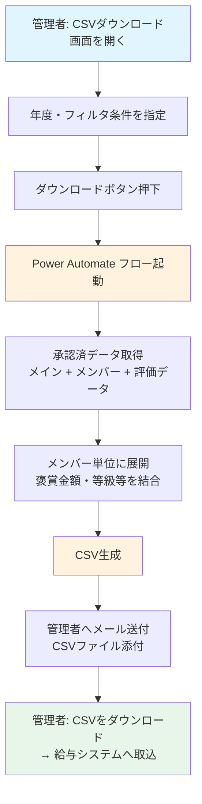
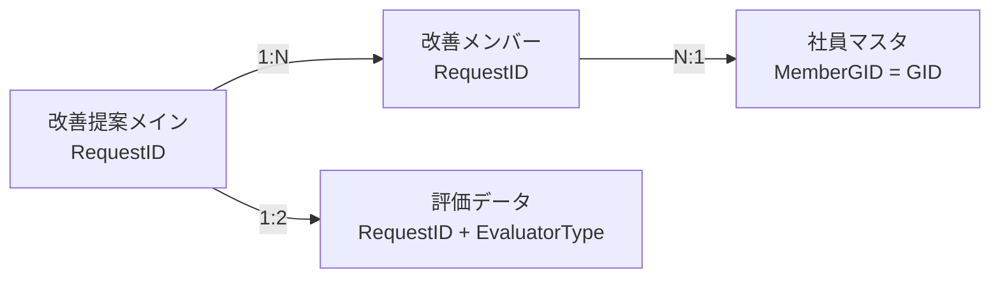
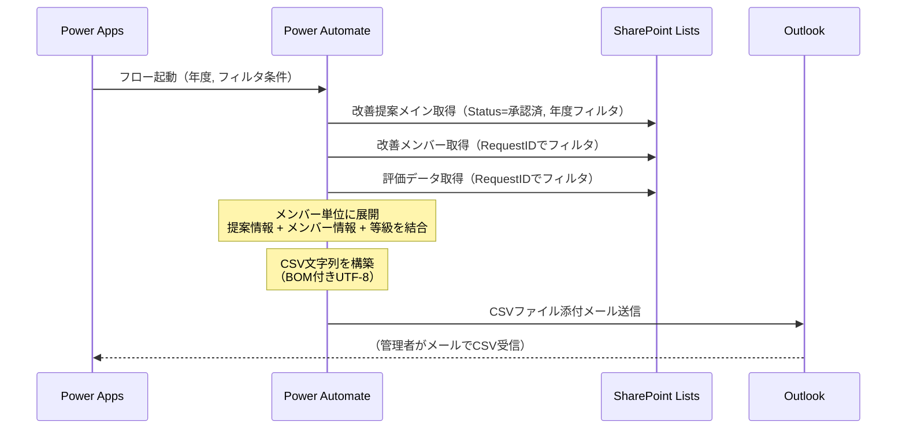

# §6 集計・CSVダウンロード機能

## 概要

承認済の改善提案データをCSV形式でダウンロードする機能を追加する。管理者が年度・ステータスでフィルタし、褒賞金額・等級・所属情報等を出力する。Power Apps にはCSV生成APIがないため、Power Automate 経由でCSVを生成しメール送付する方式を想定する。

> **スコープ注記**: overview.md 1.1節では「給与引当処理（社員/派遣/出向の集計・ダウンロード）は本システムのスコープ外」と定義している。本機能は給与引当処理そのものではなく、**管理者向けのデータエクスポート機能**として位置づける。CSVデータの給与システムへの取り込み・引当処理はシステム外の運用で対応する。

> **注意**: 本提案は概要レベルのドラフトである。出力項目・実装方式・フィルタ条件等の主要な設計判断が未確定（TBD）のため、確定後に詳細設計を追記する前提で作成している。

## 設計判断

| ID | 項目 | ステータス | 推奨案（デフォルト候補） | 備考 |
|----|------|-----------|----------------------|------|
| DJ-1 | 出力単位 | **TBD** | メンバー単位（1提案×N名→N行） | 給与振込用途ならメンバー単位が自然。提案単位の場合は別途配分ルールが必要 |
| DJ-2 | 褒賞金額の配分ルール | **TBD** | 均等割 or 全額支給（業務ルール確認必要） | **DJ-1依存**: メンバー単位出力の場合に決定必須（CSVの数値に直結）。提案単位なら不要 |
| DJ-3 | 実装方式 | **TBD** | Power Apps ボタン → Power Automate → メール送付 | SharePoint ExportToExcel は列選択・フォーマット制御不可。管理者画面（§7-2）に組み込む案もあるが§7-2は未実装 |
| DJ-4 | アクセス権限 | **TBD** | 管理者のみ | security.md のロール定義で管理者=「全件閲覧・マスタメンテナンス」。部長以上に開放するかは運用次第 |
| DJ-5 | フィルタ条件 | **TBD** | 年度指定 + ステータス=承認済 | 期間（From-To）やTEC単位のフィルタが必要かは運用次第。v2ステータス一覧: 下書き/申請中/回覧中/課長評価中/部長評価中/承認済/差戻/取下げ |
| DJ-6 | §7-2管理者画面との統合方針 | **TBD** | §6は最小限のCSVダウンロードUIのみ実装。§7-2で管理者画面として統合 | §7-2が先に実装される場合はそちらにCSVボタンを配置する方が合理的 |
| DJ-7 | 出向者・派遣社員の集計区分 | **TBD** | EmployeeType列をCSVに出力し、Excel側でフィルタ | システム側で区分別集計まで行うか、データ出力のみでExcel後処理に委ねるか |
| DJ-8 | CSV文字コード | **TBD** | BOM付きUTF-8 | Excelで開く前提ならBOM付きUTF-8が文字化けしにくい。Shift-JISは非推奨（Power Automateでの変換が煩雑） |
| DJ-9 | 出力項目 | **TBD** | 下記「出力項目候補一覧」参照 | 給与振込に必要な項目を顧客と確定する |

## 業務フロー

> **注意**: DJ-3（実装方式）が確定するまで暫定フロー。方式変更時にフロー図も更新する。

## 出力項目候補一覧

以下は候補であり、DJ-9 確定後に最終決定する。

### 提案基本情報（改善提案メインリスト）

| # | 項目名 | 取得元リスト | 取得元列（内部名） | 備考 |
|---|--------|------------|-------------------|------|
| 1 | リクエストID | 改善提案メイン | RequestID | |
| 2 | 表彰区分 | 改善提案メイン | AwardCategory | |
| 3 | 改善テーマ | 改善提案メイン | Theme | |
| 4 | 申請者GID | 改善提案メイン | ApplicantGID | |
| 5 | 申請者氏名 | 改善提案メイン | ApplicantName | |
| 6 | TEC | 改善提案メイン | Department | |
| 7 | 部門 | 改善提案メイン | Division | 空の場合あり |
| 8 | 部 | 改善提案メイン | Bu | 空の場合あり |
| 9 | 課 | 改善提案メイン | Section | 空の場合あり |
| 10 | 効果金額合計 | 改善提案メイン | TotalEffectAmount | |
| 11 | 最終褒賞金額 | 改善提案メイン | FinalRewardAmount | |
| 12 | ステータス | 改善提案メイン | Status | フィルタ用（出力時は「承認済」固定の可能性） |
| 13 | 改善完了日 | 改善提案メイン | CompletionDate | |
| 14 | 作成日時 | 改善提案メイン | Created | 申請日として利用 |

### メンバー情報（改善メンバーリスト）— DJ-1=メンバー単位の場合

| # | 項目名 | 取得元リスト | 取得元列（内部名） | 備考 |
|---|--------|------------|-------------------|------|
| 15 | メンバーGID | 改善メンバー | MemberGID | |
| 16 | メンバー氏名 | 改善メンバー | MemberName | |
| 17 | 在籍事業所 | 改善メンバー | MemberOffice | |
| 18 | 原価単位 | 改善メンバー | MemberCostUnit | |

### 評価情報（評価データリスト）

| # | 項目名 | 取得元リスト | 取得元列（内部名） | 備考 |
|---|--------|------------|-------------------|------|
| 19 | 等級 | 評価データ | Grade | 最終評価者（部長承認ありなら部長、なしなら課長）のレコードから取得 |
| 20 | 褒賞金額（評価） | 評価データ | RewardAmount | FinalRewardAmountと同値だが参照元が異なる |

### 社員マスタ（追加情報取得用）— DJ-7で出力が決まった場合

| # | 項目名 | 取得元リスト | 取得元列（内部名） | 備考 |
|---|--------|------------|-------------------|------|
| 21 | 社員区分 | 社員マスタ | EmployeeType | メンバーGIDで社員マスタを参照して取得 |
| 22 | 管理職フラグ | 社員マスタ | IsManagement | 必要に応じて |

### 出力項目に関する注意

- **等級（Grade）の取得ロジック**: 最終評価者の評価データから取得する。判定条件は以下の通り:
  1. EvaluatorType=部長のレコードが存在し Decision=承認 → **部長の評価データ**からGradeを取得
  2. 上記以外 → **課長の評価データ**からGradeを取得
  3. **表彰区分=小集団の場合** → Gradeは空（スコアリングなし）、褒賞金額は表彰区分マスタの固定値
- **褒賞金額の配分**: DJ-2 が未決定（**DJ-1依存**）。メンバー単位出力の場合、FinalRewardAmount をメンバー数で割るのか、全員に同額を出力するのかで出力値が変わる

## リスト設計

### 新規リスト・列の追加

**新規リスト・列の追加は不要。** 必要なデータはすべて既存リストから取得可能。

| 取得元 | 用途 |
|--------|------|
| 改善提案メイン | 提案基本情報、申請者情報、FinalRewardAmount |
| 改善メンバー | メンバー単位の展開（GID・氏名・事業所・原価単位） |
| 評価データ | 等級（Grade）の取得。RequestID + EvaluatorType で最終評価者を特定 |
| 社員マスタ | EmployeeType等の追加情報（DJ-7確定後） |

### データ取得のリレーション

## 画面設計

### 概要

CSVダウンロード用の最小限のUIを Power Apps に追加する。将来の§7-2 管理者画面との統合を見据え、独立した画面として実装する。

> **DJ-6 確定後**: §7-2管理者画面が先に実装される場合は、管理者画面内のセクションとして統合する可能性あり。

### 画面構成（概要レベル）

| 要素 | 内容 |
|------|------|
| 画面名 | CSVダウンロード画面（仮称） |
| アクセス権限 | 管理者のみ表示（DJ-4確定後） |
| フィルタUI | 年度ドロップダウン（DJ-5確定後に詳細化） |
| 実行ボタン | 「CSVダウンロード」ボタン → Power Automate フロー呼び出し |
| フィードバック | 「処理を開始しました。メールでCSVファイルをお届けします。」のメッセージ表示 |

### 画面遷移

> **注意**: ホーム画面（§7-1）は未実装。暫定的に既存画面からの遷移導線を検討する必要がある。

## フロー設計

### 概要

Power Automate に「CSV生成・送付フロー」を新規追加する。Power Apps のボタンからHTTP要求トリガーまたは Power Apps (V2) トリガーで起動し、フィルタ条件に基づいてデータを取得・結合・CSV化し、管理者にメール送付する。

> **DJ-3 確定後に詳細設計を追記する。** 以下は推奨方式（Power Apps → Power Automate → メール送付）を前提とした概要。

### フロー概要

| 項目 | 内容 |
|------|------|
| フロー名 | CSV生成・送付フロー（仮称） |
| トリガー | Power Apps (V2) — ボタン押下時に年度等のパラメータを受け取る |
| 出力 | CSVファイルをメール添付で管理者に送付 |

### 処理ステップ（概要）

### 技術的考慮事項

| 項目 | 課題 | 対応方針（概要） |
|------|------|----------------|
| メンバー展開 | 1提案に最大10名のメンバー → Apply to each のネストが必要 | 提案ごとにメンバーを取得し、各メンバー行をCSV文字列に追記 |
| APIスロットリング | 提案ごとにメンバー・評価データを取得するN+1クエリは、数百件でSharePoint APIスロットリング（600リクエスト/分）に抵触する恐れ | OData $filterで承認済RequestIDのメンバー・評価データを一括取得し、フロー内でグループ化する方式を検討 |
| 等級の取得 | 最終評価者の判定が必要（課長 or 部長） | EvaluatorType=部長のレコードが存在しDecision=承認なら部長、それ以外は課長。小集団はGrade空 |
| データ量 | 年間数百件×最大10名 = 最大数千行 | Power Automate の Apply to each 上限（100,000）内に収まる |
| CSV生成 | Power Automate の標準アクション活用 | Data Operations「Create CSV table」アクションを第一候補とする。BOM付与・カラム順の制御に追加処理が必要 |
| ファイルサイズ | 数千行のCSVは数百KB程度 | メール添付上限（25MB）内に十分収まる |
| BOM付きUTF-8 | Excelで文字化けしないための対策 | CSV文字列先頭にBOM（U+FEFF、Power Automateでは `decodeUriComponent('%EF%BB%BF')` で生成）を付与 |

## 既存機能への影響

| 既存機能 | 影響 | 詳細 |
|---------|------|------|
| 改善提案メインリスト | **なし** | 読み取りのみ。列追加・変更なし |
| 改善メンバーリスト | **なし** | 読み取りのみ |
| 評価データリスト | **なし** | 読み取りのみ |
| 社員マスタ | **なし** | 読み取りのみ |
| 既存3フロー | **なし** | 新規フロー追加のみ。既存トリガー・処理に変更なし |
| 既存画面（申請/閲覧/評価） | **なし** | 新規画面追加のみ |
| §4 申請取消（開発中） | **軽微** | 取消済ステータスの提案はCSV出力対象外（Status=承認済フィルタで除外）。§4でステータス選択肢が拡張されるが、フィルタ条件に影響なし |
| §7-2 管理者画面（検討中） | **統合検討** | DJ-6で方針決定。§6のCSVダウンロード画面を§7-2に統合する可能性あり |

## 移行手順への影響

### Power Automate フロー

- **新規フロー追加**: CSV生成・送付フローを新環境にデプロイする必要あり
- DJ-3確定後に `a_project/migration/deployment-guide.md` に手順を追記する

### Power Apps

- **新規画面追加**: CSVダウンロード画面を追加
- 管理者判定ロジックの実装（DJ-4確定後）
- DJ-6確定後に `a_project/migration/ui-manual-2-7.md` に手作業手順を追記する

### スクリプト

- リスト・列の追加はないため、`scripts/` への影響なし
