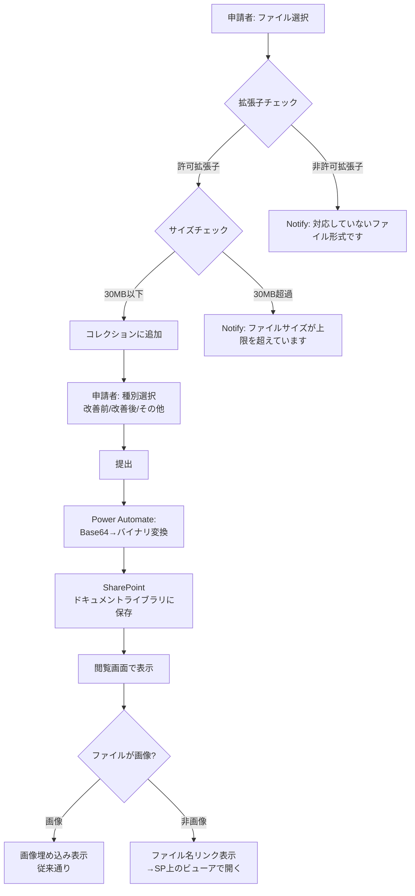
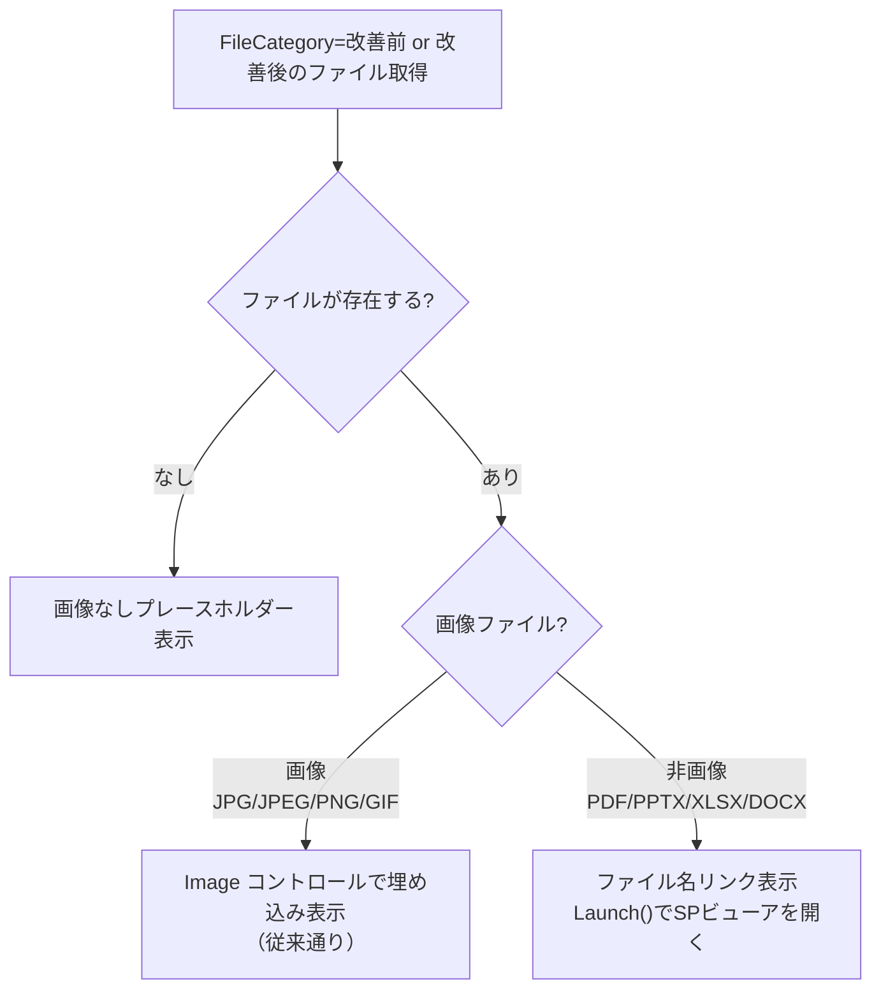

# 添付資料の多ファイル形式対応・容量表記

## 概要

現在は画像ファイル（JPG, PNG等）のみを想定している添付ファイル機能を拡張し、PDF・PowerPoint・Excel・Word等の非画像ファイルもアップロード可能にする。合わせて、ファイルサイズ上限の明示・バリデーション・対応拡張子のホワイトリスト制御を追加する。

閲覧画面での非画像ファイルの表示は、SharePoint上のOffice Online/ブラウザPDFビューアへのリンク表示とする（アプリ内プレビューは行わない）。

## 設計判断

本提案の設計は以下の判断に基づく。

### DJ-1: ファイルサイズ上限 — 全種別共通30MB

backlogでは画像15MB/非画像240MBとしていたが、以下の理由で全種別共通30MBに統一する。

- 現行のBase64方式（`JSON(UploadedImage, IncludeBinaryData)`）を維持する。Power Apps→Power Automateのファイル受け渡しにBase64テキストを使用しており、30MBのファイルはBase64で約40MBに膨張する。この範囲であればPower Automateのペイロード上限（100MB）に収まる
- 240MBはBase64で約320MBとなり、ブラウザメモリ・Power Automateペイロード上限に抵触するため非現実的
- 実機検証後に問題がなければ50MBへの引き上げを検討する余地を残す

### DJ-2: 閲覧画面の非画像ファイル表示 — リンク表示のみ

Power Apps内でのPDF/Officeプレビューは技術的に困難（iframeやWebビューアコントロールが使えない）。SharePoint上でクリックすればOffice OnlineやブラウザPDFビューアが開くため、ユーザー体験として十分。

- 画像ファイル（JPG, JPEG, PNG, GIF）: 従来通り閲覧画面で直接埋め込み表示
- 非画像ファイル（PDF, PPTX, XLSX, DOCX）: ファイル名リンクとして表示。クリックでSharePoint上のビューアで開く

### DJ-3: FileCategory — 現行維持

改善前/改善後/その他の3分類をそのまま使用する。非画像ファイルも同じ分類。

- 改善前/改善後に非画像ファイルを指定した場合、閲覧画面では画像埋め込みの代わりにファイル名リンクを表示する
- 「画像なし」プレースホルダーの表示ロジックを変更: 「改善前/改善後に**画像ファイル**がない場合」に表示する（非画像ファイルがある場合はリンク表示）

### DJ-4: アップロードUI — AddMediaButtonで実機検証優先

まず`AddMediaButton`で非画像ファイル（PDF, PPTX等）もアップロードできるか実機検証する。

- `JSON(UploadedImage, IncludeBinaryData)` が非画像ファイルに対しても正しくBase64 data URIを返すか未検証
- 動作すれば現行コードの変更は最小限で済む
- 動作しない場合は、別方式（Power Automateフローでの直接アップロード等）を検討する。その場合は本提案を改訂する

### DJ-5: 容量注記 — アップロードUI直下にグレー小文字

申請フォームのファイルアップロードUI直下に注記を表示する。

### DJ-6: エラー表示 — Notify()でエラー＋追加拒否

ファイルサイズ超過・非対応拡張子の場合、`Notify()`でエラーメッセージを表示し、コレクションへの追加を拒否する。

### DJ-7: 対応拡張子 — ホワイトリスト方式

許可する拡張子: **JPG, JPEG, PNG, GIF, PDF, PPTX, XLSX, DOCX**。
ホワイトリスト外のファイルはNotify()でエラーを表示し、追加を拒否する。

## 業務フロー

添付ファイルに関連する業務フローは以下の通り。v1からの変更は太字で示す。



## リスト設計

### 添付ファイル ドキュメントライブラリ — 変更なし

既存のドキュメントライブラリ設計（RequestID, FileCategory, FileDescription）はそのまま使用する。非画像ファイルも同じライブラリに保存される。

| 列名 | 内部名 | 型 | 変更 | 説明 |
|------|-------|---|------|------|
| リクエストID | RequestID | 1行テキスト | なし | |
| ファイル種別 | FileCategory | 選択肢 | なし | 改善前/改善後/その他 |
| 説明 | FileDescription | 複数行テキスト | なし | |

### 改善提案メイン リスト — 変更なし

添付ファイル列はドキュメントライブラリで管理しているため影響なし。

## 画面設計

### 申請フォーム — 変更箇所

#### バリデーションロジック追加（AddMediaButton.OnChange相当）

ファイル追加時に以下のバリデーションを実行する。

> 以下は設計意図を示す**擬似コード**。Power Fxの正式な構文（テーブルリテラル、`in`演算子等）は実装時に調整する。

```
// 許可拡張子リスト（擬似コード。実装時は Table({Value:"jpg"}, ...) 形式に変換）
Set(varAllowedExtensions, ".jpg.jpeg.png.gif.pdf.pptx.xlsx.docx");

// ファイル追加時のバリデーション
// 1. 拡張子チェック
Set(varFileExt, Lower(Last(Split(Self.FileName, ".")).Value));
If(
    Not("." & varFileExt in varAllowedExtensions),
    Notify("対応していないファイル形式です。対応形式: JPG, PNG, GIF, PDF, PPTX, XLSX, DOCX", NotificationType.Error);
    // コレクションに追加しない
    ,
    // 2. サイズチェック（30MB = 31,457,280 bytes）
    // data URIからヘッダーとクォートを除去してBase64部分のみでサイズ推定
    With(
        {
            dataUri: Substitute(JSON(UploadedImage1.Image, JSONFormat.IncludeBinaryData), """", ""),
            base64Body: Mid(
                Substitute(JSON(UploadedImage1.Image, JSONFormat.IncludeBinaryData), """", ""),
                Find(",", Substitute(JSON(UploadedImage1.Image, JSONFormat.IncludeBinaryData), """", "")) + 1
            )
        },
        If(
            Len(base64Body) * 3 / 4 > 31457280,
            Notify("ファイルサイズが上限（30MB）を超えています。", NotificationType.Error);
            // コレクションに追加しない
            ,
            // バリデーションOK → コレクションに追加
            Collect(colAttachments, { ... })
        )
    )
)
```

> **サイズ推定の精度について**: Base64 data URIは `data:{MIME};base64,{Base64本体}` 形式。ヘッダー部分を除去した `Base64本体` の文字数から `Len * 3/4` で元ファイルサイズを概算する。パディング（`=`）による数バイトの誤差があるが、30MBの上限判定には影響しない範囲。

> **技術的リスク（DJ-4関連）**: `JSON(UploadedImage, IncludeBinaryData)` が非画像ファイルに対して正しくdata URIを返すかは未検証。`UploadedImage` は名前の通り画像を想定したコントロールであり、PDF/Office等で動作しない可能性がある。実機検証で確認し、動作しない場合は本提案を改訂する。

#### 容量注記の追加

ファイルアップロードUI（AddMediaButton）の直下に注記ラベルを追加する。

```yaml
- lblFileNote:
    Control: Text@0.0.51
    Properties:
      Text: ="対応形式: JPG, PNG, GIF, PDF, PPTX, XLSX, DOCX（1ファイル最大30MB）"
      Size: =11
      Color: =RGBA(130, 130, 130, 1)
      Height: =20
      Width: =Parent.Width
```

### 閲覧画面 — 変更箇所

#### 改善前/改善後の表示ロジック変更

現在、改善前/改善後画像は `Image` コントロールで直接埋め込み表示している。非画像ファイル対応のため、以下のロジック分岐を追加する。



**画像ファイル判定ロジック**:

```
// 拡張子で画像かどうかを判定（擬似コード）
Set(varFileExt, Lower(Last(Split(fileName, ".")).Value));
Set(varIsImage, "." & varFileExt in ".jpg.jpeg.png.gif");
```

**改善前/改善後セクションの表示制御**:

| 条件 | 表示内容 |
|------|---------|
| 該当FileCategoryにファイルなし | 「画像なし」プレースホルダー |
| 該当FileCategoryに画像ファイルのみ | Image コントロールで埋め込み表示（従来通り） |
| 該当FileCategoryに非画像ファイルのみ | ファイル名をリンクとして表示。タップで `Launch()` を使いSP上のビューアで開く |
| 該当FileCategoryに画像と非画像が混在 | **画像を埋め込み表示 + 非画像をリンク表示**。画像は先頭1件をImageコントロールで表示し、非画像はその下にリンク一覧として表示する |

> **混在ケースの補足**: 同一FileCategory（例: 改善前）に画像と非画像の両方がアップロードされるケースは稀だが、制限はしない。表示は「画像埋め込み（先頭1件）＋非画像リンク一覧」の併記とし、ユーザーがすべてのファイルにアクセスできることを保証する。

**「その他」添付ファイルの表示**:

従来通りリンク一覧として表示。画像/非画像の区別なくリンク表示する（変更なし）。リンクURLの構築は改善前/改善後の非画像ファイルと同じく `gSharePointSiteUrl & "/" & ファイルの完全パス` を使用する。

#### 非画像ファイルのリンク表示

非画像ファイルをリンクとして表示するためのコントロール構成:

```yaml
# 改善前/改善後セクション内（非画像ファイルの場合に表示）
- btnViewBeforeFileLink:
    Control: Button@0.0.45
    Properties:
      Appearance: ='ButtonCanvas.Appearance'.Subtle
      Text: =varViewBeforeFileName
      OnSelect: =Launch(varViewBeforeFileLink)
      Visible: =!IsBlank(varViewBeforeFileName) && !varViewBeforeIsImage
```

> リンクのURLは `gSharePointSiteUrl & "/" & ファイルの完全パス` で構築する。環境依存値をハードコードしない。

### 評価画面 — 変更なし

評価画面は閲覧画面を上部に組み込んでいるため、閲覧画面の変更が自動的に反映される。評価入力部分への影響はない。

## フロー設計

### 申請通知フロー・課長承認フロー・部長承認フロー — 変更なし

ファイルアップロードはPower Apps側の提出処理（`btnSubmit.OnSelect`）内でPower Automateフローを呼び出しており、`dataUriToBinary()` でBase64をバイナリに変換している。この処理はファイル形式に依存しないため、PDF/Office等でもそのまま動作する。

変更は不要。

### 提出処理（btnSubmit.OnSelect） — 変更あり

ファイルアップロード部分のフロー呼び出し自体は変更不要だが、提出前バリデーションにファイルサイズ・拡張子チェックを追加する。ただし、AddMediaButton.OnChange時点でバリデーション済みのため、提出時の二重チェックは任意。

## 評価ロジック

影響なし。

## 既存機能への影響

| 影響箇所 | 影響内容 | 対応方針 |
|---------|---------|---------|
| 申請フォーム: AddMediaButton.OnChange | バリデーションロジック追加 | 拡張子・サイズチェックを追加 |
| 申請フォーム: 容量注記 | 新規ラベル追加 | AddMediaButton直下に配置 |
| 閲覧画面: 改善前/改善後セクション | 画像/非画像の分岐ロジック追加 | 画像→埋め込み、非画像→リンク表示 |
| 閲覧画面: Imageコントロール表示条件 | Visible条件にIsImage判定追加 | 画像ファイルの場合のみ表示 |
| submit-logic.pfx | バリデーション追加時は同期必要 | 提出時二重チェックを入れる場合のみ |
| 差戻再提出: 既存ファイル読み込み | 非画像ファイルの読み込みにも対応 | ContentBase64フォールバックは既存の仕組みで対応可 |

### 影響しない箇所

- SharePoint ドキュメントライブラリの設計（列追加なし）
- Power Automateフロー3本（変更なし）
- 評価画面の評価入力部分
- メールテンプレート
- 社員マスタ・改善分野マスタ・表彰区分マスタ

## 移行手順への影響

### デプロイガイド（deployment-guide.md）

変更なし。ドキュメントライブラリの作成スクリプト（`create-doclib.ps1`）は既存のまま使用可能。

### UI手作業手順（ui-manual-2-7.md）

以下の追記が必要:

1. **申請フォーム**: AddMediaButton直下に容量注記ラベルを配置する手順の追加
2. **申請フォーム**: AddMediaButton.OnChangeにバリデーションロジックを設定する手順の追加（YAMLで対応可能であれば不要）

### 実機検証項目

本提案には以下の実機検証が前提条件として含まれる。検証結果によっては提案の改訂が必要になる。

| No. | 検証項目 | 期待結果 | 不合格時の代替案 |
|-----|---------|---------|---------------|
| V-1 | `AddMediaButton` で PDF/PPTX/XLSX/DOCX をアップロードできるか | ファイル選択ダイアログで非画像ファイルを選択可能 | Power Automateフローでの直接アップロードに切り替え |
| V-2 | `JSON(UploadedImage, IncludeBinaryData)` が非画像ファイルに対してdata URIを返すか | 正しいdata URI文字列（`data:application/pdf;base64,...` 等）が返る | 同上 |
| V-3 | `dataUriToBinary()` で非画像のdata URIをバイナリに変換できるか | 正しいバイナリデータに変換され、SPに保存したファイルが開ける | data URI形式の調整 or バイナリ変換ロジック変更 |
| V-4 | 30MBのファイルでBase64変換・フロー実行がタイムアウトしないか | Power Automateのペイロード上限内で正常に処理完了 | 上限を20MBに引き下げ |
