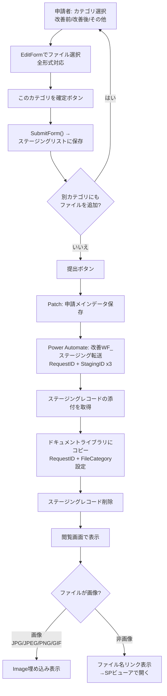
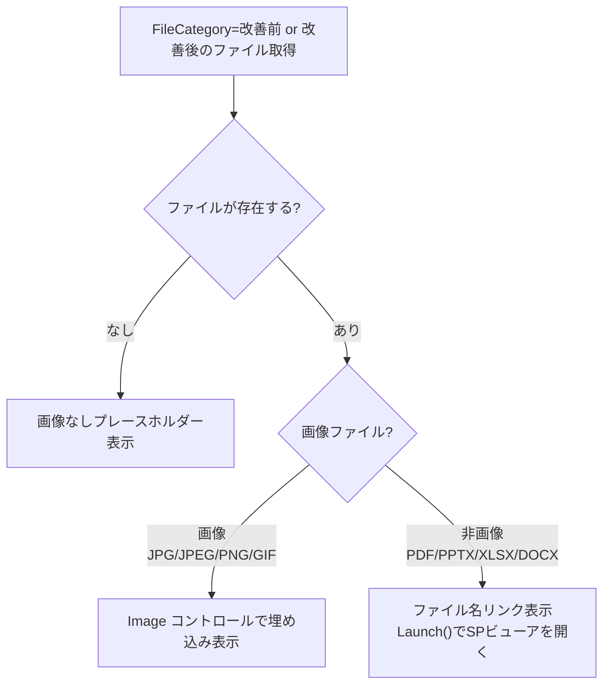

# 添付資料の多ファイル形式対応・容量表記

## 概要

現在は画像ファイル（JPG, PNG等）のみを想定している添付ファイル機能を拡張し、PDF・PowerPoint・Excel・Word等の非画像ファイルもアップロード可能にする。合わせて、ファイルサイズ上限の明示・対応形式の案内を追加する。

閲覧画面での非画像ファイルの表示は、SharePoint上のOffice Online/ブラウザPDFビューアへのリンク表示とする（アプリ内プレビューは行わない）。

## 設計判断

本提案の設計は以下の判断に基づく。

### DJ-1: ファイルサイズ上限 — UI案内30MB（SP側は250MB/ファイル）

- アップロード方式がEditForm経由のSPリスト添付に変わったため、Base64変換によるサイズ制約は消滅
- SharePointリスト添付ファイルの上限は250MB/ファイル（テナント設定による）
- ただし実用上は大容量ファイルはページ描画・ネットワーク転送に影響するため、UIに「目安: 1ファイル30MB以内」と案内する
- 技術的な強制はSP側に委ねる（上限超過時はSPがエラーを返しEditForm.OnFailureで検知可能）

### DJ-2: 閲覧画面の非画像ファイル表示 — リンク表示のみ

Power Apps内でのPDF/Officeプレビューは技術的に困難（iframeやWebビューアコントロールが使えない）。SharePoint上でクリックすればOffice OnlineやブラウザPDFビューアが開くため、ユーザー体験として十分。

- 画像ファイル（JPG, JPEG, PNG, GIF）: 従来通り閲覧画面で直接埋め込み表示
- 非画像ファイル（PDF, PPTX, XLSX, DOCX）: ファイル名リンクとして表示。クリックでSharePoint上のビューアで開く

### DJ-3: FileCategory — 現行維持

改善前/改善後/その他の3分類をそのまま使用する。非画像ファイルも同じ分類。

- 改善前/改善後に非画像ファイルを指定した場合、閲覧画面では画像埋め込みの代わりにファイル名リンクを表示する
- 「画像なし」プレースホルダーの表示ロジックを変更: 「改善前/改善後に**画像ファイル**がない場合」に表示する（非画像ファイルがある場合はリンク表示）

### DJ-4: アップロードUI — 添付ファイルステージングリスト + EditForm Attachmentコントロール

**実機検証結果（V-1 NG）**: `AddMediaButton` は非画像ファイルを選択できないことを確認。代替方式として、SharePointリスト添付ファイル機能 + EditFormのAttachmentコントロールを採用する。

**新アーキテクチャ:**

```
[旧] AddMediaButton → Base64 → Power Automate → ドキュメントライブラリ
                       ↑ 非画像ファイル選択不可（V-1 NG）

[新] EditForm (Attachment control)
        ↓ SubmitForm()
     添付ファイルステージングリスト（一時保管、カテゴリ別3レコード）
        ↓ Power Automate: 改善WF_ステージング転送
     添付ファイルドキュメントライブラリ（RequestID + FileCategory付きで保存）
```

**EditForm Attachmentコントロールの特徴:**
- 全ファイル形式に対応（SP側の制限内）
- ファイルはSubmitForm()でSPリスト添付として保存される（Base64不使用）
- Power Appsのコード内でファイル内容にアクセスする必要がなくなるため、サイズ制約も緩和

**カテゴリ（FileCategory）の管理方法:**
- カテゴリ別に3件のステージングレコードを作成（改善前/改善後/その他）
- DropDownでカテゴリ選択後、対応するステージングレコードにEditFormのItemを切り替え
- SubmitForm()でそのカテゴリのファイルをステージングレコードに保存
- Power Automateがステージングレコードを読み取り、FileCategory付きでドキュメントライブラリに移動

### DJ-5: 容量注記 — アップロードUI直下にグレー小文字

申請フォームのEditForm直下に注記ラベルを追加する（目安表示）。

### DJ-6: エラー表示 — EditForm.OnFailureで検知

ファイルサイズ超過・その他エラーはEditForm.OnFailureで`Notify()`表示する。

### DJ-7: 対応形式 — UI案内のみ（強制ホワイトリストは廃止）

EditFormのAttachmentコントロールはSP側の制限内で全ファイル形式を受け付ける。
ホワイトリスト強制は不可のため、UIに「対応確認済み形式」として案内する。

## 業務フロー



## リスト設計

### 添付ファイルステージング（新規）

申請フォームでのファイル選択時に一時保管するリスト。提出後、Power Automateによりドキュメントライブラリに移動しレコード削除。

| 列名 | 内部名 | 型 | 説明 |
|------|-------|---|------|
| タイトル | Title | 1行テキスト | "staging_{timestamp}" |
| ファイルカテゴリ | FileCategory | 1行テキスト | 改善前/改善後/その他 |
| 添付ファイル | （SP標準機能） | — | Attachments有効 |

> **作成スクリプト**: `scripts/develop/patch-staging-list.ps1`

### 添付ファイル ドキュメントライブラリ — 変更なし

既存設計をそのまま使用する。

| 列名 | 内部名 | 型 | 変更 |
|------|-------|---|------|
| リクエストID | RequestID | 1行テキスト | なし |
| ファイル種別 | FileCategory | 選択肢 | なし |
| 説明 | FileDescription | 複数行テキスト | なし |

### 改善提案メイン リスト — 変更なし

## 画面設計

### 申請フォーム — 変更箇所

#### 新データソース追加

`添付ファイルステージング` リストをPower Appsのデータソースに追加する。

#### 新変数

| 変数名 | 型 | 説明 |
|--------|---|------|
| `varStagingBeforeID` | Number | 改善前ステージングレコードのID |
| `varStagingAfterID` | Number | 改善後ステージングレコードのID |
| `varStagingOtherID` | Number | その他ステージングレコードのID |
| `varCurrentStagingItem` | Record | EditFormのItemに渡す現在選択中のステージングレコード |
| `colStagingDisplay` | Collection | 確定済みファイルの表示用コレクション `{FileName: Text, Category: Text}` |

#### OnVisible 追加処理

```powerfx
// ステージングレコードを作成（未作成の場合のみ）
// ⚠️ Patchが失敗するとIDが0のままになりフロー呼び出し時に誤動作する。
// SPの権限エラー等が想定される環境では IfError() でのハンドリング追加を検討すること。
If(
    IsBlank(varStagingBeforeID),
    Set(varStagingBeforeID,
        Patch(添付ファイルステージング, Defaults(添付ファイルステージング),
              {Title: "staging_" & Text(Now(), "yyyymmddHHmmss"), FileCategory: "改善前"}).ID)
);
If(
    IsBlank(varStagingAfterID),
    Set(varStagingAfterID,
        Patch(添付ファイルステージング, Defaults(添付ファイルステージング),
              {Title: "staging_" & Text(Now(), "yyyymmddHHmmss"), FileCategory: "改善後"}).ID)
);
If(
    IsBlank(varStagingOtherID),
    Set(varStagingOtherID,
        Patch(添付ファイルステージング, Defaults(添付ファイルステージング),
              {Title: "staging_" & Text(Now(), "yyyymmddHHmmss"), FileCategory: "その他"}).ID)
);
// EditFormの初期Item（改善前）
Set(varCurrentStagingItem, LookUp(添付ファイルステージング, ID = varStagingBeforeID))
```

#### 添付ファイルセクション — UI差し替え

**削除するコントロール:**
- `UploadedImage1` (Image@2.2.3, Visible=false の隠しコントロール)
- `cntAddFile` (AddMedia@2.2.1)

**残す/変更するコントロール:**
- `ddAttachFileCategory` (DropDown): OnChangeを追加（後述）
- `galAttachments` (Gallery): 編集モード時の既存ファイル表示に引き続き使用

**追加するコントロール（YAMLで追加）:**
- `btnConfirmAttachment`: 「このカテゴリを確定」ボタン
- `lblFileNote`: 対応形式・容量注記
- `galStagingFiles`: 確定済みファイル一覧（colStagingDisplay）

**追加するコントロール（手作業）:**
- `editFormAttachment`: EditForm（AddMediaの代替。Code Viewペースト不安定なため手作業で配置）

#### ddAttachFileCategory.OnChange

```powerfx
=Set(
    varCurrentStagingItem,
    Switch(
        ddAttachFileCategory.Selected.Value,
        "改善前", LookUp(添付ファイルステージング, ID = varStagingBeforeID),
        "改善後", LookUp(添付ファイルステージング, ID = varStagingAfterID),
        LookUp(添付ファイルステージング, ID = varStagingOtherID)
    )
)
```

#### EditForm (editFormAttachment) プロパティ

| プロパティ | 値 |
|-----------|---|
| DataSource | `=添付ファイルステージング` |
| DefaultMode | `=FormMode.Edit` |
| Item | `=varCurrentStagingItem` |
| OnSuccess | （後述） |
| OnFailure | `=Notify("ファイルのアップロードに失敗しました: " & editFormAttachment.Error, NotificationType.Error)` |

**OnSuccess:**
```powerfx
=Refresh(添付ファイルステージング);
Clear(colStagingDisplay);
If(
    !IsBlank(varStagingBeforeID),
    Collect(colStagingDisplay,
        ForAll(
            LookUp(添付ファイルステージング, ID = varStagingBeforeID).Attachments,
            {FileName: ThisRecord.FileName, Category: "改善前"}
        )
    )
);
If(
    !IsBlank(varStagingAfterID),
    Collect(colStagingDisplay,
        ForAll(
            LookUp(添付ファイルステージング, ID = varStagingAfterID).Attachments,
            {FileName: ThisRecord.FileName, Category: "改善後"}
        )
    )
);
If(
    !IsBlank(varStagingOtherID),
    Collect(colStagingDisplay,
        ForAll(
            LookUp(添付ファイルステージング, ID = varStagingOtherID).Attachments,
            {FileName: ThisRecord.FileName, Category: "その他"}
        )
    )
);
Notify("ファイルを追加しました", NotificationType.Success)
```

#### btnConfirmAttachment.OnSelect

```powerfx
=SubmitForm(editFormAttachment)
```

#### 容量注記ラベル

```yaml
- lblFileNote:
    Control: Text@0.0.51
    Properties:
      Text: ="対応確認済み形式: JPG, PNG, GIF, PDF, PPTX, XLSX, DOCX（目安: 1ファイル30MB以内）"
      Size: =11
      Color: =RGBA(130, 130, 130, 1)
      Height: =20
      Width: =Parent.Width
```

#### ステージングファイル表示ギャラリー (galStagingFiles)

```yaml
- galStagingFiles:
    Control: Gallery@2.15.0
    Variant: BrowseLayout_Vertical_TwoTextOneImageVariant_ver5.0
    Properties:
      Height: =CountRows(colStagingDisplay) * 36
      Items: =colStagingDisplay
      LayoutMinHeight: =0
      TemplateSize: =36
      Visible: =CountRows(colStagingDisplay) > 0
      Width: =Parent.Width
    Children:
      - cntStagingRow:
          Control: GroupContainer@1.5.0
          Variant: AutoLayout
          Properties:
            DropShadow: =DropShadow.None
            Height: =Parent.TemplateHeight
            LayoutAlignItems: =LayoutAlignItems.Center
            LayoutDirection: =LayoutDirection.Horizontal
            LayoutGap: =8
            PaddingLeft: =4
            Width: =Parent.TemplateWidth
          Children:
            - lblStagingCategory:
                Control: Text@0.0.51
                Properties:
                  FillPortions: =0
                  FontColor: =RGBA(56, 96, 178, 1)
                  Height: =28
                  Size: =11
                  Text: =ThisItem.Category
                  Width: =60
            - lblStagingFileName:
                Control: Text@0.0.51
                Properties:
                  FillPortions: =1
                  Height: =28
                  Size: =12
                  Text: =ThisItem.FileName
                  Width: =200
```

#### プレビュー時の添付ファイル表示（Q3確定仕様）

提出前プレビュー（申請フォームから開く確認画面）での添付ファイル表示は、**画像・非画像問わずテキスト表示のみ**とする。

- `colStagingDisplay` に1件以上ある場合: 「（添付済み: N件）」等のテキスト表示
- ファイル内容のプレビュー・サムネイル表示は行わない

> 閲覧画面（提出後）の表示ロジック（画像→埋め込み / 非画像→リンク）とは別仕様であることに注意。

#### キャンセル時のクリーンアップ

キャンセルボタン（またはNavigate前）に以下を追加:

```powerfx
// ステージングレコードを削除（未提出ファイルのクリーンアップ）
If(!IsBlank(varStagingBeforeID),
    Remove(添付ファイルステージング, LookUp(添付ファイルステージング, ID = varStagingBeforeID)));
If(!IsBlank(varStagingAfterID),
    Remove(添付ファイルステージング, LookUp(添付ファイルステージング, ID = varStagingAfterID)));
If(!IsBlank(varStagingOtherID),
    Remove(添付ファイルステージング, LookUp(添付ファイルステージング, ID = varStagingOtherID)));
Set(varStagingBeforeID, Blank());
Set(varStagingAfterID, Blank());
Set(varStagingOtherID, Blank());
Clear(colStagingDisplay)
```

### 閲覧画面 — 変更箇所（DJ-2の内容、変更なし）

#### 改善前/改善後の表示ロジック変更



**画像ファイル判定:**
```powerfx
// 拡張子で画像かどうかを判定
Set(varFileExt, Lower(Last(Split(fileName, ".")).Value));
Set(varIsImage, varFileExt in ["jpg", "jpeg", "png", "gif"]);
```

**表示制御:**

| 条件 | 表示内容 |
|------|---------|
| 該当FileCategoryにファイルなし | 「画像なし」プレースホルダー |
| 画像ファイルのみ | Image コントロールで埋め込み表示 |
| 非画像ファイルのみ | ファイル名リンク（`Launch()`でSPビューアを開く） |
| 画像と非画像が混在 | 画像を埋め込み表示 + 非画像をリンク一覧 |

### 評価画面 — 変更なし

閲覧画面の変更が自動的に反映される。

## フロー設計

### 改善WF_ステージング転送（新規）

**トリガー**: Power Apps（手動トリガー）

**入力パラメータ**:

| 変数名 | 型 | 説明 |
|--------|---|------|
| RequestID | string | 改善提案のRequestID |
| StagingBeforeID | string | 改善前ステージングレコードのID（未使用の場合は空文字） |
| StagingAfterID | string | 改善後ステージングレコードのID（未使用の場合は空文字） |
| StagingOtherID | string | その他ステージングレコードのID（未使用の場合は空文字） |

> **詳細設計**: `powerautomate/flow-staging-transfer-build.html`

### 申請通知フロー・課長承認フロー・部長承認フロー — 変更なし

### 既存の 改善WF_添付ファイルアップロード — 廃止

§1実装後は使用しない。ただし既存申請データの再提出（差戻再提出）で旧データが残っている場合に備え、フロー自体は削除せず残す。

### 提出処理（btnSubmit.OnSelect） — 変更あり

**Step 3.5 差し替え:**

```powerfx
// --- Step 3.5: 添付ファイル転送（§1 新方式） ---
// ステージングレコードからドキュメントライブラリへ転送
改善WF_ステージング転送.Run(
    If(!IsBlank(varEditRequestID), varEditRequestID, Text(varNewRequest.ID)),
    Text(varStagingBeforeID),
    Text(varStagingAfterID),
    Text(varStagingOtherID)
);
// ステージング変数をリセット（PA側でレコード削除済み）
Set(varStagingBeforeID, Blank());
Set(varStagingAfterID, Blank());
Set(varStagingOtherID, Blank());
Clear(colStagingDisplay)
```

## 評価ロジック

影響なし。

## 既存機能への影響

| 影響箇所 | 影響内容 | 対応方針 |
|---------|---------|---------|
| 申請フォーム: AddMediaButton | 削除 | EditFormに置換 |
| 申請フォーム: OnVisible | ステージング初期化追加 | コード追加 |
| 申請フォーム: cntAttachmentButtonArea | UI差し替え | btnConfirmAttachment追加 |
| 申請フォーム: btnSubmit.OnSelect | Step 3.5差し替え | 改善WF_ステージング転送に変更 |
| submit-logic.pfx | 同期必要 | Step 3.5を同じ内容に更新 |
| 閲覧画面: 改善前/改善後セクション | 画像/非画像の分岐ロジック追加 | 画像→埋め込み、非画像→リンク |
| App.OnStart | colStagingDisplay初期化追加 | `Clear(colStagingDisplay)` |

### 影響しない箇所

- 評価データ・改善メンバー・改善分野実績リスト
- Power Automateフロー3本（申請通知・課長承認・部長承認）
- 評価画面の評価入力部分
- メールテンプレート
- 各マスタリスト

## 実装完了後のspec更新計画

実装完了後、以下のspecファイルを更新すること。

| ファイル | 更新内容 |
|---|---|
| `docs/spec/screens.md` §4.3（申請内容閲覧画面） | 「改善前/改善後は画像埋め込み（画像前提）」→「画像ファイルは埋め込み、非画像ファイルはリンク、ファイルなしはプレースホルダー」に更新 |
| `docs/spec/flows.md` フロー一覧 | 「改善WF_添付ファイルアップロード」を廃止として注記（フロー自体は既存申請データ対応のため削除しない） |
| `docs/spec/lists.md` | 「添付ファイルステージング（新規）」リスト定義を追加 |

## 移行手順への影響

### デプロイガイド（deployment-guide.md）

Step 1（リスト作成）に「添付ファイルステージングリスト作成」を追加。

### UI手作業手順（ui-manual-2-7.md）

以下の手順を追加（AddMediaButton配置手順を置換）:

1. データソースに `添付ファイルステージング` を追加
2. 新規Power Automateフロー `改善WF_ステージング転送` を接続
3. `editFormAttachment` (EditForm) を配置・設定
4. Attachment DataCard の表示調整

詳細は `a_project/migration/ui-manual-2-7.md` を参照。

## 実機検証結果

| No. | 検証項目 | 結果 |
|-----|---------|------|
| V-1 | `AddMediaButton` で非画像ファイルをアップロードできるか | **NG** — 非画像ファイルは選択不可 |
| V-2 | `JSON(UploadedImage, IncludeBinaryData)` が非画像ファイルでdata URIを返すか | — （V-1 NGのためスキップ） |
| V-3 | `dataUriToBinary()` で非画像のdata URIをバイナリ変換できるか | — （V-1 NGのためスキップ） |
| V-4 | 30MBファイルでBase64変換・フロー実行がタイムアウトしないか | — （方式変更によりBase64不使用。SPネイティブ転送のため上限緩和） |
| V-5 | EditFormのAttachmentsコントロールでMaxAttachments=1による1ファイル制限が可能か | **OK** — DataCardValue の `MaxAttachments` プロパティに固定値で設定可能 |
| V-6 | EditFormのAttachmentsコントロールでContentBase64（画像データ）を取得できるか | **NG** — SubmitForm()でSPに直接送信するためBase64を経由しない。プレビュー時の画像表示不可 |
| V-7 | Power AppsのPDF Viewerコントロール（実験的）でSharePoint上のPDFをインライン表示できるか | **NG** — 認証なしのファイルのみ対応のためSharePointファイルは直接表示不可 |

---

## ✅ 仕様確定（2026-04-12 クライアント確認）

2026-04-01の検証で判明した制約について、クライアントに確認し以下のとおり仕様が確定した。

| 確認事項 | 回答 | 確定設計 |
|---|---|---|
| Q1: FileCategoryをなくすか | **維持** | 改善前/改善後/その他の3分類を継続 |
| Q2: 画像のインライン表示は必要か | **継続** | 閲覧・評価画面で画像ファイル（JPG/JPEG/PNG/GIF）はインライン埋め込み表示を維持。非画像ファイルはリンク表示 |
| Q3: プレビューでの添付ファイル表示は必要か | **テキスト表示のみ** | 画像・非画像問わず「（添付済み）」テキストで示す。ファイル中身の表示は不要 |

### 確定した制約・設計方針

- アップロード方式: EditForm (Attachments control) + ステージングリスト（AddMediaButtonは非画像ファイル選択不可のため廃止）
- プレビュー時の添付表示: 「（添付済み）」テキストのみ（画像・非画像共通）
- 閲覧・評価画面での表示:
  - 画像ファイル（JPG/JPEG/PNG/GIF）→ インライン埋め込み表示（提出後はSPドキュメントライブラリのURLでImage表示可能）
  - 非画像ファイル（PDF/PPTX/XLSX/DOCX等）→ ファイル名リンク表示（クリックでSPビューアが開く）
- PDFインライン表示・PDF Viewerコントロールは採用しない（SP認証ファイル非対応 + 実験的ステータス）
