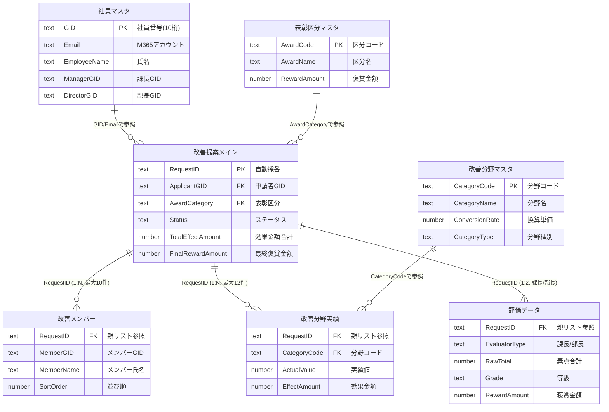

# SharePoint Lists リスト間リレーション

```mermaid
erDiagram
    社員マスタ {
        text GID PK "社員番号(10桁)"
        text Email "M365アカウント"
        text EmployeeName "氏名"
        text ManagerGID "課長GID"
        text DirectorGID "部長GID"
    }

    改善提案メイン {
        text RequestID PK "自動採番"
        text ApplicantGID FK "申請者GID"
        text AwardCategory FK "表彰区分"
        text Status "ステータス"
        number TotalEffectAmount "効果金額合計"
        number FinalRewardAmount "最終褒賞金額"
    }

    改善メンバー {
        text RequestID FK "親リスト参照"
        text MemberGID "メンバーGID"
        text MemberName "メンバー氏名"
        number SortOrder "並び順"
    }

    改善分野実績 {
        text RequestID FK "親リスト参照"
        text CategoryCode FK "分野コード"
        number ActualValue "実績値"
        number EffectAmount "効果金額"
    }

    評価データ {
        text RequestID FK "親リスト参照"
        text EvaluatorType "課長/部長"
        number RawTotal "素点合計"
        text Grade "等級"
        number RewardAmount "褒賞金額"
    }

    改善分野マスタ {
        text CategoryCode PK "分野コード"
        text CategoryName "分野名"
        number ConversionRate "換算単価"
        text CategoryType "分野種別"
    }

    表彰区分マスタ {
        text AwardCode PK "区分コード"
        text AwardName "区分名"
        number RewardAmount "褒賞金額"
    }

    社員マスタ ||--o{ 改善提案メイン : "GID/Emailで参照"
    表彰区分マスタ ||--o{ 改善提案メイン : "AwardCategoryで参照"
    改善提案メイン ||--o{ 改善メンバー : "RequestID (1:N, 最大10件)"
    改善提案メイン ||--o{ 改善分野実績 : "RequestID (1:N, 最大12件)"
    改善提案メイン ||--|{ 評価データ : "RequestID (1:2, 課長/部長)"
    改善分野マスタ ||--o{ 改善分野実績 : "CategoryCodeで参照"
```
