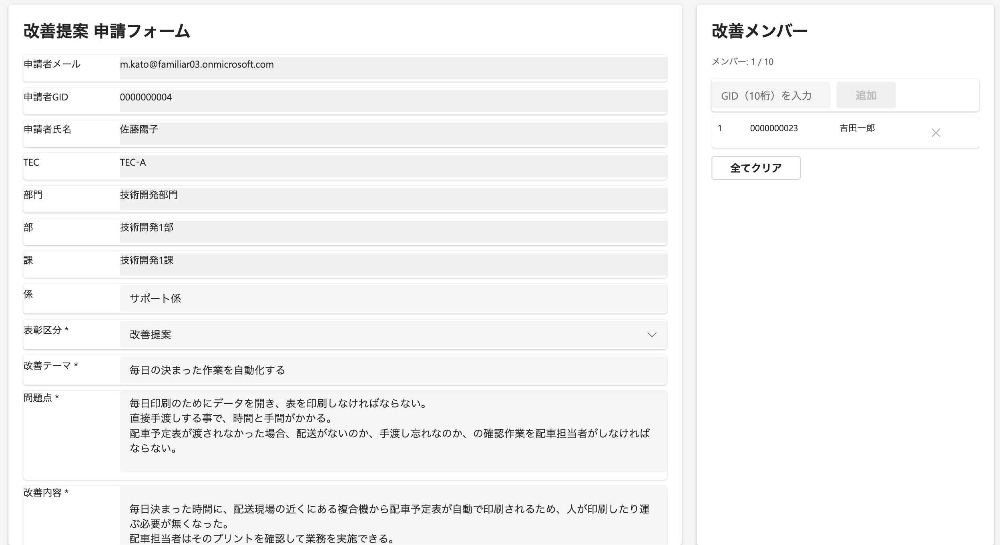
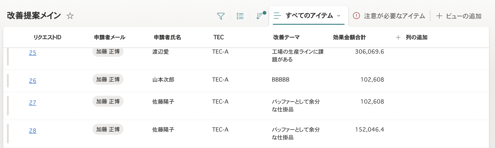
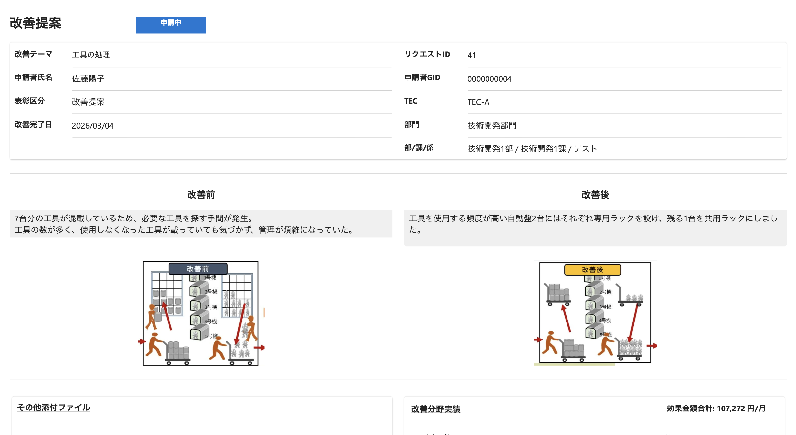
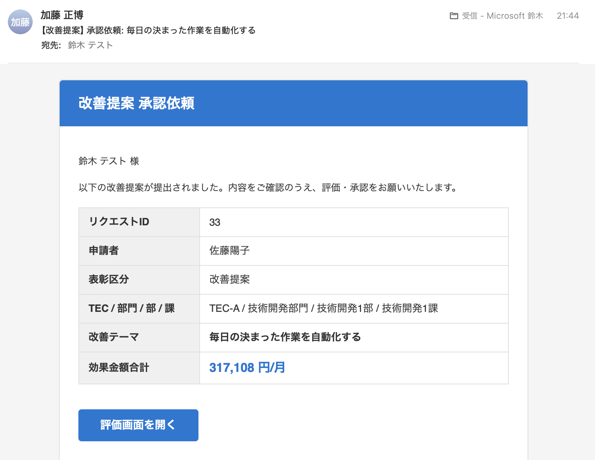
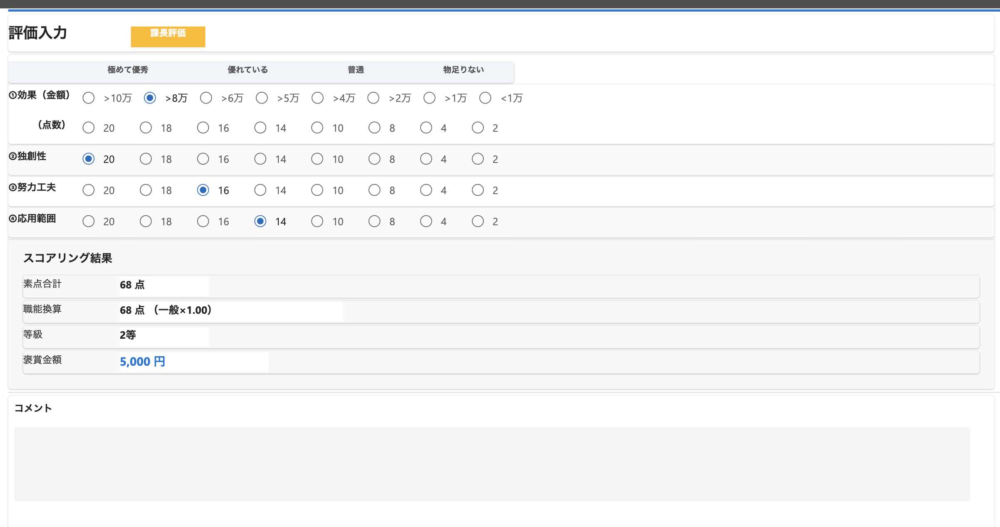
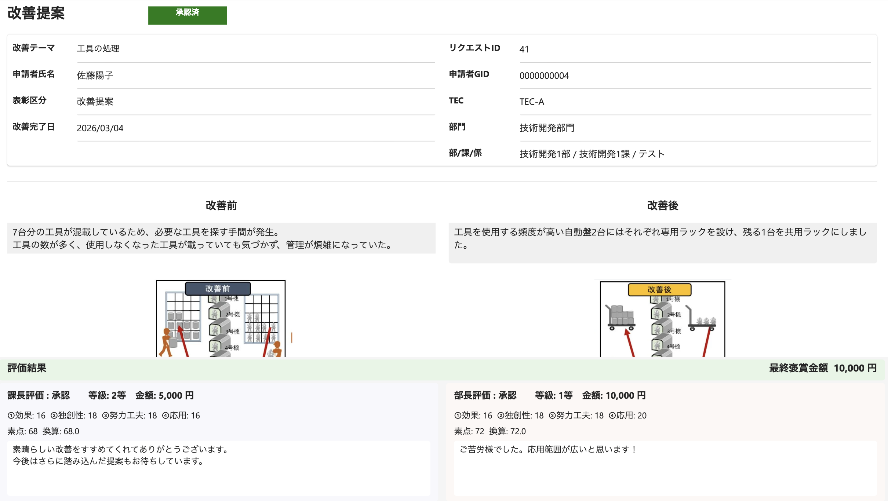

# 改善提案システム 操作手順ガイド

## 全体フロー

```
申請者が提出 → 課長が評価・承認 → (褒賞金額5,000円以上の場合) 部長が評価・承認 → 完了
```

---

## 1. 改善提案の申請

1. SharePointサイト内の **改善提案リスト** にアクセスする
2. リスト上のリンク（RequestID列）から **Power Appsの申請画面** が開く
   - 初回は新規申請として空のフォームが表示される
3. 各項目を入力する
4. 入力内容を確認し、**「提出」ボタン** を押す



> 申請が完了すると、課長宛に承認依頼メールが自動送信されます。

---

## 2. 申請内容の確認

申請後、自分の提案内容を確認したい場合：

- **改善提案メインリスト** の **RequestID列のリンク** をクリック
- Power Appsの **閲覧画面** が開き、申請内容（基本情報・メンバー・分野実績・添付ファイル）を確認できる





---

## 3. 課長による評価・承認

1. 課長宛に **承認依頼メール** が届く
2. メール内の **リンク** をクリックすると、Power Appsの **評価画面** が開く
3. 評価を行う
4. **「承認」** または **「差戻」** ボタンを押す




n

**承認後の分岐:**

- 褒賞金額 **5,000円未満** → 承認完了（申請者・課長に完了メール送信）
- 褒賞金額 **5,000円以上** → 部長承認へ進む（部長に承認依頼メール送信）

---

## 4. 部長による評価・承認

> ※ 褒賞金額が5,000円以上の場合のみ

1. 部長宛に **承認依頼メール** が届く
2. メール内の **リンク** をクリックすると、Power Appsの **評価画面** が開く
3. 課長の評価内容がデフォルト値として表示される
4. 必要に応じて再評価を行う（部長の評価が最終値として上書きされる）
5. **「承認」** または **「差戻」** ボタンを押す
6. 承認完了後、申請者・部長に完了メールが送信される

---

## 5. 承認完了後の確認

承認が完了した提案の内容を確認する方法：

- **完了メール内のリンク** をクリック → 閲覧画面が開く
- **改善提案メインリストのRequestID列のリンク** をクリック → 閲覧画面が開く

閲覧画面では以下を確認できる：

- 申請内容（基本情報・メンバー・分野実績・添付ファイル）
- 評価結果（等級・褒賞金額・各軸の評価スコア・コメント）
- 最終ステータス



---

## 6. 差戻（NG）の場合

1. 課長または部長が **「差戻」** を選択すると、申請者に **差戻通知メール** が届く
2. メール内のリンクから申請内容を確認
3. 申請内容を修正し、**再提出** する
4. 再提出後、改めて課長からの承認フローが開始される

---

## 7. 課長本人が申請者の場合

課長自身が改善提案を申請した場合、課長承認はスキップされ、**部長が第1承認者** となります。
部長宛に直接、承認依頼メールが送信されます。

---

## 補足

- 添付ファイルは改善前/改善後/その他の種別で管理されます
- 表彰区分が「小集団」系の場合、褒賞金額は固定（パール賞: 3,000円、銅賞: 5,000円、銀賞: 10,000円）
